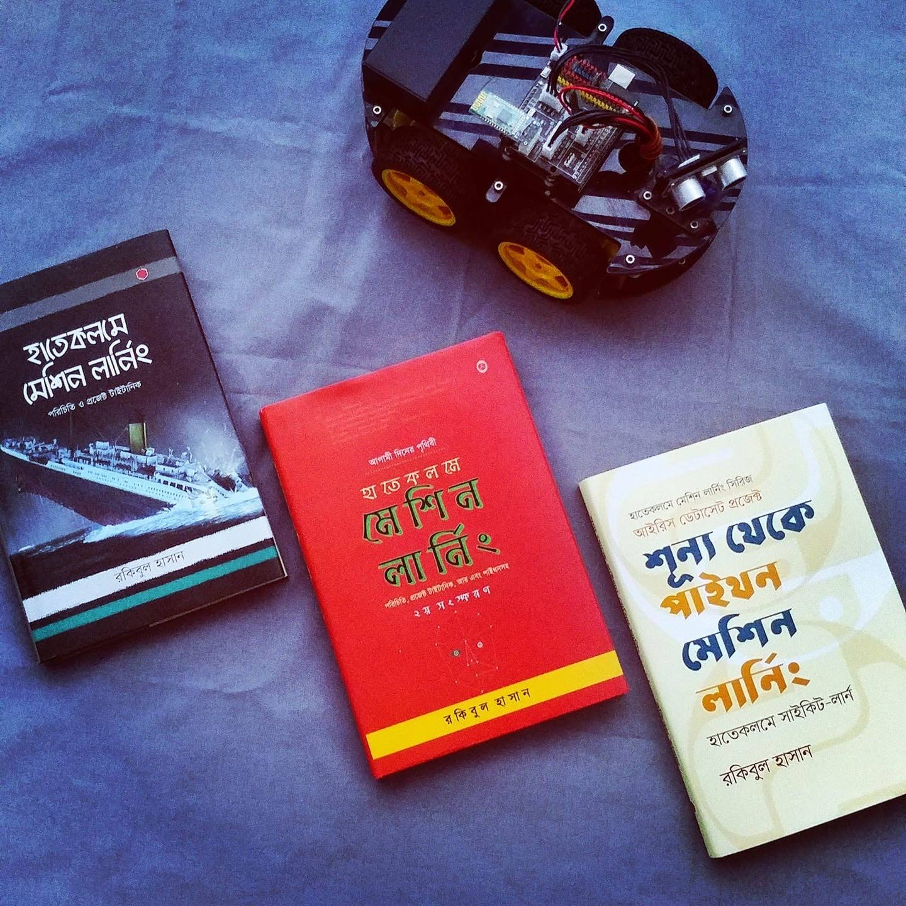

# হাতেকলমে পাইথন ডিপ লার্নিং


বইটা ড্রাফট অবস্থায় আছে। টাইমলাইন - ২১শে বইমেলা, ২০২০। প্রতিনিয়তঃ এটার আপডেট আসছে চ্যাপ্টারভিত্তিক। বই সম্পর্কে কোন ভুল বা মতামত থাকলে জানাতে পারেন ফেইসবুক মেসেঞ্জার [http://m.me/raqueeb](http://m.me/raqueeb) এবং ০১৭১৩০৯৫৭৬৭ \(বিকাল ৫- ৭টা\)। 

  
বাকি সব তথ্যের জন্য লিংক [bit.ly/mlstart](http://bit.ly/mlstart)


> There is no reason and no way that a human mind can keep up with an artificial intelligence machine by 2035.
>
> —Gray Scott

