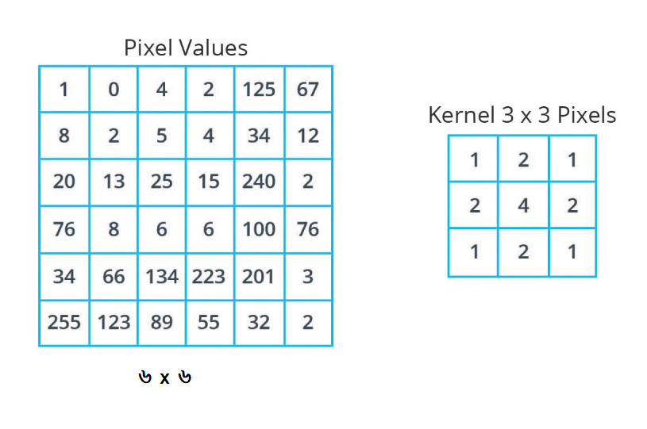
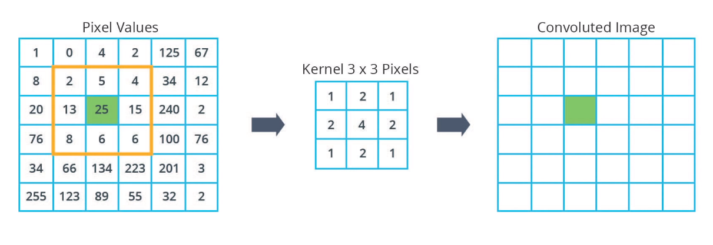
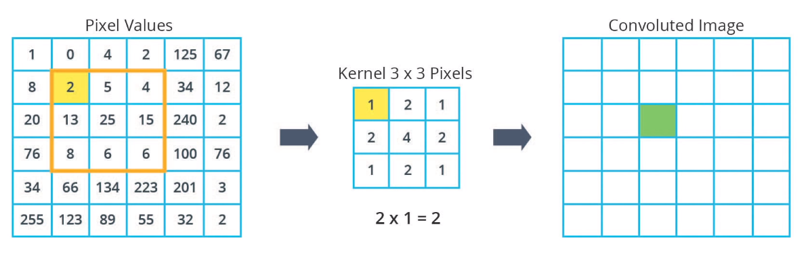
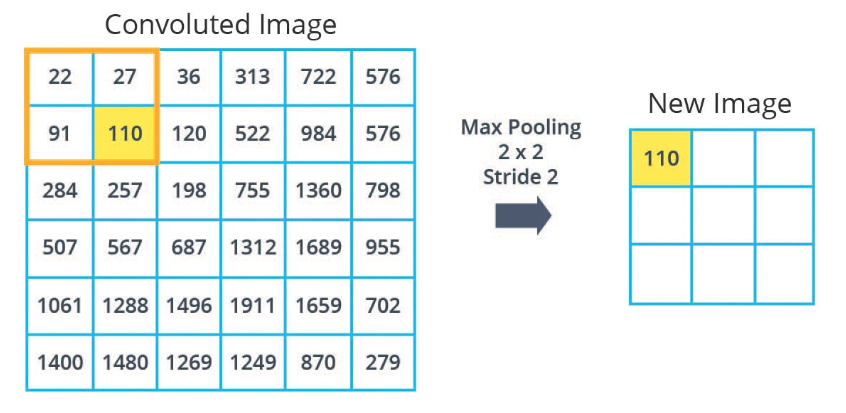

# কার্নাল কনভল্যুশন এবং ম্যাক্স পুলিং \(সিএনএন\)

#### কার্নাল কনভল্যুশন

যারা গিকি, মানে অংক ভালো বোঝেন - তাদের জন্য “উডাসিটি+গুগল” এর অনলাইন ক্লাস থেকে আরেকটা গল্প। আবারো বলছি, কনভল্যুশন হচ্ছে পুরো ছবির ওপরে ফিল্টার অ্যাপ্লাই করা। ‘ম্যাক্স পুলিং’ হচ্ছে ছবিটার সাইজ ছোট করে নিয়ে আসা, ডাউন স্যাম্পল করে। সেটাই দেখবো সামনে।

১. শুরুতেই আমরা ৬,৬ পিক্সেল ইমেজের একটা ছবি \(উডাসিটি লেখা গাড়িটার ছবি\) নেই। এটা ৬ পিক্সেলের না হলেও ধরে নিচ্ছি বোঝার সুবিধার্থে। এটা একটা ‘গ্রেস্কেল’ ছবি, যার প্রতিটা পিক্সেল ভ্যালু ০ থেকে ২৫৫ পর্যন্ত। আমরা এটাকে ‘নর্মালাইজ’ করার আগের কথা বলছি। মেশিন লার্নিং ভালো কাজ করে যখন সব ভ্যালু একই স্কেলে থাকে। সেকারণে ইমেজ প্রসেসিং এর সময় সেটাকে আমরা ‘নর্মালাইজ’ করে ভ্যালু ০ থেকে ১ এর মধ্যে নিয়ে আসব। আমাদের ছবিটাকে কনভল্যুশন প্রসেসের মধ্যে নেবার জন্য একটা ৩,৩ পিক্সেল ফিল্টার তৈরি করব। এটা নতুন গ্রিড, যা চলবে এই ৬,৬ ইমেজের উপর। আমাদের এই ৩,৩ কার্নাল ভ্যালুগুলো দেয়া হয়েছে এখানে। এই রিজিয়নটাই আমরা ব্যবহার করব আসল ছবির উপর।

২. ধরা যাক আমরা শুরু করলাম আমাদের কার্নাল কনভল্যুশন যেখানে পিক্সেল ভ্যালু হচ্ছে ২৫। বোঝার জন্য, আমরা এই ২৫কে মধ্যে রেখে কার্নালকে এমনভাবে ফেলব যাতে আমরা এখানেই সব ক্যালকুলেশন করতে পারি। এই ৩,৩ রিজিয়নের মধ্যে। আমাদের এই নতুন গ্রিড \(৩ x ৩\) পিক্সেল কারণ এটাই আমাদের কার্নাল সাইজ। এখন আমরা এই গ্রিড এর ভেতরের প্রতিটা পিক্সেল ভ্যালুর সাথে কার্নালের ভ্যালু গুন করার পর পুরো জিনিসটাকে যোগ করে ফেলবো সেই ২৫ পিক্সেলের জায়গায়। কাজটা দেখি এখন।


৩. আমাদের এই নতুন গ্রিডের বাঁদিকের সবচেয়ে উপরের ভ্যালুটা হচ্ছে ২। তার করেসপন্ডিং কার্নাল ভ্যালু হচ্ছে ১। দুটোকে গুন করি। গুনফল ২। এরপরের গ্রিড এর ভ্যালু হচ্ছে ৫, তার করেসপন্ডিং কার্নাল ভ্যালু হচ্ছে ২। গুনফল ১০। হিসেবে পুরো রিজিয়ন এবং কার্নাল সবগুলোর পিক্সেলের গুনফল এর যোগফল হচ্ছে ১৯৮। এর অর্থ হচ্ছে আমাদের ‘কনভলুটেড’ ইমেজের ফিচার ম্যাপের ভ্যালু এই নতুন ১৯৮। এভাবে প্রতিটা ভ্যালুর একটা নতুন কনভলুটেড ভ্যালু হবে। সেগুলো বসবে ডান পাশের নতুন কনভলুটেড ইমেজে।  


৪. ভালো কথা, এগুলো তো আমরা মধ্যের একটা পিক্সেলের কথা বললাম। আমাদের আসল ইমেজের সব কোনার দিকের পিক্সেলগুলোর কি হবে? ধরুন সবচেয়ে বাঁ পাশের এক নাম্বার পিক্সেলের কথা? যেই পিক্সেলটার ভ্যালু ১। সেখানেও আমরা ৩,৩ গ্রিড বসাবো। সেখানে আমরা বাকি জায়গাগুলোতে ‘০’ বসিয়ে ‘প্যাডিং’ করব। ‘০’ দিয়ে প্যাডিং করার পর এখন আমাদের ভ্যালু আসছে ২২। এভাবে আমরা পুরো ইমেজ এর পাশ দিয়ে ‘০’ দিয়ে প্যাডিং করব। তাহলে আমাদের আর অংকে সমস্যা হবে না। বর্তমান ছবি দেখুন। এখন আমাদের নতুন কনভলুটেড ইমেজ হচ্ছে ডানের ছবিটা, নতুন ভ্যালুসহ।

#### ম্যাক্স পুলিং

১. ম্যাক্স পুলিং এর জন্য আমাদের দুটো জিনিস দরকার। প্রথমটা হচ্ছে গ্রিড, যেটা হচ্ছে আসলে ‘পুল’ সাইজ। কতো করে করে টান দেব। মানে কত বাই কত গ্রিড, পরেরটা হচ্ছে স্ট্রাইড। আমাদের এই উদাহরণের জন্য আমরা একটা ২,২ পিক্সেল গ্রিড ব্যবহার করব। আমরা সেই গ্রিডকে ফেলছি আমাদের পুরো সাইজের কনভলুটেড ইমেজের উপর। তবে সেটা ২,২ অংশে। ঘরটা দেখুন। এই চারটা পিক্সেল ভ্যালু এর মধ্যে সর্বোচ্চ সংখ্যা হচ্ছে ১১০।

২. এখানে আমরা আরেকটা প্যারামিটার ব্যবহার করছি যাকে বলছি ‘স্ট্রাইড’। ‘স্ট্রাইড’ এর মানে হচ্ছে আমরা কতগুলো পিক্সেল ডানে অথবা যেদিকেই হোক ‘স্লাইড’ বা ওঠানামা করছি। আমাদের উদাহরণে আমরা দুটো পিক্সেল স্লাইড করছি, মানে ২ স্ট্রাইড। আমাদের নতুন অবস্থানে চারটা সংখ্যার মধ্যে সর্বোচ্চ ভ্যালু হচ্ছে ৫২২। এইভাবেই আমরা দুটো পিক্সেল করে স্লাইড করে পুরো ইমেজ কাভার করে নতুন ভ্যালু সহ। সেটা দিয়ে আরেকটা নতুন ইমেজ তৈরি করব। দেখুন, এই ইমেজের সাইজ অনেক ছোট হয়ে এসেছে। আমাদের অরিজিনাল ৬,৬ পিক্সেলের ইমেজ থেকে এখন আমাদের ৩,৩ পিক্সেলের ইমেজ হয়েছে। তার মানে আসল ছবিটা ডাউন স্যাম্পল হয়ে ছোট এসেছে। মানে অর্ধেক সাইজ। এই সাইজ নির্ভর করবে ‘গ্রিড’ সাইজ এবং ‘স্ট্রাইড’ এর সংখ্যার উপর।

