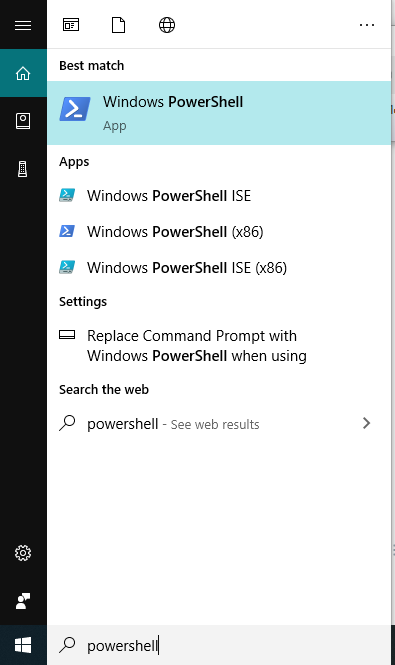
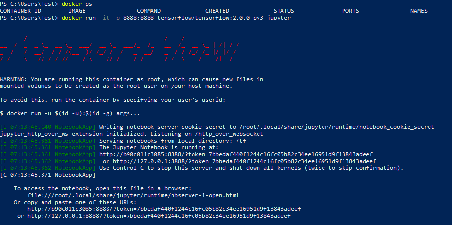

# গুগল কোলাব/জুপিটার টেন্সর-ফ্লো ২.x ডকার

> What I cannot create, I do not understand.
>
>  - Richard Feynman

মেশিন লার্নিং শেখার জন্য অসাধারণ কয়েকটি টুল বা 'ইন্টিগ্রেটেড ডেভেলপমেন্ট এনভায়রনমেন্ট' \(IDE\) নিয়ে আলাপ করছি।

১. গুগোল কোলাব: এটাকে আমরা অনলাইন জুপিটার নোটবুক বলতে পারি। সত্যি বলতে, এটা গুগলের ক্লাউড জুপিটার নোটবুক সার্ভার। ইচ্ছেমতো আপনার দরকারি নোটবুক লিখতে পারবেন এখানে। শেখার জন্য এই প্লাটফর্ম অসাধারণ কারণ এতে প্রচুর মেমোরি এবং হার্ডডিস্ক স্পেস দেওয়া আছে। ডিপ লার্নিং মডেল গুলোকে ট্রেইন করার জন্য আলাদাভাবে জিপিইউ দেয়া আছে বিনামূল্যে।
 আমার  জিপিউ কিনতে হয়নি। আপনার ব্রাউজার পয়েন্ট করুন https://colab.research.google.com এ। 

২. জুপিটার নোটবুক: অ্যানাকোন্ডা ডিস্ট্রিবিউশনে হাজারো প্যাকেজের সাথে এসেছে জুপিটার নোটবুক। তবে এর মধ্যে অনেক জিনিস আছে যেটা হয়তোবা এই মুহূর্তে দরকার পড়বে না। **টেন্সর ফ্লো ২.০** নিয়ে কাজ করতে গেলে আলাদা করে ইনস্টল করতে হবে যা একটু সমস্যাই বটে। 
এটা ঠিক যে ইনস্টল করাও তো জানতে হবে। ডাউনলোড করতে ক্লিক করুন https://www.anaconda.com/distribution/ এ। 


আমার অভিজ্ঞতা বলে দ্রুত একটা এনভায়রনমেন্ট 'ডেপ্লয়' করতে হলে 'ডকার' ছাড়া গতি নেই। আগে আমরা ভার্চুয়াল মেশিন চালাতাম, এখন আমরা কন্টেইনার চালাবো যেখানে সবকিছু একসাথে 'ক্লিন', 'সিকিউরড', এবং 'প্যাকেজড' অবস্থায় থাকবে। আমাদের লক্ষ্য থাকবে যা শিখছি সেটা প্রোডাকশনে ব্যবহার করতে।  দুটো চ্যাপ্টারে 'টেন্সর-ফ্লো সার্ভিং' এবং 'ফ্লাস্ক' দেখাবো এন্ড টু এন্ড প্রোডাকশনে যেতে।


৩. ডকার + টেন্সর-ফ্লো ২.০: পেতে চান সবকিছু একসাথে? টেন্সর ফ্লো ২.০ + জিপিইউ সাপোর্ট + জুপিটার নোটবুক + পাইথন ৩ এনভায়রনমেন্ট + দরকারি লাইব্রেরি। যারা সবসময় অনলাইনে থাকতে পারছেন না, তাদের জন্য এই সেটিং অসাধারণ। ডকার এর সবচেয়ে বড় সুবিধা হচ্ছে আপনার পছন্দমতো অ্যাপ্লিকেশনগুলোকে একটা ভার্চুয়াল কনটেইনারে চালাতে পারবেন আপনার পিসির ভিতরে, একদম আলাদা করে, আলাদা এনভারমেন্টে। এর জন্য দরকারী যত ডিপেন্ডেন্সি এবং লাইব্রেরি - সবকিছুই প্রি-কম্পাইল করা থাকে আপনার পছন্দের ইমেজে। হাজারো ইমেজ থেকে পছন্দমতো ইমেজ ডাউনলোড করে চালাবেন ডকারে, এর থেকে সহজ 'আর অ্যান্ড ডি' সম্ভব নয় ডকার ছাড়া।
 সবচেয়ে বড় সুবিধা হচ্ছে পুরো জিনিসটা চলে একটা আলাদা 'সিকিউরড' জায়গায়। লজিক্যালি সেপারেটেড। 



আমি নিজে গুগল কোলাবে কাজ করলেও আমার পছন্দের প্ল্যাটফর্ম হচ্ছে ডকার। যেমন, কালকে রাত্রে বেরিয়েছে টেন্সর-ফ্লো ২.০ ফাইনাল রিলিজ। এখন একে আলাদা করে  নামিয়ে কম্পাইল করা এবং তার এনভায়রনমেন্ট অনুযায়ী যত লাইব্রেরি দরকার সেগুলোকে ম্যানেজ করবে কে? আমার পিসিতে ডকার ডেক্সটপ ইন্সটল করা আছে, শুধু দরকার একটা টেন্সর-ফ্লো ২.০ ইমেজ যার মধ্যে আমার দরকারি সবকিছুই আছে। আমার দরকার তিনটা জিনিস একসাথে। ১. টেন্সর-ফ্লো ২.০, ২. জুপিটার নোটবুক, ৩. পাইথন ৩ এনভারমেন্ট। আর কি লাগে? নামিয়ে নিলাম একটা ইমেজ রাতেই,সবকিছু কম্পাইল করা আছে  একটাতেই। 

**ডকার সেটআপ করার প্রসিডিউর**

১. ডাউনলোড করে নিন ডকার ডেস্কটপ। দেখে নিন মিনিমাম রেকোয়ারমেন্ট। ৪ জিবি মেমোরি লাগবে। লিংক: https://docs.docker.com/docker-for-windows/install/

২. ইনস্টল করে নিন  ডকার ডেস্কটপ। পাশাপাশি একটা একাউন্ট তৈরি করে নিন ডকার থেকে। মনে রাখবেন ডকার হাবে সবকিছু পাওয়া যায়। আপনার উইন্ডোজ পিসিতে হাইপার-ভি সাপোর্ট চালু করতে হবে। পাশাপাশি বায়োসে ভার্চুয়ালাইজেশন সেটিং চালু করতে হতে পারে। 

৩. চালু করুন ডকার ডেস্কটপ, পিসি রিস্টার্টের পর। প্রথমবার চালু হতে একটু  সময় লাগতে পারে। চালু হবার পর ডকার ডেস্কটপ এর তিমিটা আর সাঁতরাবে না। চলে যাই ডকার হাবে। টেন্সর-ফ্লো ২.০+জুপিটার নোটবুক+পাইথন ৩ এর ইমেজ খুঁজতে। শুরুতেই জিপিইউ সাপোর্ট ছাড়া। লিংক: https://hub.docker.com/r/tensorflow/tensorflow/tags?page=1&name=2 । একটা কথা মনে রাখতে হবে "2.0.0-gpu-py3-jupyter" না, এটার সাইজ অনেক বেশি। ১.৬ গিগাবাইট। 

৪. আমাদের দরকার ইমেজ: "2.0.0-py3-jupyter", চলে যাই উইন্ডোজ পাওয়ার শেলে। ছবি দেখুন। বই বের হবার সময় "2.x.x-py3-jupyter" হতে পারে। 



৫. পাওয়ার শেলে লিখুন docker pull tensorflow/tensorflow:2.0.0-py3-jupyter, দেখুন ইমেজের ডাউনলোড প্রসেস। ডাউনলোড হয়ে গেলে ফিরিয়ে দেবে আমাদের প্রম্পট। এখন লিখুন, docker run -it -p 8888:8888 tensorflow/tensorflow:2.0.0-py3-jupyter যা একটা বেসিক কমান্ড। 



৬. এটা আপনাকে একটা লিংক দেবে এধরনের: [http://127.0.0.1:8888/?token=7bbedaf440f1244c16fc05b82c34ee16951d9f13843adeef](http://127.0.0.1:8888/?token=7bbedaf440f1244c16fc05b82c34ee16951d9f13843adeef) । টেন্সর-ফ্লো ২.০+জুপিটার নোটবুক+পাইথন ৩। কপি করে ব্রাউজারে ফেলে দিন। চলে আসবে জুপিটার নোটবুক। পেছনে শক্তিশালী টেন্সর-ফ্লো ২.০, পাইথন ৩ সহ। 

৭. কিভাবে বুঝবো **টেন্সর-ফ্লো ২.০** আমাদের এখানে ইনস্টল হয়েছে? একটা নতুন পাইথন ৩ নোটবুক খুলুন। টেন্সর-ফ্লো ভার্সনটা লিখুন। ছবি দেখুন। 


৮. যদি কোন লাইব্রেরি বা দরকারি পাইথন ডিপেন্ডেন্সির আলাদা দরকার হয়, তাহলে সেটা যোগ করে নেয়া যায় সহজে। এটা তো একটা লিনাক্স সিস্টেম, তাহলে ঢুকে যাই ভেতরে। 

```text
docker run -it tensorflow/tensorflow:2.0.0-py3-jupyter /bin/bash
# এরপর উদাহরণ হিসেবে পান্ডাজ 
pip install pandas
# এরপর শেল থেকে বের হয়ে যেতে হবে
exit
```

এখন কন্টেইনারের ইমেজে কমিট করতে হবে। খুঁজে বের করি কন্টেইনার আইডি, নাম। 

```text
PS C:\Users\Test> docker ps
CONTAINER ID        IMAGE                                     COMMAND             CREATED             STATUS              PORTS               NAMES
bc4389d9a422        tensorflow/tensorflow:2.0.0-py3-jupyter   "/bin/bash"         8 minutes ago       Up 8 minutes        8888/tcp            beautiful_shtern
```

কমিট করছি। 

```text
PS C:\Users\Test> docker commit bc4389d9a422 tensorflow/tensorflow:2.0.0-py3-jupyter
sha256:c4bfaac97c7b0a89c345e601c6bf5a2f0e043278b34a38f907887473c84d7d29
```

#### ডকারফাইল দিকে চালানো \(রিকমেন্ডেড\)

তবে এইসব গল্প থেকে "ডকারফাইল" ব্যবহার করা অনেক কাজের। আমি সেটাই করি। ডকার আসলে ইমেজ তৈরি করে ডকারফাইল \( `Dockerfile` \) বলে একটা ফাইল থেকে। একটা বেজ মডেল থেকে আরো দরকারি লাইব্রেরি যোগ করা যায় এই ডকারে। পাওয়ারশেলে দেখি। নিচের ফোল্ডার এবং ফাইল বানাতে হবে আপনাকে। Dockerfile এর কনটেন্ট আপনার মতো হতে পারে। শুরুতে  Dockerfile ফাইলটা নোটপ্যাড দিয়ে তৈরি করি।

```text
PS C:\Users\Test\Dockerfile> dir

Directory: C:\Users\Test\Dockerfile

Mode                LastWriteTime         Length Name
----                -------------         ------ ----
-a----        10/9/2019   9:29 PM            208 Dockerfile
```

শুরুতে প্যারেন্ট ইমেজ। যেটা হবে "tensorflow/tensorflow:2.0.0-py3-jupyter", যার উপর ভিত্তি করে পুরো জিনিস চলবে। এটা শুরু হয় FROM ডিরেক্টিভ থেকে। সব ভেঙ্গে ভেঙ্গে লিখলাম।

```text
FROM tensorflow/tensorflow:2.0.0-py3-jupyter

RUN apt-get update && pip3 install pandas
RUN pip3 install python-sklearn
RUN apt-get update && pip install tensorflow-datasets
# RUN pip install -U scikit-learn

# clean up pip cache
RUN rm -rf /root/.cache/pip/*
```

আমাদের বিল্ড করার পালা। 

```text
PS C:\Users\Test\Dockerfile> docker build .
Sending build context to Docker daemon  3.072kB
Step 1/3 : FROM tensorflow/tensorflow:2.0.0-py3-jupyter-pandas-sklearn
 ---> 1a818d50f932
......
Successfully built 15bde597bf2c
```

পরীক্ষা করে দেখি। 

```text
PS C:\Users\Test\Dockerfile> docker images
REPOSITORY              TAG                                            IMAGE ID            CREATED             SIZE
tensorflow/tensorflow   2.0.0-py3-jupyter-pandas-sklearn-tf-datasets   15bde597bf2c        4 weeks ago         1.45GB
tensorflow/tensorflow   2.0.0-py3-jupyter                              c652a4fc8a4f        5 weeks ago         1.22GB
```

আবার চালু করুন পাওয়ার-শেল, উইন্ডোজে। যেহেতু ডকার একটা 'সিকিউরড' এবং 'আইসোলেটেড' কন্টেইনার, সেখানে বসে উইন্ডোজ বা হোস্ট মেশিনের ফোল্ডার এক্সেস সম্ভব না শুরুতে। আমাদের উইন্ডোজের একটা ফোল্ডার এক্সেস করতে শেয়ার করেছি ডকারের সাথে। লিখুন;

```text
docker run -it -p 8888:8888 -v "c:/users/test/google drive:/tf" --rm --name tensorflow2 tensorflow/tensorflow:2.0.0-py3-jupyter-pandas-sklearn-tf-datasets
```

 আমাদের যেহেতু ডকারের ভেতরে ইন্টারনেট লাগবে কর্পাস/ডেটা ডাউনলোড করতে, সেখানে ডকারের কন্টেইনারে প্রক্সি চালু করতে হবে। 

