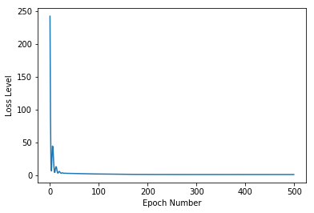

# ঝিঁঝিঁপোকার থার্মোমিটার

### ঝিঁঝিঁ পোকার থার্মোমিটার


আমরা বই পড়ছি, নোটবুক কেন পড়বো? 

নোটবুক সবসময় আপডেটেড। এই বই থেকেও। 

যেহেতু গিটবুকে নোটবুক ঠিকমতো রেন্ডার হয়না, সেকারণে গুগল কোলাব এবং গিটহাবে দেখা উচিৎ। গিটহাব লিংক: 

নিজে নিজে প্র্যাকটিস করুন: [https://github.com/raqueeb/TensorFlow2/blob/master/cricket-therm.ipynb](https://github.com/raqueeb/TensorFlow2/blob/master/cricket-therm.ipynb) এবং [https://nbviewer.jupyter.org/github/raqueeb/TensorFlow2/blob/master/cricket-therm.ipynb](https://nbviewer.jupyter.org/github/raqueeb/TensorFlow2/blob/master/cricket-therm.ipynb)

কোলাব লিংক: [https://colab.research.google.com/github/raqueeb/TensorFlow2/blob/master/cricket-therm.ipynb](https://colab.research.google.com/github/raqueeb/TensorFlow2/blob/master/cricket-therm.ipynb)


মনে আছে ছোট্ট রকিব এবং তার ফুপিমার গল্পের কথা? আমি আগের বই “শূন্য থেকে পাইথন মেশিন লার্নিং” বইটার কথা বলছিলাম। সেখানে গল্পটা ছিল এরকম, কোন এক রাত্রে যখন সবাই গরমে কাহিল, তখন ওই সময়ে কত টেম্পারেচার সেটা নিয়ে কথা হচ্ছিল ছোট্ট রকিবের গ্রামের দাদা বাড়িতে। ফুঁপিমা বলছিলেন, বাইরের বসার ঘরের সেই বড় থার্মোমিটার না দেখেও তখনকার টেম্পারেচার আন্দাজ করা যাবে ঝিঁঝিঁপোকার ডাক থেকে। সবাই অবাক, সবার প্রশ্ন কিভাবে?

বোঝা গেল যে ঝিঁঝিঁপোকার ডাকের সাথে তাপমাত্রা একটা সম্পর্ক আছে। তাপমাত্রা বাড়লে ঝিঁঝিঁপোকার ডাকার ফ্রিকোয়েন্সি বেড়ে যায়। এবং এই ডাকার ফ্রিকোয়েন্সি তাপমাত্রা সাথে অনেকটাই লিনিয়ার। মানে, তাপমাত্রা বাড়লে ডাকের ফ্রিকুয়েন্সি বাড়ে। ব্যাপারটাকে উল্টো করে ধরলে বলা যায়, ঝিঁঝিঁপোকার ডাককে ঠিকমত গুনতে পারলে ওই মুহূর্তের তাপমাত্রা বের করা সম্ভব হবে। ফুঁপিমা এর নোটবুক থেকে দেখা গেল, উনি একেকদিনের ঝিঁঝিঁপোকার ডাক এবং তাপমাত্রা পাশাপাশি লিখে সেটার মধ্যে একটা যোগসুত্র বের করেছিলেন সেগুলোকে প্লট করে। পুরো ১ মিনিটের ডাক রেকর্ড না করে তার প্রতি ১৫ সেকেন্ডের ঝিঁঝিঁপোকার ডাক এর সাথে তাপমাত্রাকে প্লটিংয়েই বোঝা গেল সেই লিনিয়ার সম্পর্ককে।

ঝিঁঝিঁপোকার ডাক বেড়ে যাওয়া মানে তাপমাত্রা বেড়ে যাওয়া। সেখান থেকে একটা ফর্মুলা বের করেছিলেন ওই সময়। ওই ফর্মুলা দিয়ে আমাদেরকে কেউ ঝিঁঝিঁপোকার ডাক এর সংখ্যা বললে তার করেসপন্ডিং ওই সময়ে কত তাপমাত্রা হবে সেটা বের করা যাবে ওই ফর্মুলা দিয়ে। তাহলে তো আর সেটা মেশিন লার্নিং হলো না। ফর্মুলা হচ্ছে একটা রুল বেইজড সিস্টেম, যা মেশিন ডেটা থেকে শেখে না। আমি এই মুহূর্তে ফর্মুলাটা আমাদের মেশিনের কাছে আগে থেকে বলছি না, কারণ আমাদের ফুঁপিমা নোটবুক থেকে ডেটা সরাসরি মেশিনে দিয়ে দেবো - সে তার ফর্মুলা বের করতে পারে কিনা? যদি সে ইনপুট ডেটা থেকেই ফর্মুলা বের করতে পারে তাহলে আমরা বুঝে যাবো আমাদের মেশিন শিখছে। সে একটা লার্নিং মেশিন। ডেটা পাল্টে গেলে আবার সে নতুন ফর্মুলা দেবে।

রাজি তো? আবারো বলছি - আমরা মেশিনকে আগে থেকে ফর্মুলা বলবো না। দেখি সে ফর্মুলা বের করতে পারে কিনা?

### প্রবলেম স্টেটমেন্ট

আমরা ঝিঝি পোকার 15 সেকেন্ডের ডাকের সংখ্যা বলবো, মেশিন কে আমাদেরকে বলতে হবে এখনকার তাপমাত্রা কত? এই মুহূর্তে আমাদের কাছে 55 টা রেকর্ড আছে যেখানে 15 সেকেন্ডের ঝিঝি পোকার ডাকের করেসপন্ডিং তাপমাত্রা দেয়া আছে টেবিলে। আপনারা শূন্য থেকে পাইথন মেশিন লার্নিং বইটা দেখতে পারেন। পাশাপাশি সেই ডাটা সেটের লিংক নিচে দেয়া হল।

ব্যাপারটাকে আমি তিন ভাবে করতে পারি।

শুধুমাত্র এটুকু বলতে পারি, প্রথম দুটো মেশিন লার্নিং নয়।

### শুরুতেই ডিপেন্ডেন্সিগুলোকে ইমপোর্ট

১. প্রথমেই টেন্সর-ফ্লো, এটাকে আমরা `tf` বলবো সুবিধার জন্য।

২. টেন্সর-ফ্লো আর নামপাই খুব কাছের জিনিস। নামপাইকে শর্ট করে `np`, যা আমাদেরকে দেবে C++ এর গতি।

```python
import tensorflow as tf
import numpy as np
```

## টেন্সর-ফ্লো ২.০

আগে দেখে নেই আমাদের টেন্সর-ফ্লো এর কতো ভার্সন ইনস্টল করা আছে। অন্য ভার্সন থাকলে সেটাকে আপগ্রেড করে নেবো নতুন ভার্শনে।

```python
tf.__version__
```

```text
'1.14.0'
```

আপগ্রেড করে নিচ্ছি ২.০তে। এমুহুর্তে দরকার না থাকলেও আমরা পুরো বইটা টেন্সর-ফ্লো ২.০ দিয়ে সাঁজাতে চাই প্লাটফর্মের কনসিস্টেন্সির জন্য।

```python
!pip install -q tensorflow==2.0.0-rc1
```

```text
     |████████████████████████████████| 86.3MB 31.5MB/s 
     |████████████████████████████████| 4.3MB 24.1MB/s 
     |████████████████████████████████| 501kB 50.4MB/s 
[?25h
```

```python
tf.__version__
```

```text
'2.0.0-rc1'
```

### ডেটা প্লটিং

শুরুতেই আমরা ডাটাগুলোকে দুটো লিস্টে ভাগ করি। প্রথম লিস্ট 'chirp15s' যেখানে আমরা ১৫ সেকেন্ডে ঝিঁঝিঁ পোকার ডাকের সংখ্যা রেকর্ড করেছি। প্রথম দুটো রেকর্ড দেখলে বোঝা যায় ঝিঁঝিঁপোকা ১৫ সেকেন্ডে ৪৪ এবং ৪৬ বার ডেকেছে। পরের লিস্টে হচ্ছে তাপমাত্রা, যা সেলসিয়াস "temp\_celsius" রেকর্ড করা হয়েছে। সেলসিয়াস মানে আমাদের সেন্টিগ্রেড। বোঝার সুবিধার জন্য এখানে একটা ফর লুপে আমরা ঝিঁঝিঁপোকার ডাক এর পাশাপাশি তাপমাত্রা ফেলে দিচ্ছি।

```python
chips_15s    = np.array([44.000,46.400,43.600,35.000,35.000,32.600,28.900,27.700,25.500,20.375,12.500,37.000,37.500,36.500,36.200,33.000,43.000,46.000,29.000,31.700,31.000,28.750,23.500,32.400,31.000,29.500,22.500,20.600,35.000,33.100,31.500,28.800,21.300,37.800,37.000,37.100,36.200,31.400,30.200,31.300,26.100,25.200,23.660,22.250,17.500,15.500,14.750,15.000,14.000,18.500,27.700,26.000,21.700,12.500,12.500],  dtype=float)
temp_celsius = np.array([26.944, 25.833, 25.556, 23.056, 21.389, 20.000, 18.889, 18.333, 16.389, 13.889, 12.778, 24.583, 23.333, 23.333, 22.500, 18.889, 25.278, 25.833, 20.278, 20.278, 20.000, 18.889, 15.000, 21.111, 20.556, 19.444, 16.250, 14.722, 22.222, 21.667, 20.556, 19.167, 15.556, 23.889, 22.917, 22.500, 21.111, 19.722, 18.889, 20.556, 17.222, 17.222, 16.111, 16.667, 13.611, 12.778, 11.111, 11.667, 10.000, 11.111, 18.333, 17.222, 15.000, 10.417, 9.5833],  dtype=float)

for i,c in enumerate(chips_15s):
  print("{} Chirps in 15 Seconds = {} degrees Celsius (C)".format(c, temp_celsius[i]))
```

```text
44.0 Chirps in 15 Seconds = 26.944 degrees Celsius (C)
46.4 Chirps in 15 Seconds = 25.833 degrees Celsius (C)
43.6 Chirps in 15 Seconds = 25.556 degrees Celsius (C)
35.0 Chirps in 15 Seconds = 23.056 degrees Celsius (C)
35.0 Chirps in 15 Seconds = 21.389 degrees Celsius (C)
32.6 Chirps in 15 Seconds = 20.0 degrees Celsius (C)
28.9 Chirps in 15 Seconds = 18.889 degrees Celsius (C)
27.7 Chirps in 15 Seconds = 18.333 degrees Celsius (C)
25.5 Chirps in 15 Seconds = 16.389 degrees Celsius (C)
20.375 Chirps in 15 Seconds = 13.889 degrees Celsius (C)
12.5 Chirps in 15 Seconds = 12.778 degrees Celsius (C)
37.0 Chirps in 15 Seconds = 24.583 degrees Celsius (C)
37.5 Chirps in 15 Seconds = 23.333 degrees Celsius (C)
36.5 Chirps in 15 Seconds = 23.333 degrees Celsius (C)
36.2 Chirps in 15 Seconds = 22.5 degrees Celsius (C)
33.0 Chirps in 15 Seconds = 18.889 degrees Celsius (C)
43.0 Chirps in 15 Seconds = 25.278 degrees Celsius (C)
46.0 Chirps in 15 Seconds = 25.833 degrees Celsius (C)
29.0 Chirps in 15 Seconds = 20.278 degrees Celsius (C)
31.7 Chirps in 15 Seconds = 20.278 degrees Celsius (C)
31.0 Chirps in 15 Seconds = 20.0 degrees Celsius (C)
28.75 Chirps in 15 Seconds = 18.889 degrees Celsius (C)
23.5 Chirps in 15 Seconds = 15.0 degrees Celsius (C)
32.4 Chirps in 15 Seconds = 21.111 degrees Celsius (C)
31.0 Chirps in 15 Seconds = 20.556 degrees Celsius (C)
29.5 Chirps in 15 Seconds = 19.444 degrees Celsius (C)
22.5 Chirps in 15 Seconds = 16.25 degrees Celsius (C)
20.6 Chirps in 15 Seconds = 14.722 degrees Celsius (C)
35.0 Chirps in 15 Seconds = 22.222 degrees Celsius (C)
33.1 Chirps in 15 Seconds = 21.667 degrees Celsius (C)
31.5 Chirps in 15 Seconds = 20.556 degrees Celsius (C)
28.8 Chirps in 15 Seconds = 19.167 degrees Celsius (C)
21.3 Chirps in 15 Seconds = 15.556 degrees Celsius (C)
37.8 Chirps in 15 Seconds = 23.889 degrees Celsius (C)
37.0 Chirps in 15 Seconds = 22.917 degrees Celsius (C)
37.1 Chirps in 15 Seconds = 22.5 degrees Celsius (C)
36.2 Chirps in 15 Seconds = 21.111 degrees Celsius (C)
31.4 Chirps in 15 Seconds = 19.722 degrees Celsius (C)
30.2 Chirps in 15 Seconds = 18.889 degrees Celsius (C)
31.3 Chirps in 15 Seconds = 20.556 degrees Celsius (C)
26.1 Chirps in 15 Seconds = 17.222 degrees Celsius (C)
25.2 Chirps in 15 Seconds = 17.222 degrees Celsius (C)
23.66 Chirps in 15 Seconds = 16.111 degrees Celsius (C)
22.25 Chirps in 15 Seconds = 16.667 degrees Celsius (C)
17.5 Chirps in 15 Seconds = 13.611 degrees Celsius (C)
15.5 Chirps in 15 Seconds = 12.778 degrees Celsius (C)
14.75 Chirps in 15 Seconds = 11.111 degrees Celsius (C)
15.0 Chirps in 15 Seconds = 11.667 degrees Celsius (C)
14.0 Chirps in 15 Seconds = 10.0 degrees Celsius (C)
18.5 Chirps in 15 Seconds = 11.111 degrees Celsius (C)
27.7 Chirps in 15 Seconds = 18.333 degrees Celsius (C)
26.0 Chirps in 15 Seconds = 17.222 degrees Celsius (C)
21.7 Chirps in 15 Seconds = 15.0 degrees Celsius (C)
12.5 Chirps in 15 Seconds = 10.417 degrees Celsius (C)
12.5 Chirps in 15 Seconds = 9.5833 degrees Celsius (C)
```

### ডেটা ভিজ্যুয়ালাইজেশন

১. আমরা পুরো ডাটাসেটকে এক্স এবং ওয়াই এক্সিসে প্লট করতে পারি। যেহেতু আমরা আগেই দেখেছি ঝিঁঝিঁপোকার ডাক এবং তাপমাত্রার সম্পর্কটা লিনিয়ার, সেখানে একটা 'বেস্ট ফিট লাইন' আমাদেরকে ভবিষ্যৎ যে কোনো ডাকের সংখ্যার করেসপন্ডিং তাপমাত্রা দেখাতে পারবে। এক্স অ্যাক্সিস যদি ঝিঁঝিঁপোকার ডাকের সংখ্যা হয় তাহলে ওয়াই এক্সিসে তারপর করেসপন্ডিং তাপমাত্রা পাওয়া যাবে।

২. নতুন ঝিঁঝিঁপোকার ডাক এর সংখ্যা যেটা এখানে নেই, সেটাও এই প্লটিং এ এক্স এক্সিসের যে অংশটা ওয়াই এক্সিসের এর সঙ্গে স্পর্শ করেছে সেটাই প্রেডিক্টেড তাপমাত্রা হবে।

তবে, এই ছবিতে আমরা সেটা না দেখিয়ে সামনে দেখানোর প্ল্যান করছি।

```python
import matplotlib.pyplot as plt

X = chips_15s
y = temp_celsius

plt.scatter(X, y, color='red')

plt.show()
```


৩. আমাদের যেহেতু ৫৫টা রেকর্ড আছে, আর রেকর্ডগুলো প্লট করলে প্রায় একটা সরল রেখা হয়, তাহলে কি একটা সরলরেখার ইকুয়েশন বের করতে পারি আমরা? সরলরেখার ইকুয়েশনে আমরা ওয়াই ভ্যালু, মানে আমাদের 'প্রেডিক্টেড' তাপমাত্রা বের করতে চাইলে, এক্স ভ্যালুতে ঝিঁঝিঁপোকার ডাক এর সংখ্যা বসালেই তো উত্তর পাবার কথা, ঠিক না? সরলরেখার ইকুয়েশন যদি y = mx + b হয় তাহলে তো 'm' যাকে আমরা স্লোপ বা ঢাল বলছি, সেটা বের করা যাবে না? এর পাশাপাশি ওয়াই ইন্টারসেপ্ট 'b' পাওয়াটা তো কঠিন কিছু না। এই পুরো ব্যাপারটা আমরা দু ভাবে করতে পারি। প্রথমটা সাধারণ অংক, ফর্মুলা থেকে, পরেরটা আমরা দেখবো পাইথন দিয়ে। কোনটাই মেশিন লার্নিং নয়।

 **আমরা সরল রেখার অংক মানে ইকুয়েশন \(y = mx + b\) নিয়ে আলাপ করছি। আগের বই "শূন্য থেকে পাইথন মেশিন লার্নিং" বইয়ে বড় করে আলাপ করেছিলাম আগে।** 

### এই ফর্মুলাটা নিরেট অংকে করি

_কোন মেশিন লার্নিং নয়_ 

আমাদের ৫৫টা ডেটাপয়েন্ট থেকে অংকে ফর্মুলাতে নিয়ে আসি। সরল রেখার অংক। ফর্মুলা নিচে দেখুন।

আমাদের "chips\_15s" মানে X এর সব ভ্যালুগুলোকে যোগ করি।

X\_sum =

44.000+46.400+43.600+35.000+35.000+32.600+28.900+27.700+25.500+20.375+12.500+37.000+37.500+36.500+36.200+33.000+43.000+46.000+29.000+31.700+31.000+28.750+23.500+32.400+31.000+29.500+22.500+20.600+35.000+33.100+31.500+28.800+21.300+37.800+37.000+37.100+36.200+31.400+30.200+31.300+26.100+25.200+23.660+22.250+17.500+15.500+14.750+15.000+14.000+18.500+27.700+26.000+21.700+12.500+12.500= 1584.285

এখন আমরা 'temp\_celsius' মানে y ভ্যালুগুলোকে যোগ করি।

y\_sum =

26.944+ 25.833+ 25.556+ 23.056+ 21.389+ 20.000+ 18.889+ 18.333+ 16.389+ 13.889+ 12.778+ 24.583+ 23.333+ 23.333+ 22.500+ 18.889+ 25.278+ 25.833+ 20.278+ 20.278+ 20.000+ 18.889+ 15.000+ 21.111+ 20.556+ 19.444+ 16.250+ 14.722+ 22.222+ 21.667+ 20.556+ 19.167+ 15.556+ 23.889+ 22.917+ 22.500+ 21.111+ 19.722+ 18.889+ 20.556+ 17.222+ 17.222+ 16.111+ 16.667+ 13.611+ 12.778+ 11.111+ 11.667+ 10.000+ 11.111+ 18.333+ 17.222+ 15.000+ 10.417+ 9.5833= 1030.1403

এখন প্রতিটা ডেটা পয়েন্টের প্রোডাক্টকে যোগ করে ফেলি।

Xy\_sum =

44.000_26.944+ 46.400_25.833+ 43.600_25.556+ 35.000_23.056+ 35.000_21.389+ 32.600_20.000+ 28.900_18.889+ 27.700_18.333+ 25.500_16.389+ 20.375_13.889+ 12.500_12.778+ 37.000_24.583+ 37.500_23.333+ 36.500_23.333+ 36.200_22.500+ 33.000_18.889+ 43.000_25.278+ 46.000_25.833+ 29.000_20.278+ 31.700_20.278+ 31.000_20.000+ 28.750_18.889+ 23.500_15.000+ 32.400_21.111+ 31.000_20.556+ 29.500_19.444+ 22.500_16.250+ 20.600_14.722+ 35.000_22.222+ 33.100_21.667+ 31.500_20.556+ 28.800_19.167+ 21.300_15.556+ 37.800_23.889+ 37.000_22.917+ 37.100_22.500+ 36.200_21.111+ 31.400_19.722+ 30.200_18.889+ 31.300_20.556+ 26.100_17.222+ 25.200_17.222+ 23.660_16.111+ 22.250_16.667+ 17.500_13.611+ 15.500_12.778+ 14.750_11.111+ 15.000_11.667+ 14.000_10.000+ 18.500_11.111+ 27.700_18.333+ 26.000_17.222+ 21.700_15.000+ 12.500_10.417+ 12.500\*9.5833= 31775.986435

এখন X এবং y ভ্যালুগুলোর যোগফলকে আলাদা আলাদা করে বর্গ করি।

X\_square\_sum =

44.000^2+46.400^2+43.600^2+35.000^2+35.000^2+32.600^2+28.900^2+27.700^2+25.500^2+20.375^2+12.500^2+37.000^2+37.500^2+36.500^2+36.200^2+33.000^2+43.000^2+46.000^2+29.000^2+31.700^2+31.000^2+28.750^2+23.500^2+32.400^2+31.000^2+29.500^2+22.500^2+20.600^2+35.000^2+33.100^2+31.500^2+28.800^2+21.300^2+37.800^2+37.000^2+37.100^2+36.200^2+31.400^2+30.200^2+31.300^2+26.100^2+25.200^2+23.660^2+22.250^2+17.500^2+15.500^2+14.750^2+15.000^2+14.000^2+18.500^2+27.700^2+26.000^2+21.700^2+12.500^2+12.500^2= 49879.553725

আগেই বলেছি, আমাদের ডেটাপয়েন্ট আছে ৫৫টা। মানে N=55. তাহলে বেস্ট ফিট লাইনের গ্রাডিয়েন্ট পাওয়া যাবে নিচের ফর্মুলা থেকে। আগের বইটা দেখতে পারেন।

m = \(N  _Xy\_sum\) - \(X\_sum_  y\_sum\) / \(N  _X\_square\_sum\) - \(X\_sum_  X\_sum\) = \(55  _31775.986435\) - \(1584.285_  1030.1403\) / \(55 \* 49879.553725\) - \(1584.285^2\) = 0.49543811976

এখন এই বেস্ট ফিট লাইনের ইন্টারসেপ্ট দরকার আমার লাইনের জন্য। সেটার ফর্মুলা;

b = \(X\_square\_sum  _y\_sum \) - \(X\_sum_  Xy\_sum\) / \(N  _X\_square\_sum\) - \(X\_sum_  x\_sum\) = \(49879.553725  _1030.1403\) - \(1584.285_  31775.986435\) / \(55  _49879.553725\) - \(1584.285_ 1584.285\) = 4.45863851637

তাহলে আমাদের এই রিগ্রেশন লাইনের সরলরেখার ইক্যুয়েশন কি?

y = 0.49543811976X + 4.45863851637

অংকে তো মাথা খারাপ হয়ে গেলো। একটু পাইথনে দেখি। এখনো মেশিন লার্নিং নয় কিন্তু।

```python
from statistics import mean

def best_fit_slope_and_intercept(X,y):
    m = (((mean(X)*mean(y)) - mean(X*y)) /
         ((mean(X)*mean(X)) - mean(X*X)))

    b = mean(y) - m*mean(X)

    return m, b

m, b = best_fit_slope_and_intercept(X,y)

print(m,b)
```

```text
0.49543811977958857 4.458638516454446
```

y = mx + b এর হিসেবে

y = 0.49543811977958857X + 4.458638516454446

একদম কাছাকাছি।

### বেস্ট ফিট লাইন

আমরা একটা রিগ্রেশন লাইন টেনে ফেলি। ধরুন ১৫ সেকেন্ডের ঝিঁঝিঁপোকার ৪১ ডাকের প্রেডিকশন কি হবে? Y এক্সিসের বরাবর রেখাটা এক্স এক্সিসের কোথায় স্পর্শ করেছে সেটা দেখলেই কিন্তু পাওয়া যাবে।

আচ্ছা, লাইনটা কিভাবে টানলাম সেটা নিয়ে আলাপ নয় এখন।

```python
# regression_line = [(m*x)+b for x in X]

regression_line = []
for x in X:
    regression_line.append((m*x)+b)

plt.scatter(X,y,color='red')
plt.plot(X, regression_line)
plt.show()
```


#### মেশিন লার্নিং কিছু টার্মিনোলোজি

* **ফিচার** — আমাদের মডেলের ইনপুট ডেটা। আমাদের এখানে একটা ভ্যালু - ১৫ সেকেন্ডে ঝিঁঝিঁপোকার ডাকের সংখ্যা।
* **লেবেল** — যেই আউটপুটটা আমাদের মডেল শিখে প্রেডিক্ট করবে। আমাদের এখানে তাপমাত্রা।
* **এক্সাম্পল** — ইনপুট/আউটপুট ডেটার একটা জোড়া, যা দরকার পড়ছে ট্রেনিং এর সময়। আমাদের এখানে chips\_15s এবং temp\_celsius অ্যারে থেকে দুটো ডেটা একটা ইনডেক্সে দেখলে \(44.000,26.944\) পাওয়া যাবে।

### মেশিন লার্নিং মডেল

আমরা সাইকিট-লার্ন দিয়েও এই জিনিসটা করতে পারতাম। তবে, যেহেতু আমরা ডিপ লার্নিং মানে টেন্সর-ফ্লো নিয়ে কাজ করতে চাই, সেকারণে আমাদের শুরুতে ফোকাস থাকবে একটা সাধারণ মডেলে। বিশেষ করে বোঝার ক্ষেত্রে। একটা লিনিয়ার মডেলে নিউরাল নেটওয়ার্ক দরকার নেই, বরং নন-লিনিয়ার মডেলের জন্য দরকার নিউরাল নেটওয়ার্ক। সেগুলো নিয়ে সামনে আলাপ হবে।

৪. আমাদের কাছে যেই ডাটা আছে, সেটাকে মেশিন লার্নিং মডেলে ঢুকিয়ে দেবো, দেখি মেশিন লার্নিং মডেল এর থেকে কোনো ফর্মুলা বের করতে পারে কিনা? পাশাপাশি আমরা একটা অজানা ভ্যালু দিয়ে দেখতে চাইবো সেখান থেকে প্রেডিক্টেড ভ্যালু জানাতে পারে কিনা? তাহলেই তো আমাদের কাজ হয়ে যায়, কি বলেন? আমরা যদি আমাদের ডিপ লার্নিং লাইব্রেরি টেন্সর-ফ্লোকে ঝিঁঝিঁ পোকার ডাক এর সংখ্যা এবং তার করেসপন্ডিং তাপমাত্রা দিয়ে দেই, তাহলে যদি সে ফর্মুলা দিতে পারে, তখন আমরা বলতে পারব আমাদের মেশিন লার্নিং মডেল ডেটা থেকে শিখেছে। যদি ডাটা থেকে নিজে নিজেই ফর্মুলা বের করতে পারে সেটাই কিন্তু শেখা, মানে মেশিন লার্নিং।

 **আমাদের এই মডেল তৈরি করতে ডিপ লার্নিং অথবা টেন্সর-ফ্লো লাগবে না। তবে ডিপ লার্নিং ফ্রেমওয়ার্ক নিয়ে ধারণা পাবার জন্য একটা অগভীর মানে 'শ্যালো' এক লেয়ারের, এক নিউরনের নেটওয়ার্ক বানানোর চেষ্টা করবো।** 

### নিউরাল নেটওয়ার্কের ৫ ষ্টেপ লাইফ সাইকেল - কেরাস দিয়ে

টেন্সর-ফ্লো ডিপ লার্নিং ফ্রেমওয়ার্ক হিসেবে একটু কমপ্লেক্স। সাইকিট-লার্ন এপিআইএর মতো এতো কম হাইপার-প্যারামিটার নিয়ে তাকে চালানো দুস্কর। যেহেতু ফ্রেমওয়ার্কটা অনেক শক্তিশালী, সেকারণে আমরা এটাকে এক্সেস করবো একটা হাই-লেভেল এপিআই দিয়ে যার কাজ হচ্ছে এই ভেতরের কমপ্লেক্সিটিকে লুকিয়ে রাখবে আমাদের কাছ থেকে। একারণে টেন্সর-ফ্লো ২.০ শুরুতেই যুক্ত করে নিয়েছে কেরাসকে। কেরাস দিয়ে ৯০%এর বেশি কাজ করা সম্ভব।

আমরা পুরো জিনিসকে ৫টা ভাগে ভাগ করে ফেলেছি। 

### মডেলের ধারণা

এখন আমরা একটা মডেল তৈরি করতে চাই। মেশিন লার্নিং মডেল তবে জিনিসটা হবে খুবই সিম্প্লিস্টিক। একটা নিউরাল নেটওয়ার্ক। এখন কথা আসতে পারে নিউরাল নেটওয়ার্ক কি? \(সামনে বিস্তারিত লিখেছি\) নিউরন নেটওয়ার্ক আসলে কিছু অ্যালগরিদমের সেট যেটাকে কিছুটা তৈরি করা হয়েছে মানুষের মস্তিষ্কের নিউরাল এর ধারণার ওপর ভিত্তি করে। মানুষের মস্তিষ্কের সেই নিউরালকে আমরা নিয়ে এসেছি মেশিন লার্নিং এ। কারণ দুটোর কাজই এক। মেশিন লার্নিং এর যে নিউরাল নেটওয়ার্ক ব্যবহার করছি তার কাজ হচ্ছে বিভিন্ন লেয়ারে প্যাটার্ন ধরতে পারা। মানুষ যেমন তার হাজারো সেন্সর ডাটা আমাদের মস্তিষ্কে পাঠাচ্ছে, সেরকমভাবে নিউরাল নেটওয়ার্কের সবচেয়ে ছোট ইউনিট হচ্ছে একটা 'পারসেপ্ট্রন'। এই 'পারসেপ্ট্রন'গুলো যেভাবে প্যাটার্ন বুঝতে পারে তা সব সংখ্যার ভেক্টরে থাকে। আমাদের ইনপুট হিসেবে সেটা ছবি, শব্দ, লেখা অথবা টাইম সিরিজ হতে পারে - তবে সবকিছুকেই পাল্টে ফেলতে হবে সংখ্যায়।

### বিভিন্ন লেয়ারে ফিচার এক্সট্রাকশন

সাধারণত: নিউরাল নেটওয়ার্কগুলো আমাদেরকে ডেটাকে বিভিন্ন গ্রুপে ক্লাস্টার করে দেয়। আমাদের ইনপুট ডাটার ওপর ভিত্তি করে সেটার ক্লাসিফিকেশন/রিগ্রেশন হবে শেষ লেয়ারে। ধরা যাক আমাদের কাছে বেশ কিছু 'লেবেল ছাড়া' ডাটা আছে। নিউরাল নেটওয়ার্কগুলো এই লেবেল ছাড়া ডাটাগুলোকে তাদের মধ্যে বিভিন্ন মিল/সঙ্গতি/অসঙ্গতি দেখে সেগুলোকে আলাদা করে গ্রুপিং করে সে। এরপর তাকে একটা লেবেল সহ ডাটাসেট দিলে সেই ট্রেনিং থেকে ফিচারগুলোকে 'এক্সট্রাক্ট' করতে পারে। নিউরাল নেটওয়ার্ক এর একটা বড় কাজ হচ্ছে বিভিন্ন লেয়ারে বিভিন্ন ফিচার এক্সট্রাক্ট করে সে। \(সামনে বিস্তারিত আলাপ করেছি\) সবশেষে একটা মানুষকে যদি ক্লাসিফাই করতে হয়, মানে চিনতে হয়, তাহলে সেটা শুরু হবে সেই পিক্সেল থেকে যার পর মানুষের মুখের একেকটা ফিচারের কোনা, মানে নাক, মুখ বানানোর জন্য যা যা ফিচার লাগবে সেগুলোকে সে এক্সট্রাক্ট করবে তার নিচের লেয়ার থেকে।

### ছোট্ট একটা মডেল

শুরুতেই একটু অংক। ডিপ লার্নিং একটা এন্ড টু এন্ড ইকোসিস্টেম, বিশেষ করে আমরা যখন টেন্সর-ফ্লো এনভায়রমেন্ট ব্যবহার করব। আমাদের এই নিউরাল নেটওয়ার্ক আউটপুটের সাথে ইনপুটের একটা চমৎকার ম্যাপিং করে। এর কাজ হচ্ছে ডাটার মধ্যে কোরিলেশন বের করা। অনেকে এইজন্য এর নাম বলে থাকেন 'ইউনিভার্সাল অ্যাপ্রক্সিমেটর'। কারণ এর কাজ হচ্ছে একটা অজানা ফাংশন f\(x\) = y এর ভ্যালুকে ধারণা করা, x আর y হচ্ছে তার ইনপুট এবং আউটপুট। আগের বইয়ে আলাপ করা হয়েছে। মেশিন লার্নিং এর এই শেখার প্রসেসে, নিউরাল নেটওয়ার্ক খুঁজে পায় তার আসল ফাংশন, যেটাকে আমরা বলতে পারি একটা প্রসেস যা x থেকে থেকে ইনপুট নিয়ে আপডেট করবে y কে।

উদাহরণ কি দেব একটা? f\(x\) = 2x + 9 = y এর মত অসংখ্য উদাহরণ নিয়ে আলাপ করব সামনে।

### হাতেকলমে মডেল তৈরি

যেহেতু আমরা একটা খুবই সহজ মডেল তৈরি করছি সেটাকে ডিপ লার্নিং এর ভাষায় আমরা বলছি ‘ডেন্স’ নেটওয়ার্ক। মানে একটার সাথে আরেকটার সরাসরি কানেকশন। গায়ে গায়ে লেগে থাকা। নেটওয়ার্কের একেকটা পারসেপ্ট্রন আরেকটার সাথে সম্পূর্ণভাবে কানেক্টেড থাকে। এর জন্যই একে বলা হচ্ছে 'ডেন্স'। 'ডেন্স'লি কানেক্টেড। \(সামনে বিস্তারিত বলেছি\) ‘ডেন্স’এর মডেল একেকটার সাথে স্ট্যাক করে কানেক্টেড মডেল। সেখানে আমরা ব্যবহার করবো "সিকোয়েন্সিয়াল", মানে একটার পর আরেকটা।

নিউরাল নেটওয়ার্ক তৈরি করতে আমাদের এটার লেয়ারগুলোর কনফিগারেশন বলতে হবে। লেয়ার ঠিকমতো কনফিগার করা হলে আমরা মডেলকে কম্পাইল করব। আগের ছবিতেও দেখেছেন এই জিনিসটা। যেহেতু আমাদের সমস্যা একটা লিনিয়ার রিগ্রেশন এর মত, মানে একটা সরল রেখার ইকুয়েশনের মত, সে কারণে আমাদের নেটওয়ার্কে একটা লেয়ার প্রয়োজন। সঙ্গে একটা নিউরন। সামনে দরকার মতো আমরা আরো কিছু লেয়ার নিয়ে আলাপ করব।

### লেয়ারের কনফিগারেশন

একটা নিউরাল নেটওয়ার্কের বেসিক বিল্ডিং ব্লক হচ্ছে লেয়ার। লেয়ারগুলোতে যে ডেটা ফিড করানো হয় সেখান থেকে সে ডেটার রিপ্রেজেন্টেশনগুলোকে ঠিকমতো এক্সট্রাক্ট করে নিয়ে নেয় একেকটা লেয়ারে। বেশিরভাগ ডিপ লার্নিং মডেলগুলোর লেয়ার একটার সাথে আরেকটার কানেকশন ডেটাগুলোকে ঠিকমতো বুঝতে সাহায্য করে \(ভিন্ন চ্যাপ্টার আছে সামনে\)। যেহেতু আমাদের সমস্যাটা খুবই সহজ সে কারণে কিন্তু আমাদের এই নেটওয়ার্কে একটা লেয়ার হলেই চলবে। এই একটা লেয়ারে আমরা একটা নিউরন চালাবো।

### তৈরি করি একটা লেয়ার

শুরুতেই লেয়ারটার নাম দিয়ে দিচ্ছি `l0`। মনে আছে scikit-learn এর কথা? সেই একইভাবে আমরা টেন্সর-ফ্লো একটা এপিআই কল করব আমাদের এই 'ডেন্স' লেয়ারের জন্য। যেহেতু আমরা সরাসরি টেন্সর-ফ্লো এর সাথে কথা বলতে চাইবো না এই মুহূর্তে, অবশ্যই সেটা বেশ কমপ্লেক্স, তাই একটা হাই লেভেল হেল্পার এপিআই দিয়ে এক্সেস করব নিচের কঠিন টেন্সর-ফ্লোকে। এখন আমরা শুধু মনে রাখি 'কেরাস' হচ্ছে আমাদের সেই হাই-লেভেল এপিআই যা টেন্সর-ফ্লো এর কম্প্লেক্সিটি লুকিয়ে রাখে। সবচেয়ে বড় কথা হচ্ছে টেন্সর-ফ্লো ২.০ এর সঙ্গে ইন-বিল্ট এসেছে এই 'কেরাস এপিআই'।

### একটা লেয়ার তৈরি করি

আমাদের লেয়ার `l0` মানে লেয়ার জিরো। এটাকে তৈরি করছি `tf.keras.layers.Dense`কে ইন্সট্যান্সিয়েট করে। ইন্সট্যান্সিয়েট ব্যাপারটা আমরা আলাপ করেছি সাইকিট-লার্নের আগের বইতে। নিচের কনফিগারেশনগুলো দেখি।


এখানে একটা ইনপুট, একটা লেয়ার, একটা নিউরন, এবং একটা আউটপুট। ছবি দেখুন। ইনপুটে একটা ভ্যালু, input\_shape=\[1\], এটা একটা ১ ডাইমেনশনের একটা সংখ্যা।

* `input_shape=[1]` — Input এর অর্থ হচ্ছে ইনপুট লেয়ার এ একটা ভ্যালু সে এক্সপেক্ট করছে। সিঙ্গেল ভ্যালু। সেই হিসেবে আমরা এটাকে বলছি এক ডাইমেনশনের একটা অ্যারে যার একটাই সদস্য। যেহেতু এটা এই মডেলের প্রথম এবং একটাই লেয়ার সে কারণে এই ইনপুট শেপ হচ্ছে পুরো মডেলিং ইনপুট শেপ। আমাদের এই সিঙ্গেল ভ্যালু হচ্ছে একটা ফ্লোটিং পয়েন্ট সংখ্যা, যা আসলে 15 সেকেন্ডে ঝিঁঝিঁপোকার ডাকের সংখ্যা।
* `units=1` — এই সংখ্যা দিয়ে আমরা বোঝাতে চাচ্ছি কতগুলো নিউরন হবে ওই লেয়ারে। আমাদের এই নিউরনের সংখ্যা বলে দেয় কতগুলো ইন্টারনাল ভ্যারিয়েবল সেই লেয়ারকে চেষ্টা করতে হবে শিখতে সমস্যাটা সমাধান করতে। সেটা নির্ভর করছে কতগুলো ইনপুট যুক্ত আছে সেই নিউরনের সাথে। মিতু এটাই এই মডেলের সব শেষ লেয়ার, আমাদের মডেলের আউটপুটের সাইজও কিন্তু ১। সারাদিন আউটপুট হচ্ছে একটা সিঙ্গেল ফ্লোট ভ্যালু ডিগ্রী সেলসিয়াস। ঝিঝি পোকা কত ডাক দিলে তার করেসপন্ডিং তাপমাত্রা। এটা যখন কয়েকটা লেয়ারের নেটওয়ার্ক হবে তাহলে সেই লেয়ারের সাইজ এবং সেপ একি হতে হবে পরবর্তী লেয়ারের input\_shape।

```python
l0 = tf.keras.layers.Dense(units=1, input_shape=[1])
```

#### লেয়ারগুলোকে মডেলে অ্যাসেম্বল করা

যখন আমরা লেয়ারগুলোকে ডিফাইন করে ফেললাম এখন তাদেরকে মডেল এ যোগ করার পালা। আমরা যখন সিকুয়েন্সিয়াল মডেলকে আমাদের লেয়ারের আর্গুমেন্ট চেপে ধরে নেব তখন একটার পর আরেকটা লেয়ার কানেক্টেড থাকবে যেভাবে আমরা একটা থেকে আরেকটা লিস্ট করতে থাকবো। এখানে আমরা কেরাসের "সিকোয়েন্সিয়াল" ক্লাস ব্যবহার করছি।

কোরাসে নিউরাল নেটওয়ার্কগুলো ডিফাইন করা থাকে লেয়ারের সিকোয়েন্স হিসেবে। এই লেয়ারের কনটেইনার হচ্ছে "সিকোয়েন্সিয়াল" ক্লাস।

এই মডেলটার কিন্তু একটাই লেয়ার l0 ।

```python
model = tf.keras.Sequential([l0])
```

**আরেক ভাবেও করা যায়**

আমরা যদি আগে থেকে মডেলকে ডিফাইন করি, তাহলে লেয়ারগুলোকে ভেতরে ফেলা যায়। এটা একটা ভালো প্রোগ্রামিং স্টাইল।

```python
model = tf.keras.Sequential([
  tf.keras.layers.Dense(units=1, input_shape=[1])
])
```

### মডেল কম্পাইলেশন, সঙ্গে থাকছে লস এবং অপটিমাইজার ফাংশন

ট্রেনিং এর আগে আমাদের মডেলকে কম্পাইল করে নিতে হবে। মডেলকে কম্পাইল করতে গেলে আমাদের নিচের দুটো ফাংশন কে ডিফাইন করতে হবে:

* **লস ফাংশন** — এটা নিয়ে আমরা আগের বইতে আলাপ করেছিলাম। আমাদের যেটা আউটকাম আসার কথা সেখান থেকে প্রেডিকশন কত দূরে? আমাদের কাজ হচ্ছে এই দূরত্বটাকে ঠিকমতো মাপা। এই দুটোর মাঝখানে যে দূরত্ব সেটা কি আমরা লস বলছি। মনে আছে আমরা এর আগে কিভাবে 'মিন স্কোয়ারড এরর' বের করেছিলাম, আগের বইতে? অংকে।
* **অপটিমাইজার ফাংশন** — আমাদের নিউরাল নেটওয়ার্কের যে ইন্টার্নাল ভ্যালুগুলো আছে সেগুলোকে কমিয়ে আনার জন্য এই ফাংশন।

```python
model.compile(loss='mean_squared_error',
              optimizer=tf.keras.optimizers.Adam(0.1))
```

এই ফাংশনগুলো সাধারণত ব্যবহার হয় ট্রেনিং এর সময়। দুটোর কাজ কিন্তু প্রাসঙ্গিক। প্রথমটার কাজ হচ্ছে প্রতিটা পয়েন্টে কত লস হচ্ছে সেটা বের করা, পরেরটা সেটাকে ধরে সেই লসকে কমিয়ে নিয়ে আসে। এই যে আমরা প্রতিটা পয়েন্টে লস ক্যালকুলেট করি, মানে ট্রেনিং ডেটার আসল ‘আউটকাম’ থেকে প্রেডিকশন কত দূরে আছে, আর সেই দুটোকে কমিয়ে নিয়ে আসতে যা কাজ করতে হয় এই দুটো ফাংশনকে - সেটাকে আমরা ট্রেনিং বলতে পারি।

আমাদের এই ট্রেনিং এর সময় "`model.fit()`" ‘অপটিমাইজার’ ফাংশন মডেলের যে ইন্টারনাল ভ্যারিয়েবলগুলো \(ওয়েট\) আছে সেগুলোর মধ্যে দূরত্বকে কমিয়ে আনার জন্য যা যা এডজাস্টমেন্ট দরকার সেগুলো করে সে। সে ততক্ষণ এই কাজ করতে থাকে \(ওই ইন্টারনাল ভেরিয়েবলগুলোর মধ্যে যা যা এডজাস্টমেন্ট দরকার\) যতক্ষণ পর্যন্ত আমাদের মডেলের ভেতরের আসল ইকুয়েশনের সমান না হয়। আমাদের ইকুয়েশন হচ্ছে ১৫ সেকেন্ডে ঝিঝি পোকার ডাকের সংখ্যার সাথে ওই সময়ের তাপমাত্রার একটা সম্পর্ক বের করা। এটা বের করতে পারলে আমাদের কাজ হাসিল।

আমরা এতক্ষণ যে ইন্টারনাল ভেরিয়েবলগুলোর কথা বললাম সেগুলো কিন্তু ইনপুট এর সাথে তার ‘করেসপন্ডিং’ ‘ওয়েট’। এগুলো নিয়ে আমরা নিউরাল নেটওয়ার্কের ‘পারসেপট্রন’ নিয়ে যখন আলাপ করব তখন বোঝা যাবে। আমাদের ডিপ লার্নিং ফ্রেমওয়ার্ক টেন্সর-ফ্লো এর ব্যাকএন্ডে কিছু বড় বড় অংকের অ্যানালাইসিস করে এই এডজাস্টমেন্ট টিউনিং করার জন্য। এর ব্যাকএন্ডে যে অংকটা আছে সেটাকে আমরা বলছি ‘গ্রেডিয়েন্ট ডিসেন্ট’। সেটা নিয়েও আলাপ করব সামনে।

আপনি যদি ভালোভাবে দেখেন আমাদের এখানে যে লস ফাংশন ব্যবহার করেছি সেটা হচ্ছে ‘মিন স্কোয়ারড এরর’। সাইকিট-লার্ন বইটাতে এটা নিয়ে বেশ বড় একটা অংক করেছিলাম। পাশাপাশি ‘অপটিমাইজার’ এর ক্ষেত্রে ‘অ্যাডাম’ ব্যবহার করেছি যা আসলে এ ধরনের মডেলের জন্য ভালোভাবেই কাজ করে। এটা একটা লেটেস্ট ট্রেন্ড, সুন্দর কাজ করে। ‘অ্যাডাম’ মানে এডাপ্টিভ মোমেন্ট এস্টিমেশন। তবে এছাড়াও আমরা অন্যান্য প্যারামিটারগুলো নিয়েও সামনে আলাপ করব।

‘অপটিমাইজার’ এর ভেতরের আরেকটা অংশ নিয়ে এখনই আলাপ করলে ব্যাপারটা সামনে সহজ হয়ে যাবে। এখানে দেখুন আমরা 0.1 যে সংখ্যাটা ব্যবহার করেছি, সেটা আসলে ‘লার্নিং রেট’। কি হারে মডেল শিখছে। এটা মডেলের ভেতরে যখন ইন্টারনাল ভেরিয়েবল বা ওয়েট নিজেদের মধ্যে এডজাস্ট করে সেটা একটা স্টেপ সাইজ ধরে করে। হাটিহাটি পা পা করে। পাহাড় থেকে নামার মতো। এই সংখ্যাটা যদি খুব কম হয় তাহলে একটা মডেল ট্রেইন করতে অনেক বেশি ‘আইটারেশন’ লাগবে। আবার সংখ্যাটা বড় হলে মডেলের অ্যাক্যুরেসি কমে যাবে। তাহলে মধ্য়পন্থা। হাতে কলমের একটা বড় মজা হচ্ছে হাইপার প্যারামিটারগুলোকে টিউন করার জন্য আমাদের ভ্যালুগুলো দিয়ে কিছুটা ট্রায়াল দিতে হবে। তবে ইন্ডাস্ট্রি স্ট্যান্ডার্ড অনুযায়ী এটার একটা ডিফল্ট ভ্যালু আছে যা ০.০০১ থেকে ০.১ পর্যন্ত ভালো কাজ করে।

### মডেলের ট্রেনিং

Scikit-learn এর মত এখানেও আমরা মডেলকে ট্রেইন করবো ফিট "`fit`" মেথডকে কল করে। ট্রেনিং এর সময় আমাদের মডেল ১৫ সেকেন্ডের ঝিঁঝিঁ পোকার ডাক এর সংখ্যার সাথে বর্তমান যে ইন্টার্নাল ভেরিয়েবলগুলো আছে \(যাকে আমরা বলছি ওয়েট\) তাদেরকে ব্যবহার করে এবং তার আউটপুট ভ্যালু যেটাকে আমরা বলছি বর্তমান তাপমাত্রা - এ দুটোর মধ্যে একটা ক্যালকুলেশন করে এদের মধ্যে রিলেশনশিপ এডজাস্ট করতে থাকে। যেহেতু শুরুতেই এই ওয়েটগুলোকে দৈব চয়নের ভিত্তিতে সেট করা হয় সে কারণে শুরুর দিকে তাদের আউটপুট আসল ভ্যালুর কাছাকাছি না আসার সম্ভাবনা বেশি। সে কারণে আমাদের যে আসল আউটপুট \(ট্রেনিং ডেটা থেকে\) আর যে আউটপুটটা এখন ক্যালকুলেট করা হলো লস ফাংশন দিয়ে, সেটাকে অপটিমাইজার ফাংশন পই পই করে বলে দেয় কিভাবে ওয়েটগুলোকে এডজাস্ট করবে সামনে।

এই পুরো ব্যাপারটা মানে পুরো সাইকেলকে আমরা বলছি ১. একটা ক্যালকুলেশন, ২. তার সঙ্গে মিলিয়ে দেখা, ৩. এর পাশাপাশি ওয়েটগুলোর যে এডজাস্টমেন্ট এই তিনটা জিনিসকে ম্যানেজ করে আমাদের এই ফিট মেথড। Scikit-learn এর মত একই ধরনের আর্গুমেন্ট তবে সঙ্গে আরো কয়েকটা এলিমেন্ট এসেছে নতুন করে। আমাদের প্রথম আর্গুমেন্ট হচ্ছে ইনপুট আর পরের আর্গুমেন্টটা হচ্ছে আমরা যেটা পেতে চাই। একদম scikit-learn। এরপরের আর্গুমেন্ট হচ্ছে ইপক \(epochs\), মানে পুরো ট্রেনিং ডাটা কতবার পুরোপুরি আগা থেকে গোড়া পর্যন্ত চালাবে, শেষে হচ্ছে ভার্বস \(verbose\) আর্গুমেন্ট যেটা নির্ধারণ করে আমাদের আউটপুটে বাড়তি ইনফরমেশন দিবে কি দিবেনা।

```python
# X = chips_15s
# y = temp_celsius

# history = model.fit(chips_15s, temp_celsius, epochs=500, verbose=True)
history = model.fit(X, y, epochs=500, verbose=True)
```

```text
Epoch 1/500
55/55 [==============================] - 0s 2ms/sample - loss: 242.3474
Epoch 2/500
55/55 [==============================] - 0s 188us/sample - loss: 90.5471
Epoch 3/500
55/55 [==============================] - 0s 92us/sample - loss: 17.2494
Epoch 4/500
55/55 [==============================] - 0s 81us/sample - loss: 6.1930
Epoch 5/500
55/55 [==============================] - 0s 81us/sample - loss: 26.9660
Epoch 6/500
55/55 [==============================] - 0s 86us/sample - loss: 44.1277
Epoch 7/500
55/55 [==============================] - 0s 80us/sample - loss: 43.1445
Epoch 8/500
55/55 [==============================] - 0s 81us/sample - loss: 28.6341
Epoch 9/500
55/55 [==============================] - 0s 85us/sample - loss: 12.7491
Epoch 10/500
55/55 [==============================] - 0s 156us/sample - loss: 4.1697
Epoch 11/500
55/55 [==============================] - 0s 144us/sample - loss: 4.0319
Epoch 12/500
55/55 [==============================] - 0s 112us/sample - loss: 8.9887
Epoch 13/500
55/55 [==============================] - 0s 86us/sample - loss: 12.7106
Epoch 14/500
55/55 [==============================] - 0s 85us/sample - loss: 12.3777
Epoch 15/500
55/55 [==============================] - 0s 90us/sample - loss: 8.2733
Epoch 16/500
55/55 [==============================] - 0s 76us/sample - loss: 4.6295
Epoch 17/500
55/55 [==============================] - 0s 90us/sample - loss: 2.7742
Epoch 18/500
55/55 [==============================] - 0s 64us/sample - loss: 3.4202
Epoch 19/500
55/55 [==============================] - 0s 96us/sample - loss: 4.9119
Epoch 20/500
55/55 [==============================] - 0s 96us/sample - loss: 5.4869
Epoch 21/500
55/55 [==============================] - 0s 102us/sample - loss: 4.8414
Epoch 22/500
55/55 [==============================] - 0s 101us/sample - loss: 3.5867
Epoch 23/500
55/55 [==============================] - 0s 85us/sample - loss: 2.8983
Epoch 24/500
55/55 [==============================] - 0s 83us/sample - loss: 2.7156
Epoch 25/500
55/55 [==============================] - 0s 85us/sample - loss: 3.0862
Epoch 26/500
55/55 [==============================] - 0s 84us/sample - loss: 3.3366
Epoch 27/500
55/55 [==============================] - 0s 83us/sample - loss: 3.2238
Epoch 28/500
55/55 [==============================] - 0s 80us/sample - loss: 2.8616
Epoch 29/500
55/55 [==============================] - 0s 108us/sample - loss: 2.5809
Epoch 30/500
55/55 [==============================] - 0s 88us/sample - loss: 2.6131
Epoch 31/500
55/55 [==============================] - 0s 91us/sample - loss: 2.7283
Epoch 32/500
55/55 [==============================] - 0s 103us/sample - loss: 2.7822
Epoch 33/500
55/55 [==============================] - 0s 121us/sample - loss: 2.7199
Epoch 34/500
55/55 [==============================] - 0s 107us/sample - loss: 2.5755
Epoch 35/500
55/55 [==============================] - 0s 102us/sample - loss: 2.4862
Epoch 36/500
55/55 [==============================] - 0s 143us/sample - loss: 2.5076
Epoch 37/500
55/55 [==============================] - 0s 112us/sample - loss: 2.5278
Epoch 38/500
55/55 [==============================] - 0s 94us/sample - loss: 2.5260
Epoch 39/500
55/55 [==============================] - 0s 96us/sample - loss: 2.4924
Epoch 40/500
55/55 [==============================] - 0s 109us/sample - loss: 2.4330
Epoch 41/500
55/55 [==============================] - 0s 106us/sample - loss: 2.4192
Epoch 42/500
55/55 [==============================] - 0s 107us/sample - loss: 2.4170
Epoch 43/500
55/55 [==============================] - 0s 84us/sample - loss: 2.3989
Epoch 44/500
55/55 [==============================] - 0s 129us/sample - loss: 2.3630
Epoch 45/500
55/55 [==============================] - 0s 111us/sample - loss: 2.3389
Epoch 46/500
55/55 [==============================] - 0s 113us/sample - loss: 2.3235
Epoch 47/500
55/55 [==============================] - 0s 112us/sample - loss: 2.3133
Epoch 48/500
55/55 [==============================] - 0s 101us/sample - loss: 2.2974
Epoch 49/500
55/55 [==============================] - 0s 94us/sample - loss: 2.2820
Epoch 50/500
55/55 [==============================] - 0s 99us/sample - loss: 2.2567
Epoch 51/500
55/55 [==============================] - 0s 115us/sample - loss: 2.2425
Epoch 52/500
55/55 [==============================] - 0s 107us/sample - loss: 2.2249
Epoch 53/500
55/55 [==============================] - 0s 114us/sample - loss: 2.2097
Epoch 54/500
55/55 [==============================] - 0s 103us/sample - loss: 2.1919
Epoch 55/500
55/55 [==============================] - 0s 101us/sample - loss: 2.1790
Epoch 56/500
55/55 [==============================] - 0s 103us/sample - loss: 2.1643
Epoch 57/500
55/55 [==============================] - 0s 107us/sample - loss: 2.1455
Epoch 58/500
55/55 [==============================] - 0s 119us/sample - loss: 2.1263
Epoch 59/500
55/55 [==============================] - 0s 104us/sample - loss: 2.1244
Epoch 60/500
55/55 [==============================] - 0s 121us/sample - loss: 2.1185
Epoch 61/500
55/55 [==============================] - 0s 136us/sample - loss: 2.0834
Epoch 62/500
55/55 [==============================] - 0s 108us/sample - loss: 2.0602
Epoch 63/500
55/55 [==============================] - 0s 95us/sample - loss: 2.0561
Epoch 64/500
55/55 [==============================] - 0s 121us/sample - loss: 2.0338
Epoch 65/500
55/55 [==============================] - 0s 103us/sample - loss: 2.0103
Epoch 66/500
55/55 [==============================] - 0s 111us/sample - loss: 1.9959
Epoch 67/500
55/55 [==============================] - 0s 76us/sample - loss: 1.9801
Epoch 68/500
55/55 [==============================] - 0s 145us/sample - loss: 1.9641
Epoch 69/500
55/55 [==============================] - 0s 124us/sample - loss: 1.9482
Epoch 70/500
55/55 [==============================] - 0s 118us/sample - loss: 1.9353
Epoch 71/500
55/55 [==============================] - 0s 129us/sample - loss: 1.9192
Epoch 72/500
55/55 [==============================] - 0s 110us/sample - loss: 1.9025
Epoch 73/500
55/55 [==============================] - 0s 116us/sample - loss: 1.8895
Epoch 74/500
55/55 [==============================] - 0s 126us/sample - loss: 1.8730
Epoch 75/500
55/55 [==============================] - 0s 119us/sample - loss: 1.8577
Epoch 76/500
55/55 [==============================] - 0s 117us/sample - loss: 1.8486
Epoch 77/500
55/55 [==============================] - 0s 114us/sample - loss: 1.8287
Epoch 78/500
55/55 [==============================] - 0s 106us/sample - loss: 1.8265
Epoch 79/500
55/55 [==============================] - 0s 115us/sample - loss: 1.8030
Epoch 80/500
55/55 [==============================] - 0s 118us/sample - loss: 1.7866
Epoch 81/500
55/55 [==============================] - 0s 127us/sample - loss: 1.7662
Epoch 82/500
55/55 [==============================] - 0s 118us/sample - loss: 1.7498
Epoch 83/500
55/55 [==============================] - 0s 122us/sample - loss: 1.7570
Epoch 84/500
55/55 [==============================] - 0s 120us/sample - loss: 1.7436
Epoch 85/500
55/55 [==============================] - 0s 136us/sample - loss: 1.7333
Epoch 86/500
55/55 [==============================] - 0s 124us/sample - loss: 1.6965
Epoch 87/500
55/55 [==============================] - 0s 111us/sample - loss: 1.6949
Epoch 88/500
55/55 [==============================] - 0s 134us/sample - loss: 1.6721
Epoch 89/500
55/55 [==============================] - 0s 102us/sample - loss: 1.6602
Epoch 90/500
55/55 [==============================] - 0s 96us/sample - loss: 1.6500
Epoch 91/500
55/55 [==============================] - 0s 87us/sample - loss: 1.6440
Epoch 92/500
55/55 [==============================] - 0s 69us/sample - loss: 1.6165
Epoch 93/500
55/55 [==============================] - 0s 106us/sample - loss: 1.6043
Epoch 94/500
55/55 [==============================] - 0s 125us/sample - loss: 1.6006
Epoch 95/500
55/55 [==============================] - 0s 126us/sample - loss: 1.5851
Epoch 96/500
55/55 [==============================] - 0s 118us/sample - loss: 1.5737
Epoch 97/500
55/55 [==============================] - 0s 120us/sample - loss: 1.5636
Epoch 98/500
55/55 [==============================] - 0s 129us/sample - loss: 1.5397
Epoch 99/500
55/55 [==============================] - 0s 116us/sample - loss: 1.5271
Epoch 100/500
55/55 [==============================] - 0s 105us/sample - loss: 1.5150
Epoch 101/500
55/55 [==============================] - 0s 116us/sample - loss: 1.5039
Epoch 102/500
55/55 [==============================] - 0s 313us/sample - loss: 1.4947
Epoch 103/500
55/55 [==============================] - 0s 124us/sample - loss: 1.4798
Epoch 104/500
55/55 [==============================] - 0s 117us/sample - loss: 1.4786
Epoch 105/500
55/55 [==============================] - 0s 92us/sample - loss: 1.4745
Epoch 106/500
55/55 [==============================] - 0s 60us/sample - loss: 1.4532
Epoch 107/500
55/55 [==============================] - 0s 118us/sample - loss: 1.4334
Epoch 108/500
55/55 [==============================] - 0s 107us/sample - loss: 1.4231
Epoch 109/500
55/55 [==============================] - 0s 102us/sample - loss: 1.4105
Epoch 110/500
55/55 [==============================] - 0s 104us/sample - loss: 1.4064
Epoch 111/500
55/55 [==============================] - 0s 108us/sample - loss: 1.3910
Epoch 112/500
55/55 [==============================] - 0s 97us/sample - loss: 1.3854
Epoch 113/500
55/55 [==============================] - 0s 98us/sample - loss: 1.3719
Epoch 114/500
55/55 [==============================] - 0s 106us/sample - loss: 1.3685
Epoch 115/500
55/55 [==============================] - 0s 124us/sample - loss: 1.3622
Epoch 116/500
55/55 [==============================] - 0s 135us/sample - loss: 1.3440
Epoch 117/500
55/55 [==============================] - 0s 110us/sample - loss: 1.3324
Epoch 118/500
55/55 [==============================] - 0s 107us/sample - loss: 1.3261
Epoch 119/500
55/55 [==============================] - 0s 105us/sample - loss: 1.3324
Epoch 120/500
55/55 [==============================] - 0s 105us/sample - loss: 1.2980
Epoch 121/500
55/55 [==============================] - 0s 120us/sample - loss: 1.3021
Epoch 122/500
55/55 [==============================] - 0s 118us/sample - loss: 1.2950
Epoch 123/500
55/55 [==============================] - 0s 120us/sample - loss: 1.2721
Epoch 124/500
55/55 [==============================] - 0s 107us/sample - loss: 1.2690
Epoch 125/500
55/55 [==============================] - 0s 113us/sample - loss: 1.2754
Epoch 126/500
55/55 [==============================] - 0s 109us/sample - loss: 1.2926
Epoch 127/500
55/55 [==============================] - 0s 126us/sample - loss: 1.2417
Epoch 128/500
55/55 [==============================] - 0s 138us/sample - loss: 1.2259
Epoch 129/500
55/55 [==============================] - 0s 132us/sample - loss: 1.2386
Epoch 130/500
55/55 [==============================] - 0s 102us/sample - loss: 1.2173
Epoch 131/500
55/55 [==============================] - 0s 102us/sample - loss: 1.2004
Epoch 132/500
55/55 [==============================] - 0s 95us/sample - loss: 1.1981
Epoch 133/500
55/55 [==============================] - 0s 122us/sample - loss: 1.1981
Epoch 134/500
55/55 [==============================] - 0s 128us/sample - loss: 1.1846
Epoch 135/500
55/55 [==============================] - 0s 127us/sample - loss: 1.1687
Epoch 136/500
55/55 [==============================] - 0s 126us/sample - loss: 1.1688
Epoch 137/500
55/55 [==============================] - 0s 115us/sample - loss: 1.1687
Epoch 138/500
55/55 [==============================] - 0s 116us/sample - loss: 1.1518
Epoch 139/500
55/55 [==============================] - 0s 154us/sample - loss: 1.1399
Epoch 140/500
55/55 [==============================] - 0s 130us/sample - loss: 1.1413
Epoch 141/500
55/55 [==============================] - 0s 73us/sample - loss: 1.1436
Epoch 142/500
55/55 [==============================] - 0s 81us/sample - loss: 1.1313
Epoch 143/500
55/55 [==============================] - 0s 113us/sample - loss: 1.1127
Epoch 144/500
55/55 [==============================] - 0s 100us/sample - loss: 1.1109
Epoch 145/500
55/55 [==============================] - 0s 98us/sample - loss: 1.1049
Epoch 146/500
55/55 [==============================] - 0s 94us/sample - loss: 1.0955
Epoch 147/500
55/55 [==============================] - 0s 103us/sample - loss: 1.0959
Epoch 148/500
55/55 [==============================] - 0s 126us/sample - loss: 1.0833
Epoch 149/500
55/55 [==============================] - 0s 112us/sample - loss: 1.0884
Epoch 150/500
55/55 [==============================] - 0s 108us/sample - loss: 1.0873
Epoch 151/500
55/55 [==============================] - 0s 93us/sample - loss: 1.0634
Epoch 152/500
55/55 [==============================] - 0s 95us/sample - loss: 1.0576
Epoch 153/500
55/55 [==============================] - 0s 108us/sample - loss: 1.0545
Epoch 154/500
55/55 [==============================] - 0s 111us/sample - loss: 1.0488
Epoch 155/500
55/55 [==============================] - 0s 86us/sample - loss: 1.0494
Epoch 156/500
55/55 [==============================] - 0s 93us/sample - loss: 1.0345
Epoch 157/500
55/55 [==============================] - 0s 103us/sample - loss: 1.0289
Epoch 158/500
55/55 [==============================] - 0s 123us/sample - loss: 1.0244
Epoch 159/500
55/55 [==============================] - 0s 124us/sample - loss: 1.0331
Epoch 160/500
55/55 [==============================] - 0s 108us/sample - loss: 1.0128
Epoch 161/500
55/55 [==============================] - 0s 107us/sample - loss: 1.0181
Epoch 162/500
55/55 [==============================] - 0s 116us/sample - loss: 1.0069
Epoch 163/500
55/55 [==============================] - 0s 131us/sample - loss: 1.0008
Epoch 164/500
55/55 [==============================] - 0s 99us/sample - loss: 0.9975
Epoch 165/500
55/55 [==============================] - 0s 102us/sample - loss: 0.9979
Epoch 166/500
55/55 [==============================] - 0s 115us/sample - loss: 1.0048
Epoch 167/500
55/55 [==============================] - 0s 87us/sample - loss: 0.9831
Epoch 168/500
55/55 [==============================] - 0s 82us/sample - loss: 0.9746
Epoch 169/500
55/55 [==============================] - 0s 82us/sample - loss: 0.9814
Epoch 170/500
55/55 [==============================] - 0s 97us/sample - loss: 0.9687
Epoch 171/500
55/55 [==============================] - 0s 186us/sample - loss: 0.9670
Epoch 172/500
55/55 [==============================] - 0s 88us/sample - loss: 0.9622
Epoch 173/500
55/55 [==============================] - 0s 108us/sample - loss: 0.9503
Epoch 174/500
55/55 [==============================] - 0s 141us/sample - loss: 0.9500
Epoch 175/500
55/55 [==============================] - 0s 102us/sample - loss: 0.9583
Epoch 176/500
55/55 [==============================] - 0s 96us/sample - loss: 0.9464
Epoch 177/500
55/55 [==============================] - 0s 99us/sample - loss: 0.9383
Epoch 178/500
55/55 [==============================] - 0s 108us/sample - loss: 0.9389
Epoch 179/500
55/55 [==============================] - 0s 131us/sample - loss: 0.9395
Epoch 180/500
55/55 [==============================] - 0s 98us/sample - loss: 0.9455
Epoch 181/500
55/55 [==============================] - 0s 96us/sample - loss: 0.9272
Epoch 182/500
55/55 [==============================] - 0s 113us/sample - loss: 0.9227
Epoch 183/500
55/55 [==============================] - 0s 118us/sample - loss: 0.9143
Epoch 184/500
55/55 [==============================] - 0s 104us/sample - loss: 0.9130
Epoch 185/500
55/55 [==============================] - 0s 103us/sample - loss: 0.9235
Epoch 186/500
55/55 [==============================] - 0s 132us/sample - loss: 0.9134
Epoch 187/500
55/55 [==============================] - 0s 107us/sample - loss: 0.9068
Epoch 188/500
55/55 [==============================] - 0s 119us/sample - loss: 0.9119
Epoch 189/500
55/55 [==============================] - 0s 117us/sample - loss: 0.8947
Epoch 190/500
55/55 [==============================] - 0s 98us/sample - loss: 0.9137
Epoch 191/500
55/55 [==============================] - 0s 104us/sample - loss: 0.9113
Epoch 192/500
55/55 [==============================] - 0s 85us/sample - loss: 0.9007
Epoch 193/500
55/55 [==============================] - 0s 117us/sample - loss: 0.8876
Epoch 194/500
55/55 [==============================] - 0s 91us/sample - loss: 0.9105
Epoch 195/500
55/55 [==============================] - 0s 133us/sample - loss: 0.8808
Epoch 196/500
55/55 [==============================] - 0s 129us/sample - loss: 0.8955
Epoch 197/500
55/55 [==============================] - 0s 119us/sample - loss: 0.8947
Epoch 198/500
55/55 [==============================] - 0s 116us/sample - loss: 0.8800
Epoch 199/500
55/55 [==============================] - 0s 117us/sample - loss: 0.8786
Epoch 200/500
55/55 [==============================] - 0s 84us/sample - loss: 0.8779
Epoch 201/500
55/55 [==============================] - 0s 101us/sample - loss: 0.8650
Epoch 202/500
55/55 [==============================] - 0s 93us/sample - loss: 0.8631
Epoch 203/500
55/55 [==============================] - 0s 94us/sample - loss: 0.8710
Epoch 204/500
55/55 [==============================] - 0s 111us/sample - loss: 0.8649
Epoch 205/500
55/55 [==============================] - 0s 101us/sample - loss: 0.8561
Epoch 206/500
55/55 [==============================] - 0s 115us/sample - loss: 0.8660
Epoch 207/500
55/55 [==============================] - 0s 98us/sample - loss: 0.8662
Epoch 208/500
55/55 [==============================] - 0s 92us/sample - loss: 0.8517
Epoch 209/500
55/55 [==============================] - 0s 93us/sample - loss: 0.8505
Epoch 210/500
55/55 [==============================] - 0s 81us/sample - loss: 0.8503
Epoch 211/500
55/55 [==============================] - 0s 126us/sample - loss: 0.8473
Epoch 212/500
55/55 [==============================] - 0s 116us/sample - loss: 0.8420
Epoch 213/500
55/55 [==============================] - 0s 96us/sample - loss: 0.8417
Epoch 214/500
55/55 [==============================] - 0s 103us/sample - loss: 0.8429
Epoch 215/500
55/55 [==============================] - 0s 105us/sample - loss: 0.8427
Epoch 216/500
55/55 [==============================] - 0s 125us/sample - loss: 0.8355
Epoch 217/500
55/55 [==============================] - 0s 112us/sample - loss: 0.8368
Epoch 218/500
55/55 [==============================] - 0s 117us/sample - loss: 0.8533
Epoch 219/500
55/55 [==============================] - 0s 114us/sample - loss: 0.8366
Epoch 220/500
55/55 [==============================] - 0s 111us/sample - loss: 0.8384
Epoch 221/500
55/55 [==============================] - 0s 123us/sample - loss: 0.8385
Epoch 222/500
55/55 [==============================] - 0s 107us/sample - loss: 0.8281
Epoch 223/500
55/55 [==============================] - 0s 104us/sample - loss: 0.8269
Epoch 224/500
55/55 [==============================] - 0s 112us/sample - loss: 0.8233
Epoch 225/500
55/55 [==============================] - 0s 113us/sample - loss: 0.8234
Epoch 226/500
55/55 [==============================] - 0s 104us/sample - loss: 0.8376
Epoch 227/500
55/55 [==============================] - 0s 106us/sample - loss: 0.8362
Epoch 228/500
55/55 [==============================] - 0s 107us/sample - loss: 0.8175
Epoch 229/500
55/55 [==============================] - 0s 114us/sample - loss: 0.8186
Epoch 230/500
55/55 [==============================] - 0s 116us/sample - loss: 0.8190
Epoch 231/500
55/55 [==============================] - 0s 120us/sample - loss: 0.8185
Epoch 232/500
55/55 [==============================] - 0s 155us/sample - loss: 0.8250
Epoch 233/500
55/55 [==============================] - 0s 134us/sample - loss: 0.8239
Epoch 234/500
55/55 [==============================] - 0s 134us/sample - loss: 0.8137
Epoch 235/500
55/55 [==============================] - 0s 123us/sample - loss: 0.8211
Epoch 236/500
55/55 [==============================] - 0s 141us/sample - loss: 0.8284
Epoch 237/500
55/55 [==============================] - 0s 125us/sample - loss: 0.8155
Epoch 238/500
55/55 [==============================] - 0s 120us/sample - loss: 0.8130
Epoch 239/500
55/55 [==============================] - 0s 117us/sample - loss: 0.8060
Epoch 240/500
55/55 [==============================] - 0s 97us/sample - loss: 0.8337
Epoch 241/500
55/55 [==============================] - 0s 265us/sample - loss: 0.8114
Epoch 242/500
55/55 [==============================] - 0s 125us/sample - loss: 0.8118
Epoch 243/500
55/55 [==============================] - 0s 115us/sample - loss: 0.8236
Epoch 244/500
55/55 [==============================] - 0s 112us/sample - loss: 0.8026
Epoch 245/500
55/55 [==============================] - 0s 103us/sample - loss: 0.8030
Epoch 246/500
55/55 [==============================] - 0s 113us/sample - loss: 0.8289
Epoch 247/500
55/55 [==============================] - 0s 122us/sample - loss: 0.8114
Epoch 248/500
55/55 [==============================] - 0s 113us/sample - loss: 0.7999
Epoch 249/500
55/55 [==============================] - 0s 115us/sample - loss: 0.8249
Epoch 250/500
55/55 [==============================] - 0s 135us/sample - loss: 0.8017
Epoch 251/500
55/55 [==============================] - 0s 137us/sample - loss: 0.8000
Epoch 252/500
55/55 [==============================] - 0s 145us/sample - loss: 0.8164
Epoch 253/500
55/55 [==============================] - 0s 138us/sample - loss: 0.8054
Epoch 254/500
55/55 [==============================] - 0s 129us/sample - loss: 0.7903
Epoch 255/500
55/55 [==============================] - 0s 137us/sample - loss: 0.7995
Epoch 256/500
55/55 [==============================] - 0s 125us/sample - loss: 0.8066
Epoch 257/500
55/55 [==============================] - 0s 128us/sample - loss: 0.7899
Epoch 258/500
55/55 [==============================] - 0s 120us/sample - loss: 0.7985
Epoch 259/500
55/55 [==============================] - 0s 125us/sample - loss: 0.8217
Epoch 260/500
55/55 [==============================] - 0s 121us/sample - loss: 0.7952
Epoch 261/500
55/55 [==============================] - 0s 159us/sample - loss: 0.7888
Epoch 262/500
55/55 [==============================] - 0s 117us/sample - loss: 0.7910
Epoch 263/500
55/55 [==============================] - 0s 124us/sample - loss: 0.8078
Epoch 264/500
55/55 [==============================] - 0s 110us/sample - loss: 0.7964
Epoch 265/500
55/55 [==============================] - 0s 138us/sample - loss: 0.7897
Epoch 266/500
55/55 [==============================] - 0s 131us/sample - loss: 0.8332
Epoch 267/500
55/55 [==============================] - 0s 136us/sample - loss: 0.7945
Epoch 268/500
55/55 [==============================] - 0s 138us/sample - loss: 0.7853
Epoch 269/500
55/55 [==============================] - 0s 122us/sample - loss: 0.8190
Epoch 270/500
55/55 [==============================] - 0s 133us/sample - loss: 0.8136
Epoch 271/500
55/55 [==============================] - 0s 125us/sample - loss: 0.7844
Epoch 272/500
55/55 [==============================] - 0s 140us/sample - loss: 0.7976
Epoch 273/500
55/55 [==============================] - 0s 142us/sample - loss: 0.7973
Epoch 274/500
55/55 [==============================] - 0s 127us/sample - loss: 0.7881
Epoch 275/500
55/55 [==============================] - 0s 119us/sample - loss: 0.7889
Epoch 276/500
55/55 [==============================] - 0s 127us/sample - loss: 0.7970
Epoch 277/500
55/55 [==============================] - 0s 98us/sample - loss: 0.8011
Epoch 278/500
55/55 [==============================] - 0s 110us/sample - loss: 0.7929
Epoch 279/500
55/55 [==============================] - 0s 272us/sample - loss: 0.7858
Epoch 280/500
55/55 [==============================] - 0s 281us/sample - loss: 0.8230
Epoch 281/500
55/55 [==============================] - 0s 141us/sample - loss: 0.7864
Epoch 282/500
55/55 [==============================] - 0s 134us/sample - loss: 0.7777
Epoch 283/500
55/55 [==============================] - 0s 136us/sample - loss: 0.8041
Epoch 284/500
55/55 [==============================] - 0s 125us/sample - loss: 0.8127
Epoch 285/500
55/55 [==============================] - 0s 109us/sample - loss: 0.8004
Epoch 286/500
55/55 [==============================] - 0s 114us/sample - loss: 0.7869
Epoch 287/500
55/55 [==============================] - 0s 98us/sample - loss: 0.7852
Epoch 288/500
55/55 [==============================] - 0s 126us/sample - loss: 0.7946
Epoch 289/500
55/55 [==============================] - 0s 107us/sample - loss: 0.7868
Epoch 290/500
55/55 [==============================] - 0s 108us/sample - loss: 0.7798
Epoch 291/500
55/55 [==============================] - 0s 103us/sample - loss: 0.8016
Epoch 292/500
55/55 [==============================] - 0s 121us/sample - loss: 0.7971
Epoch 293/500
55/55 [==============================] - 0s 116us/sample - loss: 0.8038
Epoch 294/500
55/55 [==============================] - 0s 117us/sample - loss: 0.7840
Epoch 295/500
55/55 [==============================] - 0s 67us/sample - loss: 0.7797
Epoch 296/500
55/55 [==============================] - 0s 71us/sample - loss: 0.7824
Epoch 297/500
55/55 [==============================] - 0s 91us/sample - loss: 0.7871
Epoch 298/500
55/55 [==============================] - 0s 94us/sample - loss: 0.7761
Epoch 299/500
55/55 [==============================] - 0s 108us/sample - loss: 0.7862
Epoch 300/500
55/55 [==============================] - 0s 126us/sample - loss: 0.7836
Epoch 301/500
55/55 [==============================] - 0s 104us/sample - loss: 0.7852
Epoch 302/500
55/55 [==============================] - 0s 118us/sample - loss: 0.7817
Epoch 303/500
55/55 [==============================] - 0s 105us/sample - loss: 0.7767
Epoch 304/500
55/55 [==============================] - 0s 100us/sample - loss: 0.7756
Epoch 305/500
55/55 [==============================] - 0s 140us/sample - loss: 0.7834
Epoch 306/500
55/55 [==============================] - 0s 109us/sample - loss: 0.7776
Epoch 307/500
55/55 [==============================] - 0s 119us/sample - loss: 0.7752
Epoch 308/500
55/55 [==============================] - 0s 108us/sample - loss: 0.7837
Epoch 309/500
55/55 [==============================] - 0s 110us/sample - loss: 0.7804
Epoch 310/500
55/55 [==============================] - 0s 124us/sample - loss: 0.7754
Epoch 311/500
55/55 [==============================] - 0s 137us/sample - loss: 0.7956
Epoch 312/500
55/55 [==============================] - 0s 138us/sample - loss: 0.7862
Epoch 313/500
55/55 [==============================] - 0s 118us/sample - loss: 0.8005
Epoch 314/500
55/55 [==============================] - 0s 138us/sample - loss: 0.7811
Epoch 315/500
55/55 [==============================] - 0s 143us/sample - loss: 0.7731
Epoch 316/500
55/55 [==============================] - 0s 122us/sample - loss: 0.7882
Epoch 317/500
55/55 [==============================] - 0s 137us/sample - loss: 0.7786
Epoch 318/500
55/55 [==============================] - 0s 111us/sample - loss: 0.8021
Epoch 319/500
55/55 [==============================] - 0s 137us/sample - loss: 0.7844
Epoch 320/500
55/55 [==============================] - 0s 106us/sample - loss: 0.7787
Epoch 321/500
55/55 [==============================] - 0s 139us/sample - loss: 0.7876
Epoch 322/500
55/55 [==============================] - 0s 93us/sample - loss: 0.7759
Epoch 323/500
55/55 [==============================] - 0s 95us/sample - loss: 0.7710
Epoch 324/500
55/55 [==============================] - 0s 104us/sample - loss: 0.7904
Epoch 325/500
55/55 [==============================] - 0s 127us/sample - loss: 0.7903
Epoch 326/500
55/55 [==============================] - 0s 136us/sample - loss: 0.7691
Epoch 327/500
55/55 [==============================] - 0s 123us/sample - loss: 0.8028
Epoch 328/500
55/55 [==============================] - 0s 142us/sample - loss: 0.8042
Epoch 329/500
55/55 [==============================] - 0s 135us/sample - loss: 0.7782
Epoch 330/500
55/55 [==============================] - 0s 139us/sample - loss: 0.7854
Epoch 331/500
55/55 [==============================] - 0s 144us/sample - loss: 0.7718
Epoch 332/500
55/55 [==============================] - 0s 121us/sample - loss: 0.7742
Epoch 333/500
55/55 [==============================] - 0s 136us/sample - loss: 0.8017
Epoch 334/500
55/55 [==============================] - 0s 107us/sample - loss: 0.7756
Epoch 335/500
55/55 [==============================] - 0s 115us/sample - loss: 0.7788
Epoch 336/500
55/55 [==============================] - 0s 94us/sample - loss: 0.8155
Epoch 337/500
55/55 [==============================] - 0s 116us/sample - loss: 0.7892
Epoch 338/500
55/55 [==============================] - 0s 97us/sample - loss: 0.7859
Epoch 339/500
55/55 [==============================] - 0s 71us/sample - loss: 0.7961
Epoch 340/500
55/55 [==============================] - 0s 118us/sample - loss: 0.7707
Epoch 341/500
55/55 [==============================] - 0s 115us/sample - loss: 0.7869
Epoch 342/500
55/55 [==============================] - 0s 153us/sample - loss: 0.7929
Epoch 343/500
55/55 [==============================] - 0s 137us/sample - loss: 0.7749
Epoch 344/500
55/55 [==============================] - 0s 114us/sample - loss: 0.7793
Epoch 345/500
55/55 [==============================] - 0s 114us/sample - loss: 0.7824
Epoch 346/500
55/55 [==============================] - 0s 112us/sample - loss: 0.7719
Epoch 347/500
55/55 [==============================] - 0s 112us/sample - loss: 0.8043
Epoch 348/500
55/55 [==============================] - 0s 257us/sample - loss: 0.7761
Epoch 349/500
55/55 [==============================] - 0s 152us/sample - loss: 0.7875
Epoch 350/500
55/55 [==============================] - 0s 114us/sample - loss: 0.8018
Epoch 351/500
55/55 [==============================] - 0s 131us/sample - loss: 0.7755
Epoch 352/500
55/55 [==============================] - 0s 110us/sample - loss: 0.7736
Epoch 353/500
55/55 [==============================] - 0s 139us/sample - loss: 0.7906
Epoch 354/500
55/55 [==============================] - 0s 129us/sample - loss: 0.7733
Epoch 355/500
55/55 [==============================] - 0s 124us/sample - loss: 0.7733
Epoch 356/500
55/55 [==============================] - 0s 119us/sample - loss: 0.7720
Epoch 357/500
55/55 [==============================] - 0s 150us/sample - loss: 0.7781
Epoch 358/500
55/55 [==============================] - 0s 124us/sample - loss: 0.7742
Epoch 359/500
55/55 [==============================] - 0s 132us/sample - loss: 0.7753
Epoch 360/500
55/55 [==============================] - 0s 110us/sample - loss: 0.7717
Epoch 361/500
55/55 [==============================] - 0s 127us/sample - loss: 0.7710
Epoch 362/500
55/55 [==============================] - 0s 112us/sample - loss: 0.7779
Epoch 363/500
55/55 [==============================] - 0s 129us/sample - loss: 0.7712
Epoch 364/500
55/55 [==============================] - 0s 127us/sample - loss: 0.7711
Epoch 365/500
55/55 [==============================] - 0s 127us/sample - loss: 0.7793
Epoch 366/500
55/55 [==============================] - 0s 109us/sample - loss: 0.8080
Epoch 367/500
55/55 [==============================] - 0s 105us/sample - loss: 0.7703
Epoch 368/500
55/55 [==============================] - 0s 101us/sample - loss: 0.7857
Epoch 369/500
55/55 [==============================] - 0s 96us/sample - loss: 0.7732
Epoch 370/500
55/55 [==============================] - 0s 91us/sample - loss: 0.7739
Epoch 371/500
55/55 [==============================] - 0s 87us/sample - loss: 0.7809
Epoch 372/500
55/55 [==============================] - 0s 123us/sample - loss: 0.8131
Epoch 373/500
55/55 [==============================] - 0s 124us/sample - loss: 0.7783
Epoch 374/500
55/55 [==============================] - 0s 90us/sample - loss: 0.7704
Epoch 375/500
55/55 [==============================] - 0s 97us/sample - loss: 0.7840
Epoch 376/500
55/55 [==============================] - 0s 88us/sample - loss: 0.7938
Epoch 377/500
55/55 [==============================] - 0s 88us/sample - loss: 0.7884
Epoch 378/500
55/55 [==============================] - 0s 78us/sample - loss: 0.7726
Epoch 379/500
55/55 [==============================] - 0s 101us/sample - loss: 0.7805
Epoch 380/500
55/55 [==============================] - 0s 123us/sample - loss: 0.7720
Epoch 381/500
55/55 [==============================] - 0s 85us/sample - loss: 0.7753
Epoch 382/500
55/55 [==============================] - 0s 86us/sample - loss: 0.7726
Epoch 383/500
55/55 [==============================] - 0s 85us/sample - loss: 0.7955
Epoch 384/500
55/55 [==============================] - 0s 75us/sample - loss: 0.7740
Epoch 385/500
55/55 [==============================] - 0s 91us/sample - loss: 0.7728
Epoch 386/500
55/55 [==============================] - 0s 96us/sample - loss: 0.7816
Epoch 387/500
55/55 [==============================] - 0s 89us/sample - loss: 0.7704
Epoch 388/500
55/55 [==============================] - 0s 287us/sample - loss: 0.7868
Epoch 389/500
55/55 [==============================] - 0s 83us/sample - loss: 0.8190
Epoch 390/500
55/55 [==============================] - 0s 70us/sample - loss: 0.7709
Epoch 391/500
55/55 [==============================] - 0s 76us/sample - loss: 0.7732
Epoch 392/500
55/55 [==============================] - 0s 91us/sample - loss: 0.7714
Epoch 393/500
55/55 [==============================] - 0s 85us/sample - loss: 0.7719
Epoch 394/500
55/55 [==============================] - 0s 91us/sample - loss: 0.7733
Epoch 395/500
55/55 [==============================] - 0s 87us/sample - loss: 0.7723
Epoch 396/500
55/55 [==============================] - 0s 85us/sample - loss: 0.7711
Epoch 397/500
55/55 [==============================] - 0s 96us/sample - loss: 0.7728
Epoch 398/500
55/55 [==============================] - 0s 84us/sample - loss: 0.7711
Epoch 399/500
55/55 [==============================] - 0s 72us/sample - loss: 0.7737
Epoch 400/500
55/55 [==============================] - 0s 84us/sample - loss: 0.7927
Epoch 401/500
55/55 [==============================] - 0s 76us/sample - loss: 0.7776
Epoch 402/500
55/55 [==============================] - 0s 92us/sample - loss: 0.7821
Epoch 403/500
55/55 [==============================] - 0s 123us/sample - loss: 0.7725
Epoch 404/500
55/55 [==============================] - 0s 104us/sample - loss: 0.7818
Epoch 405/500
55/55 [==============================] - 0s 93us/sample - loss: 0.7763
Epoch 406/500
55/55 [==============================] - 0s 170us/sample - loss: 0.7712
Epoch 407/500
55/55 [==============================] - 0s 82us/sample - loss: 0.7784
Epoch 408/500
55/55 [==============================] - 0s 77us/sample - loss: 0.7920
Epoch 409/500
55/55 [==============================] - 0s 88us/sample - loss: 0.7716
Epoch 410/500
55/55 [==============================] - 0s 97us/sample - loss: 0.7728
Epoch 411/500
55/55 [==============================] - 0s 73us/sample - loss: 0.7733
Epoch 412/500
55/55 [==============================] - 0s 96us/sample - loss: 0.7928
Epoch 413/500
55/55 [==============================] - 0s 92us/sample - loss: 0.7748
Epoch 414/500
55/55 [==============================] - 0s 95us/sample - loss: 0.7744
Epoch 415/500
55/55 [==============================] - 0s 73us/sample - loss: 0.7841
Epoch 416/500
55/55 [==============================] - 0s 90us/sample - loss: 0.8019
Epoch 417/500
55/55 [==============================] - 0s 98us/sample - loss: 0.7811
Epoch 418/500
55/55 [==============================] - 0s 93us/sample - loss: 0.7763
Epoch 419/500
55/55 [==============================] - 0s 81us/sample - loss: 0.7836
Epoch 420/500
55/55 [==============================] - 0s 96us/sample - loss: 0.7699
Epoch 421/500
55/55 [==============================] - 0s 105us/sample - loss: 0.7733
Epoch 422/500
55/55 [==============================] - 0s 76us/sample - loss: 0.7854
Epoch 423/500
55/55 [==============================] - 0s 87us/sample - loss: 0.7722
Epoch 424/500
55/55 [==============================] - 0s 78us/sample - loss: 0.7701
Epoch 425/500
55/55 [==============================] - 0s 83us/sample - loss: 0.7754
Epoch 426/500
55/55 [==============================] - 0s 82us/sample - loss: 0.7771
Epoch 427/500
55/55 [==============================] - 0s 76us/sample - loss: 0.8191
Epoch 428/500
55/55 [==============================] - 0s 86us/sample - loss: 0.7768
Epoch 429/500
55/55 [==============================] - 0s 71us/sample - loss: 0.7979
Epoch 430/500
55/55 [==============================] - 0s 94us/sample - loss: 0.7959
Epoch 431/500
55/55 [==============================] - 0s 108us/sample - loss: 0.7788
Epoch 432/500
55/55 [==============================] - 0s 100us/sample - loss: 0.7747
Epoch 433/500
55/55 [==============================] - 0s 87us/sample - loss: 0.7725
Epoch 434/500
55/55 [==============================] - 0s 85us/sample - loss: 0.7752
Epoch 435/500
55/55 [==============================] - 0s 94us/sample - loss: 0.7727
Epoch 436/500
55/55 [==============================] - 0s 106us/sample - loss: 0.7739
Epoch 437/500
55/55 [==============================] - 0s 95us/sample - loss: 0.7739
Epoch 438/500
55/55 [==============================] - 0s 78us/sample - loss: 0.7714
Epoch 439/500
55/55 [==============================] - 0s 78us/sample - loss: 0.7838
Epoch 440/500
55/55 [==============================] - 0s 104us/sample - loss: 0.7714
Epoch 441/500
55/55 [==============================] - 0s 107us/sample - loss: 0.7781
Epoch 442/500
55/55 [==============================] - 0s 103us/sample - loss: 0.7771
Epoch 443/500
55/55 [==============================] - 0s 95us/sample - loss: 0.7903
Epoch 444/500
55/55 [==============================] - 0s 99us/sample - loss: 0.7838
Epoch 445/500
55/55 [==============================] - 0s 144us/sample - loss: 0.7721
Epoch 446/500
55/55 [==============================] - 0s 92us/sample - loss: 0.8026
Epoch 447/500
55/55 [==============================] - 0s 85us/sample - loss: 0.7666
Epoch 448/500
55/55 [==============================] - 0s 93us/sample - loss: 0.8132
Epoch 449/500
55/55 [==============================] - 0s 92us/sample - loss: 0.7977
Epoch 450/500
55/55 [==============================] - 0s 89us/sample - loss: 0.7839
Epoch 451/500
55/55 [==============================] - 0s 86us/sample - loss: 0.8334
Epoch 452/500
55/55 [==============================] - 0s 101us/sample - loss: 0.8050
Epoch 453/500
55/55 [==============================] - 0s 99us/sample - loss: 0.7975
Epoch 454/500
55/55 [==============================] - 0s 78us/sample - loss: 0.7861
Epoch 455/500
55/55 [==============================] - 0s 91us/sample - loss: 0.7716
Epoch 456/500
55/55 [==============================] - 0s 76us/sample - loss: 0.7872
Epoch 457/500
55/55 [==============================] - 0s 101us/sample - loss: 0.7849
Epoch 458/500
55/55 [==============================] - 0s 104us/sample - loss: 0.7797
Epoch 459/500
55/55 [==============================] - 0s 99us/sample - loss: 0.7708
Epoch 460/500
55/55 [==============================] - 0s 93us/sample - loss: 0.7740
Epoch 461/500
55/55 [==============================] - 0s 95us/sample - loss: 0.7884
Epoch 462/500
55/55 [==============================] - 0s 83us/sample - loss: 0.7762
Epoch 463/500
55/55 [==============================] - 0s 92us/sample - loss: 0.7706
Epoch 464/500
55/55 [==============================] - 0s 96us/sample - loss: 0.7772
Epoch 465/500
55/55 [==============================] - 0s 95us/sample - loss: 0.7803
Epoch 466/500
55/55 [==============================] - 0s 96us/sample - loss: 0.7743
Epoch 467/500
55/55 [==============================] - 0s 94us/sample - loss: 0.7946
Epoch 468/500
55/55 [==============================] - 0s 88us/sample - loss: 0.7683
Epoch 469/500
55/55 [==============================] - 0s 89us/sample - loss: 0.7965
Epoch 470/500
55/55 [==============================] - 0s 75us/sample - loss: 0.7731
Epoch 471/500
55/55 [==============================] - 0s 69us/sample - loss: 0.7906
Epoch 472/500
55/55 [==============================] - 0s 63us/sample - loss: 0.7901
Epoch 473/500
55/55 [==============================] - 0s 73us/sample - loss: 0.7782
Epoch 474/500
55/55 [==============================] - 0s 95us/sample - loss: 0.7851
Epoch 475/500
55/55 [==============================] - 0s 88us/sample - loss: 0.7714
Epoch 476/500
55/55 [==============================] - 0s 99us/sample - loss: 0.7796
Epoch 477/500
55/55 [==============================] - 0s 87us/sample - loss: 0.7812
Epoch 478/500
55/55 [==============================] - 0s 85us/sample - loss: 0.7714
Epoch 479/500
55/55 [==============================] - 0s 95us/sample - loss: 0.7745
Epoch 480/500
55/55 [==============================] - 0s 94us/sample - loss: 0.7716
Epoch 481/500
55/55 [==============================] - 0s 80us/sample - loss: 0.7787
Epoch 482/500
55/55 [==============================] - 0s 82us/sample - loss: 0.7757
Epoch 483/500
55/55 [==============================] - 0s 95us/sample - loss: 0.8161
Epoch 484/500
55/55 [==============================] - 0s 94us/sample - loss: 0.7719
Epoch 485/500
55/55 [==============================] - 0s 89us/sample - loss: 0.7847
Epoch 486/500
55/55 [==============================] - 0s 96us/sample - loss: 0.7829
Epoch 487/500
55/55 [==============================] - 0s 96us/sample - loss: 0.7862
Epoch 488/500
55/55 [==============================] - 0s 102us/sample - loss: 0.7964
Epoch 489/500
55/55 [==============================] - 0s 93us/sample - loss: 0.7645
Epoch 490/500
55/55 [==============================] - 0s 99us/sample - loss: 0.7929
Epoch 491/500
55/55 [==============================] - 0s 118us/sample - loss: 0.7843
Epoch 492/500
55/55 [==============================] - 0s 107us/sample - loss: 0.7745
Epoch 493/500
55/55 [==============================] - 0s 94us/sample - loss: 0.7888
Epoch 494/500
55/55 [==============================] - 0s 94us/sample - loss: 0.7689
Epoch 495/500
55/55 [==============================] - 0s 94us/sample - loss: 0.7802
Epoch 496/500
55/55 [==============================] - 0s 105us/sample - loss: 0.7819
Epoch 497/500
55/55 [==============================] - 0s 91us/sample - loss: 0.7753
Epoch 498/500
55/55 [==============================] - 0s 92us/sample - loss: 0.8208
Epoch 499/500
55/55 [==============================] - 0s 89us/sample - loss: 0.7780
Epoch 500/500
55/55 [==============================] - 0s 99us/sample - loss: 0.7834
```

আমরা সামনের জুপিটার/কোলাব নোটবুকে আরো উদাহরণ দেখবো। ঘাবড়াবেন না।

### ট্রেনিং এর সাথে লস কমানোর একটা ছবি

বরাবরের মতো ফিট মেথডটার আউটপুট একটা অবজেক্ট এ ফেরত পাঠাচ্ছি। এখানকার অবজেক্টের নাম বলছি হিস্ট্রি, সেটা যে কোন নামেই হতে পারে। এখন এই অবজেক্টকে ঠিকমতো প্লট করলে বোঝা যাবে প্রতিটা ট্রেনিং এর সাথে কিভাবে মডেলের লস কমে আসে। শুরুর দিকের বেশি লস - মানে হচ্ছে আমরা যে তাপমাত্রাকে প্রেডিক্ট করতে চাচ্ছি, তার থেকে ট্রেনিং ডাটাবেজে যে তাপমাত্রা আছে সেটা আসলে বেশি ছিল। বেশি ইপকের সাথে সাথে কমে এসেছে সেই লস এর মাত্রা।

আগের বইয়ের মত আমরা এখানে ‘ম্যাটপ্লটলিব’ লাইব্রেরি ব্যবহার করছি ডেটা ভিজুয়ালাইজেশন এর জন্য। ভালোভাবে লক্ষ্য করলেই বোঝা যাবে আমাদের মডেল শুরুতেই কিন্তু কমিয়ে নিয়েছে লসের মাত্রা, তবে মাঝে সেটা একটু কমে গিয়েছিল যার শেষের দিকে সেটা একদম শূন্যের কাছাকাছি চলে গিয়েছে। এর মানে হচ্ছে মডেলটা অনেকটাই ভালো পারফরম্যান্স দেবে।

```python
import matplotlib.pyplot as plt
plt.xlabel('Epoch Number')
plt.ylabel("Loss Level")
plt.plot(history.history['loss'])
```

```text
[<matplotlib.lines.Line2D at 0x7f8efbd80748>]
```



### মডেলকে দিয়ে প্রেডিক্ট করাই তাপমাত্রা

আমাদের হাতে চলে এলো এমন একটা মডেল যাকে ট্রেইন করা হয়েছে আমাদের ১৫ সেকেন্ডের ঝিঁঝিঁপোকার ডাকের সংখ্যার সাথে তার করেসপন্ডিং তাপমাত্রা। তাহলে তো আমরা একটা অজানা ১৫ সেকেন্ডের ঝিঁঝিঁ পোকার ডাক এর সংখ্যা দিলে মডেল বলে দিতে পারবে ওই মুহূর্তের তাপমাত্রা। ভুল বললাম?

আমাদেরকে দেখতে হবে কোন ডাটাটা সেই ৫৫টা রেকর্ড এর মধ্যে নেই।

৩৪, মানে ১৫ সেকেন্ডের ঝিঁঝিঁপোকার ডাকের সংখ্যা = ৩৪

এখন প্রেডিক্ট করতে হবে ওই সময়ে তাপমাত্রা কতো ছিলো? পারবোনা?

```python
print(model.predict([34]))
```

```text
[[21.205147]]
```

এর আসল উত্তর হবে $34 \times 0.49543811976 + 4.45863851637 = 21.303534$, এর মানে হচ্ছে আমাদের মডেল একদম প্রায় মিলিয়ে দিয়েছে।

#### আমরা কি করলাম?

* আমরা একটা ডেন্স লেয়ার মডেল তৈরি করেছি। 
* আমরা সেটাকে ট্রেইন করেছি ২৭,৫০০ এক্সাম্পল দিয়ে \(৫৫ জোড়া ইনপুট, ৫০০ ইপক\).

আমাদের মডেল ডেন্স লেয়ারে ইন্টারনাল ভ্যারিয়েবল \(ওয়েট\)গুলোকে সেভাবেই টিউন করেছে যাতে ঠিক তাপমাত্রাটা বলতে পারে যদি কেউ ১৫ সেকেন্ডের ওই সময়ের ঝিঁঝিঁপোকার ডাকের সংখ্যা দিতে পারেন।

### তাহলে ফর্মুলা কোথায়?

আমরা অনেক্ষন ডেন্স লেয়ারের ভেতর ইন্টারনাল ভ্যারিয়েবলের কথা বলেছি। সেটা কি খালি চোখে দেখা যাবে না? অবশ্যই যাবে।

কেরাসের `লেয়ারের_নাম.get_weights()` দিলেই চলে আসবে নামপাই অ্যারের লিস্ট হিসেবে।

```python
l0.get_weights()
```

```text
[array([[0.4924147]], dtype=float32), array([4.4630466], dtype=float32)]
```

তাহলে আমাদের ফর্মুলা কি ছিলো?

y = 0.49543811976X + 4.45863851637 \[y = mX + b\]

আমাদের প্রথম ভ্যারিয়েবল m হচ্ছে ~0.4954 আর পরেরটা মানে b হচ্ছে ~4.4586. এর অর্থ হচ্ছে আমাদের মেশিন লার্নিং মডেল ইনপুট ডেটা থেকে ফর্মুলা বের করে ফেলেছে। এটাই চাইছিলাম আমরা। যেহেতু এটা মাত্র একটা লেয়ার, একটা নিউরন - সেকারণে এর আউটকাম এসেছে একটা লাইনের ইকুয়েশনের মতো।

