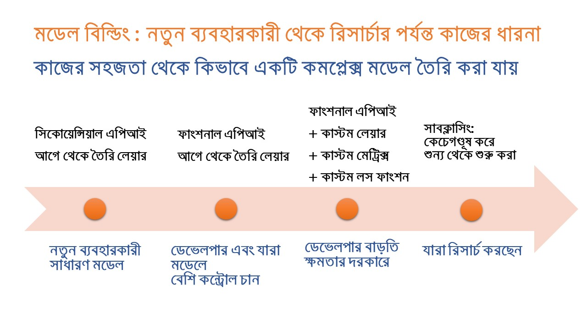

# বইটা কিভাবে ব্যবহার করবেন?

> Machine learning is concept heavy and code light.


বাংলায় ডিপ লার্নিং এই বইটা নতুন হওয়ায় এর উপর এক্সপেকটেশন থাকাটাই স্বাভাবিক। আমি চেষ্টা করেছি যাতে ডিপ লার্নিংকে আমাদের নিজস্ব কাজে লাগানো যায় - সেকারণে বইটা শুরু হয়েছে সব বেসিক ধারণা দিয়ে। বেসিক ধারণা হবার পর এসেছি কাজে লাগে এমন অ্যাপ্লিকেশন, যেমন ন্যাচারাল ল্যাঙ্গুয়েজ প্রসেসিংয়ে \(এনএলপি\)। আর এই এনএলপি কাজ করবে বাংলা ভাষায়। শেষে একটা মডেলকে মোবাইল অ্যাপে চালানোর ধারণা দেবো হাতেকলমে। 


১. বইটা পড়তে হবে একদম শুরু থেকে শেষ পর্যন্ত। চ্যাপ্টারগুলো রিলেটেড। বাদ দেয়া যাবে না।

২. যে চ্যাপ্টারগুলোতে নোটবুক আছে, সেই চ্যাপ্টারগুলো পুরোটা লেখাই হয়েছে নোটবুকে। যেহেতু, গিটবুক এখনো নোটবুক রেন্ডার করতে পারে না, সেকারণে সেগুলোকে পাল্টে দিয়েছি মার্কডাউন ডকুমেন্টে। সেখানেও শেষ রক্ষা হয়নি। নোটবুকের মার্কডাউন কনভার্সন অতোটা ভালো নয়। সেকারণে অনুরোধ করবো - অনলাইনে নোটবুক থেকে পড়তে। তাছাড়াও নোটবুকই সবসময়ে আপডেটেড থাকছে। বই প্রিন্ট হবার পরও নোটবুক আপডেট হতে থাকবে। 

৩. বইটা অ্যাবসলিউট বিগিনারদের জন্য নয়। এই বইটা লেখা শুরু করেও বন্ধ রেখেছিলাম [পাইথন মেশিন লার্নিং](https://www.rokomari.com/book/187277/) বইটা লেখার জন্য যাতে এই বইটা ধরতে না অসুবিধা হয়। সেকারণে 'শূন্য থেকে পাইথন মেশিন লার্নিং' বইটা আবশ্যিক এই বইটা শুরু করার জন্য। 

৪. পুরো বইটাতে আমি টেন্সর-ফ্লো এর 'সিকোয়েন্সিয়াল মডেল' এপিআই ব্যবহার করেছি। কারণ, এটা দিয়েই ৯০% ডিপ লার্নিং কাজ করা যায় এখনই। সবচেয়ে বড় সুবিধা হচ্ছে জিনিসটাতে ভুল হবার সম্ভাবনা কম। স্টেপ বাই স্টেপ লেয়ারিং কনসেপ্ট। নিচের ছবিটা দেখুন। নতুন ব্যাবহারকারিদের জন্য সিকোয়েন্সিয়াল এর জন্য বিল্ট-ইন লেয়ারিং কনসেপ্ট। যারা ডিপ লার্নিং এর ওপর পুরো কন্ট্রোল নিতে চান, মানে একদম স্ক্রাচ থেকে মডেল তৈরী করবেন তাদের জন্য সাবক্লাসিং। তবে ফাংশনাল এপিআই দিয়ে মধ্যপন্থা অর্থাৎ কাস্টম লেয়ার থেকে শুরু করে কাস্টম ম্যাট্রিক্স এবং লস ফাংশন তৈরি করা সোজা। 

তবে, আমি আপনাদের বলছি - আমরা এমন কোন কাজ এখানে করতে পারিনি যার জন্য ফাংশনাল বা সাবক্লাসিং লাগছে এখুনি। বরং ফাংশনাল এবং সাব-ক্লাসিং এপিআই এ মুহূর্তে ঝামেলা বাড়াতে পারে। 


বইটার শুরুতে সেভাবে পাইথন না লাগলেও ধীরে ধীরে বইয়ের ভেতরে ঢুকতে পাইথন লাগবে। তবে পাইথনের বেশি জ্ঞান দরকার নেই। পাইথন দিয়ে টুপল, লিস্ট এক্সেস, ফাইল হ্যান্ডলিং এবং ডাইরেক্টরি অপারেশন এই জিনিসগুলো কাজে দেবে শুরুতে। পাইথন জানা মানে মেশিন লার্নিং বা ডিপ লার্নিং জানা নয়। মেশিন/ডিপ লার্নিং হচ্ছে কনসেপ্ট হেভি, কোড লাইট। 

যেহেতু পাইথনের প্রচুর প্রি-বিল্ট সাইন্টিফিক লাইব্রেরি \(নামপাই, পান্ডাজ, ম্যাটপ্লটলিব ইত্যাদি\) আছে, সেকারণে পাইথনের অনেক কমপ্লেক্সটি তারা লুকিয়ে রাখে। তবে বেসিক ফাইল হ্যান্ডলিং, টুপল, লিস্ট/ভেক্টর এক্সেস জানলে শুরু করা যায়।   


৫. বইয়ে প্রচুর নোটবুক দেয়া আছে যা চালানোর যাবে 'এন্ড টু এন্ড'। জুপিটার নোটবুক অথবা গুগল কোলাবে শুরুতে "রান অল" দিলেই শুরু থেকে শেষ পর্যন্ত চলবে কোন সমস্যা ছাড়াই। সমস্যা হলে গিটহাবে "পুল রিকোয়েস্ট" করে দেখুন। তবে, আমি চাইবো আপনি ইচ্ছেমতো পাল্টাবেন দরকারি ভ্যারিয়েবল \(আপনি কোন কিছু ভাঙবেন না!\) এবং দেখুন কোনটা আপনার জন্য ভালো রেজাল্ট নিয়ে আসে। আমাকেও খাটতে হয়েছে একটা লেভেল পর্যন্ত, সেখানে আপনাদের নিজে থেকে পরীক্ষা নিরীক্ষা অনেক বেশি বেশি ধারণা দেবে শিখতে। প্র্যাকটিস এবং প্রাকটিস, যতক্ষণ পর্যন্ত না বুঝছেন ব্যাপারটা। 

৬. আমাদের নোটবুকগুলো একবার চালানোর সময় সমস্যা হলে যেখানে সমস্যা হয়েছে সেখান থেকে আবার "রান টাইম" মেন্যু থেকে "রান আফটার" দিতে পারি। অথবা "রানটাইম রিসেট অল" করে নতুন করে শুরু করতে পারি।
 একটা ফাইল একবার ডাউনলোড হয়ে গেলে "রানটাইম রিসেট অল" করার পর আবার নতুন করে শুরু করতে হবে। 

৭. গুগোল কোলাবে নোটবুকগুলো চালানোর সময় দেখে নেবেন আপনি আগে থেকে গুগল একাউন্টে লগইন করা আছেন কিনা। লগইন করা না থাকলে লগইন করে নিন গুগল কোলাব চালানোর জন্য। নিজের পিসিতে জুপিটার নোটবুক চালানোর জন্য এটা প্রযোজ্য নয়।

