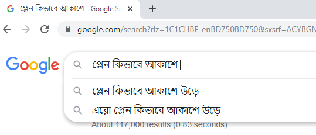
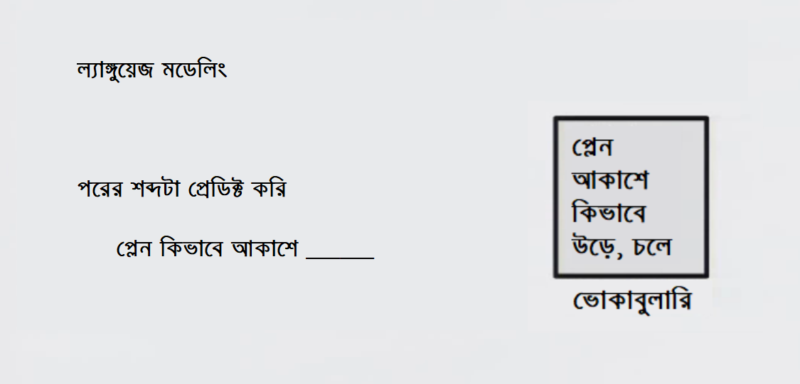
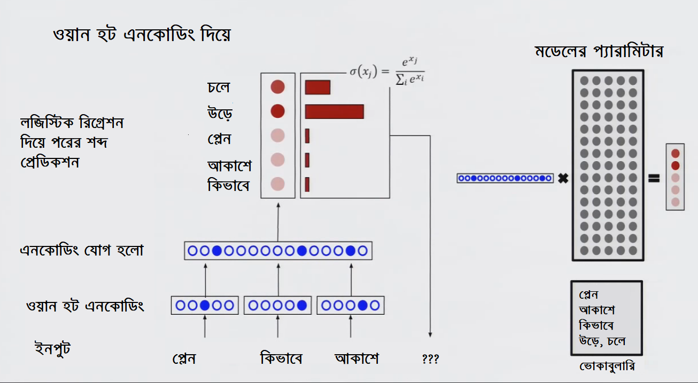
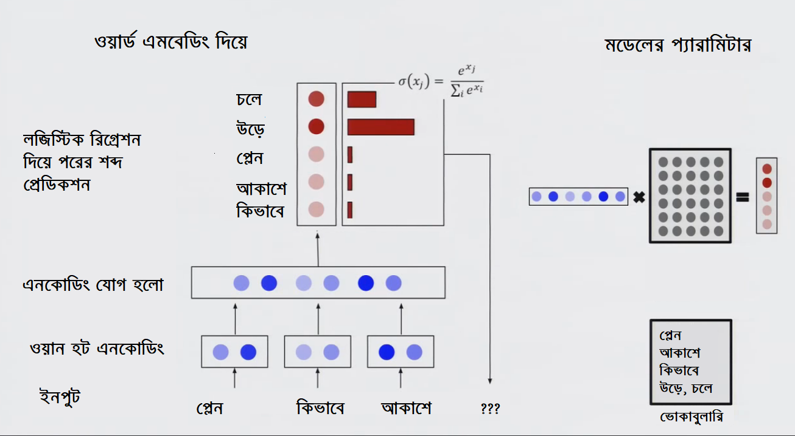

# সার্চে এমবেডিং: পরের শব্দটা কি হবে?

কোথায় নেই ওয়ার্ড এম্বেডিং এর ব্যবহার? তবে সেই গল্প দেবার আগে অন্য গল্প বলি। আমরা সবাই প্রশ্নের উত্তর খুঁজছি। প্রশ্নের পাশাপাশি বিভিন্ন প্রোডাক্ট অথবা দরকারি জিনিসপত্র খুঁজছি অনলাইনে। আগে আমরা যখন সার্চ ইঞ্জিনে প্রশ্ন করতাম, আমাদের কষ্ট কমানোর জন্য প্রশ্ন লেখার শুরুর পর থেকে অটো কমপ্লিশন ফিচার - কি প্রশ্ন করতে পারি সেটার শুরুর দেখেই পুরো প্রশ্নটাকে কমপ্লিট করত। এখন এসেছে পরের ধাপ। গুগল আপনার সচরাচর প্রশ্নের উত্তর ওয়েবসাইটে না পাঠিয়ে নিজেই উত্তর দেবার চেষ্টা করছে। আমরা দেখেছি সেই ট্রেন্ড। সেটা বাড়ছে আরো বেশি। 


জীবনের প্রশ্ন সহ অন্য অনেক প্রশ্নের উত্তর খুঁজতে আমি প্রায়ই যাই ‘কোরা’ ওয়েবসাইটে। প্রোগ্রামিং অথবা মেশিন লার্নিং নিয়ে সমস্যায় পড়লে ‘স্ট্যাক ওভারফ্লো’ ওয়েবসাইট। প্রশ্নের পাশাপাশি তারা রিকমেন্ড করে কাছাকাছি ধরনের প্রশ্নগুলোকে। ফলে দেখা যায় যে মূল প্রশ্নের উত্তরে ঠিক উত্তরটা না পেলেও অন্য প্রশ্নের উত্তরে সেটা পাওয়া যায়। এগুলো কিভাবে করছে তারা? ওয়ার্ড এম্বেডিং। আগেকার সার্চ মডেল পাল্টে যাচ্ছে এই ওয়ার্ড এম্বেডিং এর কারণে। 

আস্তে আস্তে অনেকেই জিমেইলে ফেরত আসছেন এর অসাধারণ অটো কমপ্লিশন ফিচারের কারণে। আমি বাক্যের শুরুটা কোনরকমে ধরলেই সে সাজেস্ট করছে কিভাবে পুরো বাক্যটা লিখতে হবে। ডানের অ্যারো চিহ্ন চাপলেই লেখা হয়ে যাচ্ছে পুরো বাক্যটা। ইমেইল এর মাঝখানে এবং শেষের দিকে কি ধরনের কথাগুলো লেখা হতে পারে সেগুলো বলে দিচ্ছে আগে থেকে। কিভাবে হচ্ছে এগুলো? ওয়ার্ড এম্বেডিং।


আমরা এখানে একটা উদাহরণ দেখি। আমি সার্চ করতে চাই - ‘প্লেন কিভাবে আকাশে উড়ে’? শুরু করলাম শব্দগুলো দিয়ে। দেখা গেল সে বাকিটা সাজেস্ট করছে সে। আমি ‘উড়ে’ না লিখলেও সে সাজেস্ট করছে সেটা। ডিপ লার্নিং এ ব্যাপারটা কিভাবে ঘটছে?

