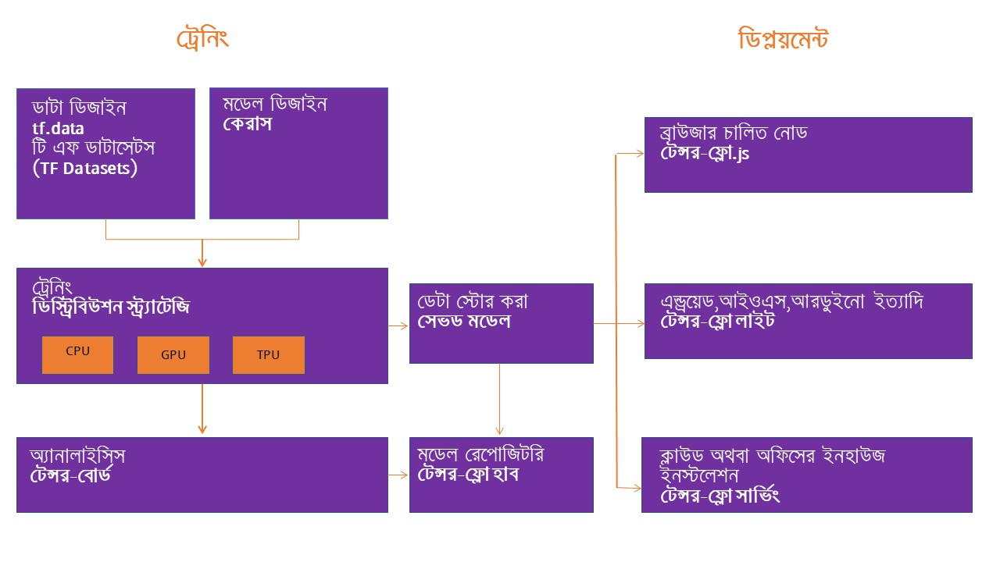

# এক নজরে 'টেন্সর-ফ্লো' ইকো-সিস্টেম

অনেকে বলেন ডিপ লার্নিং ফ্রেমওয়ার্কে টেন্সর-ফ্লো ছাড়া কি কিছু নেই? অবশ্যই আছে। তবে, 'লিপ অফ ফেইথ' থেকে আমাদেরকে একটা বেছে নিতে হবে। কারণ - যেতে হবে বহুদূর। সময় কম। সময় নেই হাজারো ফ্রেমওয়ার্ক শেখা। আমি নিজেও বার্নট-আউট হাজারো জিনিস শিখতে গিয়ে। যেহেতু শিখতেই হবে, এক লাইনে শেখা সহজ।

সে হিসেবে গুগল সাপোর্টেড ডিপ লার্নিং ফ্রেমওয়ার্ক হিসেবে টেন্সর-ফ্লো ২.x অন্য লেভেলে চলে এসেছে। আমার প্রচুর বন্ধুবান্ধব এবং সিলিকন ভ্যালির কোম্পানিগুলোর মধ্যে জানাশোনা থাকায় পাশাপাশি ডিপ লার্নিং বুটক্যাম্পে দেখেছি কেন টেন্সর-ফ্লো এখনো সেরা। সেটা আমরা শিখতে শিখতে জানবো। 

আজকের আলাপ টেন্সর-ফ্লো ইকো-সিস্টেম। 

ডিপ লার্নিং শেখার শুরুতে আমাদের টেন্সর-ফ্লো এর হাই লেভেল ইকোসিস্টেম দেখা উচিত। তবে সবকিছুর শুরুতেই ট্রেনিং।  ট্রেনিং এ ডেটা কিভাবে আসবে? ডেটাকে কিভাবে ইনপুট হিসেবে ব্যবহার , করে সেটাকে প্রসেস করবো? সেজন্য এসেছে tf.data এপিআই, যা ডেটার এই কমপ্লেক্স ইনপুট পাইপলাইনকে ঝামেলা ছাড়াই এগ্রিগেট করে যার জন্য যেই প্রসেসিং প্রযোজ্য সেটা করে ছেড়ে দেবে। এখন অনেকে বলতে পারেন ডেটা পাইপলাইন কি?

সফটওয়্যার ইন্ডাস্ট্রিতে একসারিতে থাকা ডাটা প্রসেসিং কম্পোনেন্টগুলোর সিকোয়েন্সকে ডাটা পাইপলাইন বলে সবাই। মেশিন লার্নিং কাজে এই পাইপলাইন ব্যবহার খুবই কমন একটা ব্যাপার। মেশিন লার্নিং সিকোয়েন্সে আমাদের আগের ডাটা সোর্স থেকে ডাটাকে ‘অন দ্য ফ্লাই’ ম্যানিপুলেট করতে হয়। এর পাশাপাশি সেই ডাটাগুলোকে বেশ কিছু ট্রানসফর্মেশন মধ্যে দিয়ে গিয়ে পরের স্টেজে পাঠাতে হয়। 

মেশিন লার্নিং এর কম্পোনেন্টগুলো সাধারণত একটার পর আরেকটা থাকে - মানে একটার কাজ শেষ হলে আরেকটা কাজ শুরু হয়। এখানে প্রতিটা কম্পনেন্ট বেশ বড় ডাটাকে পুল করে নিয়ে আসে আগের ডাটা স্টোর থেকে। সেটাকে প্রসেস করে তার দরকার মতো ভাগ করে সেগুলোকে পাঠিয়ে দেয় পরবর্তী ডাটা স্টোরে। সেখান থেকে তার পাইপলাইনের পরবর্তী কম্পনেন্ট সেই ডাটাকে প্রসেস করে তার আউটপুটকে পাঠিয়ে দেয় পরবর্তী ডাটা স্টোরে। আমরা দেখেছি এখানে প্রতিটা কম্পনেন্ট অনেকটাই ‘সেল্ফ কনটেইন্ড’, নিজের মধ্যে কাজটা করে রেখে দিতে পারে।

 দুটো উদাহরণ দেই। 

একটা ইমেজ মডেলের পাইপলাইন কেমন হতে পারে? শুরুতে ফাইলগুলো একটা ডিস্ট্রিবিউটেড ফাইল সিস্টেম থেকে এগ্রিগেট হয়ে আসতে পারে। প্রতিটা ইমেজ এর ওপর দরকারি প্রসেসিং, পাশাপাশি দৈবচয়নের ভিত্তিতে সেই ইমেজগুলোকে ‘সাফলিং’ এবং প্রসেসিং এর সুবিধা নিতে বিভিন্ন ব্যাচে ভাগ করে ট্রেনিংয়ের জন্য উপযুক্ত করে শেষে ওই ট্রেনিং এ পাঠানো - সেই ইনপুট পাইপলাইনের কাজ হতে পারে। 

আচ্ছা, একটা টেক্সট মডেলের ইনপুট পাইপলাইন দেখতে কেমন হবে? শুরুতে প্রি-প্রসেসিং হিসেবে টেক্সট ডাটা থেকে বিভিন্ন ‘সিম্বল’ আলাদাভাবে এক্সট্রাক্ট করতে হতে পারে। এরপর সেই টেক্সটগুলোকে এম্বেডিং ভেক্টরে কনভার্ট করার জন্য লুকআপ টেবিল থেকে দরকারি ডাটা নিয়ে এসে তার প্রয়োজনীয় ব্যাচিংয়ের জন্য তৈরি করা। ওখানে সেই ব্যাচ তৈরি করার জন্য বিভিন্ন দৈর্ঘ্যের সিকোয়েন্সকে ম্যাচিং করানো দরকার পড়ে। 

সত্যি বলতে - এই টিএফ.ডাটা এপিআই এত বড় বড় ডাটার ইনপুট পাইপলাইন একাই হ্যান্ডেল করতে পারে। পাশাপাশি বিভিন্ন ডাটা ফরম্যাটকে পড়ে তার জন্য প্রয়োজনীয় ট্রানসফর্মেশন করে দেয় এই পাইপলাইনে। আমাদের tf.data এপিআই এর মধ্যে tf.data.Dataset আছে যার মধ্যে অনেকগুলো কম্পোনেন্ট একেকটা ডাটাসেট তৈরি এবং ব্যবহারে সাহায্য করছে। খানিকটা একটা ইউনিফাইড ডেটাসেট এপিআই। 

এখন আসি আসল ট্রেনিংয়ের মডেল ডিজাইনে। 

মডেল ডিজাইনের জন্য আমরা সরাসরি টেন্সর-ফ্লো এর সাথে যোগাযোগ করবো না। যেহেতু টেন্সর-ফ্লো ফ্রেমওয়ার্ক অনেক শক্তিশালী সে কারণে সরাসরি টেন্সর-ফ্লো এর ইন্টারফেস ঝামেলাপূর্ন বলে কাজ করা কঠিন। তাই আমরা একটা হাই লেভেল এপিআই ব্যবহার করব যাতে নতুন ব্যবহারকারীদের কাছে জিনিসটা সহজ মনে হয়। সেই হাই লেভেল অ্যাপ্লিকেশন হচ্ছে কেরাস।

এখন আসি ট্রেনিং ডিস্ট্রিবিউশন স্ট্রাটেজি নিয়ে। tf.distribute.Strategy হচ্ছে টেন্সর-ফ্লো এর একটা এপিআই যার মাধ্যমে অনেকগুলো সিপিইউ, জিপিইউ, অথবা টিপিইউ \(টেন্সর প্রসেসিং ইউনিট\) এর উপর ট্রেনিং চালানো যায়। পাশাপাশি একটা মেশিন নয় বরং অনেকগুলো মেশিনে একসাথে এই ট্রেনিং চালানো কোন সমস্যাই নয়। কেরাস এর মত হাই লেভেল এপিআই দিয়ে এ ধরনের বিভিন্ন রিসোর্স ব্যবহার করে ডিস্ট্রিবিউটেড ট্রেনিং করানো বেশ সহজ। এই জন্য টেন্সর-ফ্লো অসাধারণ, কারণ গুগলের সবচেয়ে বড় বড় সার্ভিস চলছে হাজারো মেশিনে। 

ট্রেনিং এর সময় মডেল ভালো কাজ করলো নাকি খারাপ করলো সেটাকে মনিটর করার জন্য দরকার কিছু ভিজুয়ালাইজেশন টুল। সে দিক থেকে টেন্সর-বোর্ড অসাধারণ। ট্রেনিং এর সময় যে লগ জেনারেট হয় সেই লগ  থেকে চমৎকার ডেটা ভিজুয়ালাইজেশন দিতে পারে এই টেন্সর-বোর্ড।

এখন আসি “সেভডমডেল” নিয়ে। আমাদের টেন্সর-ফ্লো মডেলকে বিভিন্ন সময় বিভিন্ন কাজে ব্যবহার করতে চাইলে সেটাকে একটা ইউনিভার্সাল ফরম্যাটে রাখতে পারলে কাজের সুবিধা হয়। আমাদের পুরো টেন্সর-ফ্লো প্রোগ্রামকে একটা জায়গায় ‘সেভ’ করে রাখা - যার মধ্যে ডাটার ওয়েট এবং বিভিন্ন কম্পিউটেশনাল তথ্য যদি এক জায়গায় রাখা যায় তাহলে সেটাকে ব্যবহার করা যাবে বিভিন্ন সিচুয়েশনে। মজার কথা হচ্ছে, এসব ক্ষেত্রে আমাদের অরিজিনাল মডেল তৈরি করার কোড দরকার হচ্ছে না। তাকে রান করানোর জন্য যা দরকার সেটা থাকছে এর ভেতরে। ফলে এই ফরম্যাটে মডেল শেয়ার করা অথবা অন্য কোথাও ডেপ্লয় করা খুব সহজ। এই  সেভডমডেল আমাদের টেন্সর-ফ্লো লাইট, টেন্সর-ফ্লো জাভাস্ক্রিপ্ট \(ব্রাউজারে চলার জন্য\) টেন্সর-ফ্লো সার্ভিং অথবা টেন্সর-ফ্লো হাবে ব্যবহার করার জন্য লাগবে। এই সব সার্ভিস নিয়ে একটু পরেই আলাপ করছি। একই ফরম্যাটে চলে সব জায়গায়। 

এখন টেন্সর-ফ্লো হাব নিয়ে কথা বলছি। মনে আছে ডকার হাবের কথা? ডকারের রিইউজেবল মডিউলের অনলাইন লাইব্রেরি হচ্ছে ডকার হাব। আমার পছন্দ মতো দরকারি প্ল্যাটফর্ম - প্রয়োজনীয় লাইব্রেরি সহ ডাউনলোড করে নিতে পারি  ডকার হাব থেকে। সেটা হবে না কেন মেশিন লার্নিং এর ক্ষেত্রে? ঠিক ধরেছেন। মেশিন লার্নিং মডেলের বিভিন্ন রিইউজেজেবল অংশ নিয়ে তৈরি হয়েছে টেন্সর-ফ্লো হাব। এই মডিউলগুলো হচ্ছে ‘সেলফ কন্টেইনড’ প্রোগ্রামের একটা অংশ যার মধ্যে টেন্সর ফ্লো গ্রাফ, তার অ্যাসোসিয়েটেড ওয়েট, দরকারি অ্যাসেটগুলোকে পুড়ে ব্যবহার করা যাবে ট্রান্সফার লার্নিং দিয়ে। সামনে ট্রান্সফার লার্নিং নিয়ে আলাপ করবো। এর দরকারি মডিউলের মিলনমেলা হচ্ছে টেন্সর-ফ্লো হাব। আমাদের পছন্দমতো মডিউল খুঁজতে চলে যাবো এই টেন্সর-ফ্লো হাব মডেল রিপোজিটরিতে। 

মডেলকে পুরোপুরি ব্রাউজারে চালাতে গেলে TensorFlow.js একটা অসাধারণ লাইব্রেরি। অনেক সময় মেশিন লার্নিং মডেলকে সার্ভারে না পাঠিয়ে শুধুমাত্র ব্রাউজারে চালানো সম্ভব। এর অর্থ হচ্ছে মেশিন লার্নিং মডেলকে ডেপ্লয় করা যায় জাভাস্ক্রিপ্টে। মডেলকে সরাসরি ব্রাউজারে চালানোর পাশাপাশি Node.js এ চালানো যায়। 

এখন আসি মজার কাজে।  ডিপ লার্নিং এর ট্রেনিং এর সময় যত প্রসেসিং পাওয়ার লাগে, তবে একটা মডেল তৈরি হয়ে গেলে সেটার ‘ইনফারেন্স’ থেকে বিভিন্ন প্রেডিকশন বা দরকারি এপিআই দিয়ে কোয়েরি করতে সেরকম প্রসেসিং পাওয়ার লাগে না বললেই চলে। সে কারণে টেন্সর-ফ্লো এর একটা স্ট্রিপ-ডাউন ভার্শন আছে যা মোবাইল ফোন থেকে শুরু করে ছোটখাটো আইওটি ডিভাইস এ ব্যবহার করা যায়। আরডুইনোর মত ছোটখাটো প্রসেসিং করা সম্ভব এই ‘টেন্সর-ফ্লো লাইট’ নামের ভার্সন দিয়ে। এর মানে হচ্ছে এন্ড্রয়েডে একটা আলাদা ফ্রেমওয়ার্ক ফায়ারবেজ এ ‘এম এল কিট’ অসাধারণ। ‘কোটলিন’ এর পাশাপাশি আইওএস ডিভাইসগুলোতে এই জিনিস চলছে অনেকদিন ধরেই। আমাদের হাতের মোবাইল ফোনগুলোতে যত অ্যাপ দেখছেন সেগুলোর অধিকাংশই ব্যবহার করছে টেন্সর-ফ্লো লাইটের কিছু ভেরিয়েন্ট।

শেষে আসি ‘টেন্সর-ফ্লো সার্ভিং’ নিয়ে। 

মেশিন লার্নিং মডেল বানালাম কিন্তু সেই মেশিন লার্নিং মডেলগুলোকে প্রোডাকশন এনভারমেন্টে চালাতে গেলে সেটাকে একটা সার্ভার বা ‘সার্ভিং সিস্টেমে’র মধ্যে যেতে হবে। টেন্সর-ফ্লো সার্ভিং একই সার্ভার আর্কিটেকচার এবং এপিআইকে ঠিক রেখে নতুন একটা প্রোডাকশন এনভায়রনমেন্টে কাজ করতে পারে। ধরুন, আমরা মাইক্রো সার্ভিস হিসেবে ‘ফ্লাস্ক’ ব্যবহার করতাম টেন্সর-ফ্লো এর সাথে। এখন আলাদা কোন এনভায়রনমেন্ট লাগবেনা ফ্লাস্কের মত - যা শুধুমাত্র টেন্সর-ফ্লো সার্ভিং দিয়ে করা সম্ভব। এই বইয়ে আমরা বেশকিছু এপিআই দিয়ে সার্ভিং মডেলে কাজ করে দেখিয়েছি।

