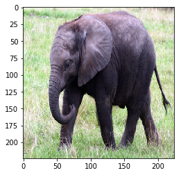

## ‘প্রি-ট্রেইনড’ মডেল এবং তার ব্যবহার

ডিপ লার্নিং এর যে অংশটা পৃথিবী কাঁপাচ্ছে সেটা হচ্ছে ‘ট্রান্সফার লার্নিং’। তবে ‘ট্রান্সফার লার্নিং’ শেখার আগে আমাদের জানতে হবে ‘প্রি-ট্রেইনড’ মডেল কি? কেন ‘প্রি-ট্রেইনড’ মডেলের দরকার পড়লো? তার আগে একটা প্রশ্ন করি? আমরা যখন বিভিন্ন মডেলকে ট্রেইন করছিলাম, আপনি দেখছেন যে মডেলগুলো ট্রেইন করতে বেশ সময় লাগছে। বড় বড় মডেল ট্রেইন করতে পুরো দিন - অনেক সময় সপ্তাহ লেগে যায়। এখন যদি আমাদেরকে প্রতিবারই মডেলকে ট্রেইন করে নিতে হয় কাজের শুরুতে - তাহলে মডেল থেকে আউটপুট নিয়ে কাজ করবো কখন? এতে প্রচুর সময়ের অপচয় হবে। 

এর পাশাপাশি আমাদের কাছে সেই মডেলকে ‘ট্রেইন’ করার মত সে ধরনের রিসোর্স নাও থাকতে পারে। এই ধরনের কম্পিউটেশনাল হেভি কাজের জন্য ছোট ছোট মেশিন - যেমন মোবাইল ফোন এবং খুব অল্প প্রসেসর যুক্ত ডিভাইস যেমন ‘স্মার্ট-ওয়াচ’, ‘হিট সেন্সর’, গুগল কোরালের মতো ডিভাইস  - সেখানে মেশিন লার্নিং ব্যবহার করা সম্ভব হতো না যদি আমাদের কাছে এই ধরনের ‘প্রি-ট্রেইনড’ মডেল প্রযুক্তি না আসতো। মডেল ট্রেইন হবে বিশাল বিশাল মেশিনে, কিন্তু দরকারের ইনফারেন্স চলবে এই ছোট্ট ছোট্ট ডিভাইসে। একটা ‘প্রি-ট্রেইনড’ মডেল হচ্ছে এমন একটা স্টোরকৃত, (মেমোরিতে ‘সেভ’ করা) নিউরাল নেটওয়ার্ক এর একটা কপি যা আগে ট্রেইন করা হয়েছে বিশাল ডাটাসেটের বিলিয়ন ফিচারের ওপর। 

এর অর্থ হচ্ছে কোটি কোটি ফিচার সমৃদ্ধ ডাটাসেটের উপর ট্রেইন করা মডেল চালানো যাবে আমাদের হাতের কাছের লো-কম্পিউটেশন সম্মৃদ্ধ ডিভাইসগুলোর উপর। যেহেতু এই মডেলগুলো আগে থেকে তাদের ফিচার ম্যাপগুলো শিখছে, সে কারণে এই প্রি-ট্রেইনড মডেলগুলোকে চালানো যাচ্ছে আগের ট্রেনিং এর অংশের পর থেকে। 

## ‘ট্রান্সফার লার্নিং’ কেন?

এই ‘ট্রান্সফার লার্নিং’ (সামনে বলছি) এর জন্য যখন একটা মডেলকে ট্রেইন করা হয়েছিল একটা কাজের জন্য - এখন সেটাকে ব্যবহার করা যাচ্ছে অন্যান্য কাজে। ব্যাপারটা এরকম যে - একটা মডেল, যাকে নির্দিষ্ট একটা কাজের জন্য ট্রেইন করা হলেও সেটাকে নতুন করে অন্য কাজের জন্য তার প্যারামিটারগুলোকে ‘এডজাস্ট’ এবং ‘ফাইন টিউনিং’ করা যাচ্ছে একেবারে গোড়া থেকে নতুন মডেল ট্রেইন না করেও। এই যে একটা মডেলকে ট্রেইন করা হয়েছে একটা কাজের জন্য, সেটাকে এখন ব্যবহার করা যাচ্ছে অনান্য কাজের জন্য সেটাকে আমরা বলতে পারি ‘প্রি-ট্রেইনড’ মডেল। 

আমাদের ‘কেরাস’ এ এই ‘প্রি-ট্রেইনড’ মডেলগুলো আছে ‘অ্যাপ্লিকেশন’ হিসেবে। ধরা যাক একটা ‘ইমেজনেট’ ডাটাসেটে যে অ্যাপ্লিকেশন আছে - সে প্রায় ১০০০ ক্যাটাগরি বা ক্লাসে বিভিন্ন ইমেজকে ক্লাসিফাই করতে পারে। এই ‘প্রি-ট্রেইনড’ মডেলগুলো আছে দু'ভাগে, একটা মডেল আর্কিটেকচার হিসেবে, আরেকটা মডেল ওয়েট এ। মডেল আর্কিটেকচারগুলো সাধারণতঃ ডাউনলোড হয়ে থাকে কেরাস ইনস্টলেশনের সময়। এখন কেরাস কিন্তু টেন্সর-ফ্লো এর ইন্টেগ্রাল পার্ট। তবে মডেলের ওয়েটগুলো অনেক বড় বড় সাইজের ফাইল হওয়াতে সেটা ডাউনলোড হয় যখন আমরা একটা মডেলকে ইনস্ট্যান্সিয়েট করি।

 যেহেতু এই  ‘প্রি-ট্রেইনড’ মডেলগুলো পাওয়া যায় তাদের ‘প্রি-ট্রেইনড’ ওয়েট সহ, এ কারণেই এই মডেলগুলোকে ব্যবহার করা যায় বিভিন্ন ‘আউট অফ দ্যা বক্স’ প্রেডিকশন অথবা ফিচার এক্সট্রাকশন এবং নতুন একটা মডেলের ফাইন টিউনিং এ। আবারো বলছি, আমরা এই মডেলগুলোকে যে কাজের জন্য ট্রেইন করা হয়েছিল সেটা না করে অন্য কাজে ব্যবহার করার ধারণাটাই হচ্ছে ট্রান্সফার লার্নিং। সেটা নিয়ে বিস্তারিত আলাপ করব সামনের চ্যাপ্টারে।


```python
# যেহেতু কেরাস এখন টেন্সর-ফ্লো এর ইন্টিগ্রাল পার্ট, একে টেন্সর-ফ্লো থেকে নিয়ে আসছি

from tensorflow.keras.applications.resnet50 import ResNet50
from tensorflow.keras.preprocessing import image
from tensorflow.keras.applications.resnet50 import preprocess_input
import numpy as np
```


```python
# আমরা ওয়েট সহ মডেলকে ইনস্ট্যান্সিয়েট করছি

model = ResNet50(weights='imagenet')
# যদি Inception_V3 মডেল লোড করতাম
# from tensorflow.keras.applications import inception_v3
# inception_model = inception_v3.InceptionV3(weights=’imagenet’)
```

    WARNING:tensorflow:From /usr/local/lib/python3.6/dist-packages/tensorflow_core/python/ops/resource_variable_ops.py:1630: calling BaseResourceVariable.__init__ (from tensorflow.python.ops.resource_variable_ops) with constraint is deprecated and will be removed in a future version.
    Instructions for updating:
    If using Keras pass *_constraint arguments to layers.
    Downloading data from https://github.com/keras-team/keras-applications/releases/download/resnet/resnet50_weights_tf_dim_ordering_tf_kernels.h5
    102973440/102967424 [==============================] - 3s 0us/step


```python
# বিশাল বড় মডেল, দেখুন প্যারামিটারের সংখ্যা ২ কোটি ৫৬ লাখের ওপর

model.summary()
```

    Model: "resnet50"
    __________________________________________________________________________________________________
    Layer (type)                    Output Shape         Param #     Connected to                     
    ==================================================================================================
    input_1 (InputLayer)            [(None, 224, 224, 3) 0                                            
    __________________________________________________________________________________________________
    conv1_pad (ZeroPadding2D)       (None, 230, 230, 3)  0           input_1[0][0]                    
    __________________________________________________________________________________________________
    conv1_conv (Conv2D)             (None, 112, 112, 64) 9472        conv1_pad[0][0]                  
    __________________________________________________________________________________________________
    conv1_bn (BatchNormalization)   (None, 112, 112, 64) 256         conv1_conv[0][0]                 
    __________________________________________________________________________________________________
    conv1_relu (Activation)         (None, 112, 112, 64) 0           conv1_bn[0][0]                   
    __________________________________________________________________________________________________
    pool1_pad (ZeroPadding2D)       (None, 114, 114, 64) 0           conv1_relu[0][0]                 
    __________________________________________________________________________________________________
    pool1_pool (MaxPooling2D)       (None, 56, 56, 64)   0           pool1_pad[0][0]                  
    __________________________________________________________________________________________________
    conv2_block1_1_conv (Conv2D)    (None, 56, 56, 64)   4160        pool1_pool[0][0]                 
    __________________________________________________________________________________________________
    conv2_block1_1_bn (BatchNormali (None, 56, 56, 64)   256         conv2_block1_1_conv[0][0]        
    __________________________________________________________________________________________________
    conv2_block1_1_relu (Activation (None, 56, 56, 64)   0           conv2_block1_1_bn[0][0]          
    __________________________________________________________________________________________________
    conv2_block1_2_conv (Conv2D)    (None, 56, 56, 64)   36928       conv2_block1_1_relu[0][0]        
    __________________________________________________________________________________________________
    conv2_block1_2_bn (BatchNormali (None, 56, 56, 64)   256         conv2_block1_2_conv[0][0]        
    __________________________________________________________________________________________________
    conv2_block1_2_relu (Activation (None, 56, 56, 64)   0           conv2_block1_2_bn[0][0]          
    __________________________________________________________________________________________________
    conv2_block1_0_conv (Conv2D)    (None, 56, 56, 256)  16640       pool1_pool[0][0]                 
    __________________________________________________________________________________________________
    conv2_block1_3_conv (Conv2D)    (None, 56, 56, 256)  16640       conv2_block1_2_relu[0][0]        
    __________________________________________________________________________________________________
    conv2_block1_0_bn (BatchNormali (None, 56, 56, 256)  1024        conv2_block1_0_conv[0][0]        
    __________________________________________________________________________________________________
    conv2_block1_3_bn (BatchNormali (None, 56, 56, 256)  1024        conv2_block1_3_conv[0][0]        
    __________________________________________________________________________________________________
    conv2_block1_add (Add)          (None, 56, 56, 256)  0           conv2_block1_0_bn[0][0]          
                                                                     conv2_block1_3_bn[0][0]          
    __________________________________________________________________________________________________
    conv2_block1_out (Activation)   (None, 56, 56, 256)  0           conv2_block1_add[0][0]           
    __________________________________________________________________________________________________
    conv2_block2_1_conv (Conv2D)    (None, 56, 56, 64)   16448       conv2_block1_out[0][0]           
    __________________________________________________________________________________________________
    conv2_block2_1_bn (BatchNormali (None, 56, 56, 64)   256         conv2_block2_1_conv[0][0]        
    __________________________________________________________________________________________________
    conv2_block2_1_relu (Activation (None, 56, 56, 64)   0           conv2_block2_1_bn[0][0]          
    __________________________________________________________________________________________________
    conv2_block2_2_conv (Conv2D)    (None, 56, 56, 64)   36928       conv2_block2_1_relu[0][0]        
    __________________________________________________________________________________________________
    conv2_block2_2_bn (BatchNormali (None, 56, 56, 64)   256         conv2_block2_2_conv[0][0]        
    __________________________________________________________________________________________________
    conv2_block2_2_relu (Activation (None, 56, 56, 64)   0           conv2_block2_2_bn[0][0]          
    __________________________________________________________________________________________________
    conv2_block2_3_conv (Conv2D)    (None, 56, 56, 256)  16640       conv2_block2_2_relu[0][0]        
    __________________________________________________________________________________________________
    conv2_block2_3_bn (BatchNormali (None, 56, 56, 256)  1024        conv2_block2_3_conv[0][0]        
    __________________________________________________________________________________________________
    conv2_block2_add (Add)          (None, 56, 56, 256)  0           conv2_block1_out[0][0]           
                                                                     conv2_block2_3_bn[0][0]          
    __________________________________________________________________________________________________
    conv2_block2_out (Activation)   (None, 56, 56, 256)  0           conv2_block2_add[0][0]           
    __________________________________________________________________________________________________
    conv2_block3_1_conv (Conv2D)    (None, 56, 56, 64)   16448       conv2_block2_out[0][0]           
    __________________________________________________________________________________________________
    conv2_block3_1_bn (BatchNormali (None, 56, 56, 64)   256         conv2_block3_1_conv[0][0]        
    __________________________________________________________________________________________________
    conv2_block3_1_relu (Activation (None, 56, 56, 64)   0           conv2_block3_1_bn[0][0]          
    __________________________________________________________________________________________________
    conv2_block3_2_conv (Conv2D)    (None, 56, 56, 64)   36928       conv2_block3_1_relu[0][0]        
    __________________________________________________________________________________________________
    conv2_block3_2_bn (BatchNormali (None, 56, 56, 64)   256         conv2_block3_2_conv[0][0]        
    __________________________________________________________________________________________________
    conv2_block3_2_relu (Activation (None, 56, 56, 64)   0           conv2_block3_2_bn[0][0]          
    __________________________________________________________________________________________________
    conv2_block3_3_conv (Conv2D)    (None, 56, 56, 256)  16640       conv2_block3_2_relu[0][0]        
    __________________________________________________________________________________________________
    conv2_block3_3_bn (BatchNormali (None, 56, 56, 256)  1024        conv2_block3_3_conv[0][0]        
    __________________________________________________________________________________________________
    conv2_block3_add (Add)          (None, 56, 56, 256)  0           conv2_block2_out[0][0]           
                                                                     conv2_block3_3_bn[0][0]          
    __________________________________________________________________________________________________
    conv2_block3_out (Activation)   (None, 56, 56, 256)  0           conv2_block3_add[0][0]           
    __________________________________________________________________________________________________
    conv3_block1_1_conv (Conv2D)    (None, 28, 28, 128)  32896       conv2_block3_out[0][0]           
    __________________________________________________________________________________________________
    conv3_block1_1_bn (BatchNormali (None, 28, 28, 128)  512         conv3_block1_1_conv[0][0]        
    __________________________________________________________________________________________________
    conv3_block1_1_relu (Activation (None, 28, 28, 128)  0           conv3_block1_1_bn[0][0]          
    __________________________________________________________________________________________________
    conv3_block1_2_conv (Conv2D)    (None, 28, 28, 128)  147584      conv3_block1_1_relu[0][0]        
    __________________________________________________________________________________________________
    conv3_block1_2_bn (BatchNormali (None, 28, 28, 128)  512         conv3_block1_2_conv[0][0]        
    __________________________________________________________________________________________________
    conv3_block1_2_relu (Activation (None, 28, 28, 128)  0           conv3_block1_2_bn[0][0]          
    __________________________________________________________________________________________________
    conv3_block1_0_conv (Conv2D)    (None, 28, 28, 512)  131584      conv2_block3_out[0][0]           
    __________________________________________________________________________________________________
    conv3_block1_3_conv (Conv2D)    (None, 28, 28, 512)  66048       conv3_block1_2_relu[0][0]        
    __________________________________________________________________________________________________
    conv3_block1_0_bn (BatchNormali (None, 28, 28, 512)  2048        conv3_block1_0_conv[0][0]        
    __________________________________________________________________________________________________
    conv3_block1_3_bn (BatchNormali (None, 28, 28, 512)  2048        conv3_block1_3_conv[0][0]        
    __________________________________________________________________________________________________
    conv3_block1_add (Add)          (None, 28, 28, 512)  0           conv3_block1_0_bn[0][0]          
                                                                     conv3_block1_3_bn[0][0]          
    __________________________________________________________________________________________________
    conv3_block1_out (Activation)   (None, 28, 28, 512)  0           conv3_block1_add[0][0]           
    __________________________________________________________________________________________________
    conv3_block2_1_conv (Conv2D)    (None, 28, 28, 128)  65664       conv3_block1_out[0][0]           
    __________________________________________________________________________________________________
    conv3_block2_1_bn (BatchNormali (None, 28, 28, 128)  512         conv3_block2_1_conv[0][0]        
    __________________________________________________________________________________________________
    conv3_block2_1_relu (Activation (None, 28, 28, 128)  0           conv3_block2_1_bn[0][0]          
    __________________________________________________________________________________________________
    conv3_block2_2_conv (Conv2D)    (None, 28, 28, 128)  147584      conv3_block2_1_relu[0][0]        
    __________________________________________________________________________________________________
    conv3_block2_2_bn (BatchNormali (None, 28, 28, 128)  512         conv3_block2_2_conv[0][0]        
    __________________________________________________________________________________________________
    conv3_block2_2_relu (Activation (None, 28, 28, 128)  0           conv3_block2_2_bn[0][0]          
    __________________________________________________________________________________________________
    conv3_block2_3_conv (Conv2D)    (None, 28, 28, 512)  66048       conv3_block2_2_relu[0][0]        
    __________________________________________________________________________________________________
    conv3_block2_3_bn (BatchNormali (None, 28, 28, 512)  2048        conv3_block2_3_conv[0][0]        
    __________________________________________________________________________________________________
    conv3_block2_add (Add)          (None, 28, 28, 512)  0           conv3_block1_out[0][0]           
                                                                     conv3_block2_3_bn[0][0]          
    __________________________________________________________________________________________________
    conv3_block2_out (Activation)   (None, 28, 28, 512)  0           conv3_block2_add[0][0]           
    __________________________________________________________________________________________________
    conv3_block3_1_conv (Conv2D)    (None, 28, 28, 128)  65664       conv3_block2_out[0][0]           
    __________________________________________________________________________________________________
    conv3_block3_1_bn (BatchNormali (None, 28, 28, 128)  512         conv3_block3_1_conv[0][0]        
    __________________________________________________________________________________________________
    conv3_block3_1_relu (Activation (None, 28, 28, 128)  0           conv3_block3_1_bn[0][0]          
    __________________________________________________________________________________________________
    conv3_block3_2_conv (Conv2D)    (None, 28, 28, 128)  147584      conv3_block3_1_relu[0][0]        
    __________________________________________________________________________________________________
    conv3_block3_2_bn (BatchNormali (None, 28, 28, 128)  512         conv3_block3_2_conv[0][0]        
    __________________________________________________________________________________________________
    conv3_block3_2_relu (Activation (None, 28, 28, 128)  0           conv3_block3_2_bn[0][0]          
    __________________________________________________________________________________________________
    conv3_block3_3_conv (Conv2D)    (None, 28, 28, 512)  66048       conv3_block3_2_relu[0][0]        
    __________________________________________________________________________________________________
    conv3_block3_3_bn (BatchNormali (None, 28, 28, 512)  2048        conv3_block3_3_conv[0][0]        
    __________________________________________________________________________________________________
    conv3_block3_add (Add)          (None, 28, 28, 512)  0           conv3_block2_out[0][0]           
                                                                     conv3_block3_3_bn[0][0]          
    __________________________________________________________________________________________________
    conv3_block3_out (Activation)   (None, 28, 28, 512)  0           conv3_block3_add[0][0]           
    __________________________________________________________________________________________________
    conv3_block4_1_conv (Conv2D)    (None, 28, 28, 128)  65664       conv3_block3_out[0][0]           
    __________________________________________________________________________________________________
    conv3_block4_1_bn (BatchNormali (None, 28, 28, 128)  512         conv3_block4_1_conv[0][0]        
    __________________________________________________________________________________________________
    conv3_block4_1_relu (Activation (None, 28, 28, 128)  0           conv3_block4_1_bn[0][0]          
    __________________________________________________________________________________________________
    conv3_block4_2_conv (Conv2D)    (None, 28, 28, 128)  147584      conv3_block4_1_relu[0][0]        
    __________________________________________________________________________________________________
    conv3_block4_2_bn (BatchNormali (None, 28, 28, 128)  512         conv3_block4_2_conv[0][0]        
    __________________________________________________________________________________________________
    conv3_block4_2_relu (Activation (None, 28, 28, 128)  0           conv3_block4_2_bn[0][0]          
    __________________________________________________________________________________________________
    conv3_block4_3_conv (Conv2D)    (None, 28, 28, 512)  66048       conv3_block4_2_relu[0][0]        
    __________________________________________________________________________________________________
    conv3_block4_3_bn (BatchNormali (None, 28, 28, 512)  2048        conv3_block4_3_conv[0][0]        
    __________________________________________________________________________________________________
    conv3_block4_add (Add)          (None, 28, 28, 512)  0           conv3_block3_out[0][0]           
                                                                     conv3_block4_3_bn[0][0]          
    __________________________________________________________________________________________________
    conv3_block4_out (Activation)   (None, 28, 28, 512)  0           conv3_block4_add[0][0]           
    __________________________________________________________________________________________________
    conv4_block1_1_conv (Conv2D)    (None, 14, 14, 256)  131328      conv3_block4_out[0][0]           
    __________________________________________________________________________________________________
    conv4_block1_1_bn (BatchNormali (None, 14, 14, 256)  1024        conv4_block1_1_conv[0][0]        
    __________________________________________________________________________________________________
    conv4_block1_1_relu (Activation (None, 14, 14, 256)  0           conv4_block1_1_bn[0][0]          
    __________________________________________________________________________________________________
    conv4_block1_2_conv (Conv2D)    (None, 14, 14, 256)  590080      conv4_block1_1_relu[0][0]        
    __________________________________________________________________________________________________
    conv4_block1_2_bn (BatchNormali (None, 14, 14, 256)  1024        conv4_block1_2_conv[0][0]        
    __________________________________________________________________________________________________
    conv4_block1_2_relu (Activation (None, 14, 14, 256)  0           conv4_block1_2_bn[0][0]          
    __________________________________________________________________________________________________
    conv4_block1_0_conv (Conv2D)    (None, 14, 14, 1024) 525312      conv3_block4_out[0][0]           
    __________________________________________________________________________________________________
    conv4_block1_3_conv (Conv2D)    (None, 14, 14, 1024) 263168      conv4_block1_2_relu[0][0]        
    __________________________________________________________________________________________________
    conv4_block1_0_bn (BatchNormali (None, 14, 14, 1024) 4096        conv4_block1_0_conv[0][0]        
    __________________________________________________________________________________________________
    conv4_block1_3_bn (BatchNormali (None, 14, 14, 1024) 4096        conv4_block1_3_conv[0][0]        
    __________________________________________________________________________________________________
    conv4_block1_add (Add)          (None, 14, 14, 1024) 0           conv4_block1_0_bn[0][0]          
                                                                     conv4_block1_3_bn[0][0]          
    __________________________________________________________________________________________________
    conv4_block1_out (Activation)   (None, 14, 14, 1024) 0           conv4_block1_add[0][0]           
    __________________________________________________________________________________________________
    conv4_block2_1_conv (Conv2D)    (None, 14, 14, 256)  262400      conv4_block1_out[0][0]           
    __________________________________________________________________________________________________
    conv4_block2_1_bn (BatchNormali (None, 14, 14, 256)  1024        conv4_block2_1_conv[0][0]        
    __________________________________________________________________________________________________
    conv4_block2_1_relu (Activation (None, 14, 14, 256)  0           conv4_block2_1_bn[0][0]          
    __________________________________________________________________________________________________
    conv4_block2_2_conv (Conv2D)    (None, 14, 14, 256)  590080      conv4_block2_1_relu[0][0]        
    __________________________________________________________________________________________________
    conv4_block2_2_bn (BatchNormali (None, 14, 14, 256)  1024        conv4_block2_2_conv[0][0]        
    __________________________________________________________________________________________________
    conv4_block2_2_relu (Activation (None, 14, 14, 256)  0           conv4_block2_2_bn[0][0]          
    __________________________________________________________________________________________________
    conv4_block2_3_conv (Conv2D)    (None, 14, 14, 1024) 263168      conv4_block2_2_relu[0][0]        
    __________________________________________________________________________________________________
    conv4_block2_3_bn (BatchNormali (None, 14, 14, 1024) 4096        conv4_block2_3_conv[0][0]        
    __________________________________________________________________________________________________
    conv4_block2_add (Add)          (None, 14, 14, 1024) 0           conv4_block1_out[0][0]           
                                                                     conv4_block2_3_bn[0][0]          
    __________________________________________________________________________________________________
    conv4_block2_out (Activation)   (None, 14, 14, 1024) 0           conv4_block2_add[0][0]           
    __________________________________________________________________________________________________
    conv4_block3_1_conv (Conv2D)    (None, 14, 14, 256)  262400      conv4_block2_out[0][0]           
    __________________________________________________________________________________________________
    conv4_block3_1_bn (BatchNormali (None, 14, 14, 256)  1024        conv4_block3_1_conv[0][0]        
    __________________________________________________________________________________________________
    conv4_block3_1_relu (Activation (None, 14, 14, 256)  0           conv4_block3_1_bn[0][0]          
    __________________________________________________________________________________________________
    conv4_block3_2_conv (Conv2D)    (None, 14, 14, 256)  590080      conv4_block3_1_relu[0][0]        
    __________________________________________________________________________________________________
    conv4_block3_2_bn (BatchNormali (None, 14, 14, 256)  1024        conv4_block3_2_conv[0][0]        
    __________________________________________________________________________________________________
    conv4_block3_2_relu (Activation (None, 14, 14, 256)  0           conv4_block3_2_bn[0][0]          
    __________________________________________________________________________________________________
    conv4_block3_3_conv (Conv2D)    (None, 14, 14, 1024) 263168      conv4_block3_2_relu[0][0]        
    __________________________________________________________________________________________________
    conv4_block3_3_bn (BatchNormali (None, 14, 14, 1024) 4096        conv4_block3_3_conv[0][0]        
    __________________________________________________________________________________________________
    conv4_block3_add (Add)          (None, 14, 14, 1024) 0           conv4_block2_out[0][0]           
                                                                     conv4_block3_3_bn[0][0]          
    __________________________________________________________________________________________________
    conv4_block3_out (Activation)   (None, 14, 14, 1024) 0           conv4_block3_add[0][0]           
    __________________________________________________________________________________________________
    conv4_block4_1_conv (Conv2D)    (None, 14, 14, 256)  262400      conv4_block3_out[0][0]           
    __________________________________________________________________________________________________
    conv4_block4_1_bn (BatchNormali (None, 14, 14, 256)  1024        conv4_block4_1_conv[0][0]        
    __________________________________________________________________________________________________
    conv4_block4_1_relu (Activation (None, 14, 14, 256)  0           conv4_block4_1_bn[0][0]          
    __________________________________________________________________________________________________
    conv4_block4_2_conv (Conv2D)    (None, 14, 14, 256)  590080      conv4_block4_1_relu[0][0]        
    __________________________________________________________________________________________________
    conv4_block4_2_bn (BatchNormali (None, 14, 14, 256)  1024        conv4_block4_2_conv[0][0]        
    __________________________________________________________________________________________________
    conv4_block4_2_relu (Activation (None, 14, 14, 256)  0           conv4_block4_2_bn[0][0]          
    __________________________________________________________________________________________________
    conv4_block4_3_conv (Conv2D)    (None, 14, 14, 1024) 263168      conv4_block4_2_relu[0][0]        
    __________________________________________________________________________________________________
    conv4_block4_3_bn (BatchNormali (None, 14, 14, 1024) 4096        conv4_block4_3_conv[0][0]        
    __________________________________________________________________________________________________
    conv4_block4_add (Add)          (None, 14, 14, 1024) 0           conv4_block3_out[0][0]           
                                                                     conv4_block4_3_bn[0][0]          
    __________________________________________________________________________________________________
    conv4_block4_out (Activation)   (None, 14, 14, 1024) 0           conv4_block4_add[0][0]           
    __________________________________________________________________________________________________
    conv4_block5_1_conv (Conv2D)    (None, 14, 14, 256)  262400      conv4_block4_out[0][0]           
    __________________________________________________________________________________________________
    conv4_block5_1_bn (BatchNormali (None, 14, 14, 256)  1024        conv4_block5_1_conv[0][0]        
    __________________________________________________________________________________________________
    conv4_block5_1_relu (Activation (None, 14, 14, 256)  0           conv4_block5_1_bn[0][0]          
    __________________________________________________________________________________________________
    conv4_block5_2_conv (Conv2D)    (None, 14, 14, 256)  590080      conv4_block5_1_relu[0][0]        
    __________________________________________________________________________________________________
    conv4_block5_2_bn (BatchNormali (None, 14, 14, 256)  1024        conv4_block5_2_conv[0][0]        
    __________________________________________________________________________________________________
    conv4_block5_2_relu (Activation (None, 14, 14, 256)  0           conv4_block5_2_bn[0][0]          
    __________________________________________________________________________________________________
    conv4_block5_3_conv (Conv2D)    (None, 14, 14, 1024) 263168      conv4_block5_2_relu[0][0]        
    __________________________________________________________________________________________________
    conv4_block5_3_bn (BatchNormali (None, 14, 14, 1024) 4096        conv4_block5_3_conv[0][0]        
    __________________________________________________________________________________________________
    conv4_block5_add (Add)          (None, 14, 14, 1024) 0           conv4_block4_out[0][0]           
                                                                     conv4_block5_3_bn[0][0]          
    __________________________________________________________________________________________________
    conv4_block5_out (Activation)   (None, 14, 14, 1024) 0           conv4_block5_add[0][0]           
    __________________________________________________________________________________________________
    conv4_block6_1_conv (Conv2D)    (None, 14, 14, 256)  262400      conv4_block5_out[0][0]           
    __________________________________________________________________________________________________
    conv4_block6_1_bn (BatchNormali (None, 14, 14, 256)  1024        conv4_block6_1_conv[0][0]        
    __________________________________________________________________________________________________
    conv4_block6_1_relu (Activation (None, 14, 14, 256)  0           conv4_block6_1_bn[0][0]          
    __________________________________________________________________________________________________
    conv4_block6_2_conv (Conv2D)    (None, 14, 14, 256)  590080      conv4_block6_1_relu[0][0]        
    __________________________________________________________________________________________________
    conv4_block6_2_bn (BatchNormali (None, 14, 14, 256)  1024        conv4_block6_2_conv[0][0]        
    __________________________________________________________________________________________________
    conv4_block6_2_relu (Activation (None, 14, 14, 256)  0           conv4_block6_2_bn[0][0]          
    __________________________________________________________________________________________________
    conv4_block6_3_conv (Conv2D)    (None, 14, 14, 1024) 263168      conv4_block6_2_relu[0][0]        
    __________________________________________________________________________________________________
    conv4_block6_3_bn (BatchNormali (None, 14, 14, 1024) 4096        conv4_block6_3_conv[0][0]        
    __________________________________________________________________________________________________
    conv4_block6_add (Add)          (None, 14, 14, 1024) 0           conv4_block5_out[0][0]           
                                                                     conv4_block6_3_bn[0][0]          
    __________________________________________________________________________________________________
    conv4_block6_out (Activation)   (None, 14, 14, 1024) 0           conv4_block6_add[0][0]           
    __________________________________________________________________________________________________
    conv5_block1_1_conv (Conv2D)    (None, 7, 7, 512)    524800      conv4_block6_out[0][0]           
    __________________________________________________________________________________________________
    conv5_block1_1_bn (BatchNormali (None, 7, 7, 512)    2048        conv5_block1_1_conv[0][0]        
    __________________________________________________________________________________________________
    conv5_block1_1_relu (Activation (None, 7, 7, 512)    0           conv5_block1_1_bn[0][0]          
    __________________________________________________________________________________________________
    conv5_block1_2_conv (Conv2D)    (None, 7, 7, 512)    2359808     conv5_block1_1_relu[0][0]        
    __________________________________________________________________________________________________
    conv5_block1_2_bn (BatchNormali (None, 7, 7, 512)    2048        conv5_block1_2_conv[0][0]        
    __________________________________________________________________________________________________
    conv5_block1_2_relu (Activation (None, 7, 7, 512)    0           conv5_block1_2_bn[0][0]          
    __________________________________________________________________________________________________
    conv5_block1_0_conv (Conv2D)    (None, 7, 7, 2048)   2099200     conv4_block6_out[0][0]           
    __________________________________________________________________________________________________
    conv5_block1_3_conv (Conv2D)    (None, 7, 7, 2048)   1050624     conv5_block1_2_relu[0][0]        
    __________________________________________________________________________________________________
    conv5_block1_0_bn (BatchNormali (None, 7, 7, 2048)   8192        conv5_block1_0_conv[0][0]        
    __________________________________________________________________________________________________
    conv5_block1_3_bn (BatchNormali (None, 7, 7, 2048)   8192        conv5_block1_3_conv[0][0]        
    __________________________________________________________________________________________________
    conv5_block1_add (Add)          (None, 7, 7, 2048)   0           conv5_block1_0_bn[0][0]          
                                                                     conv5_block1_3_bn[0][0]          
    __________________________________________________________________________________________________
    conv5_block1_out (Activation)   (None, 7, 7, 2048)   0           conv5_block1_add[0][0]           
    __________________________________________________________________________________________________
    conv5_block2_1_conv (Conv2D)    (None, 7, 7, 512)    1049088     conv5_block1_out[0][0]           
    __________________________________________________________________________________________________
    conv5_block2_1_bn (BatchNormali (None, 7, 7, 512)    2048        conv5_block2_1_conv[0][0]        
    __________________________________________________________________________________________________
    conv5_block2_1_relu (Activation (None, 7, 7, 512)    0           conv5_block2_1_bn[0][0]          
    __________________________________________________________________________________________________
    conv5_block2_2_conv (Conv2D)    (None, 7, 7, 512)    2359808     conv5_block2_1_relu[0][0]        
    __________________________________________________________________________________________________
    conv5_block2_2_bn (BatchNormali (None, 7, 7, 512)    2048        conv5_block2_2_conv[0][0]        
    __________________________________________________________________________________________________
    conv5_block2_2_relu (Activation (None, 7, 7, 512)    0           conv5_block2_2_bn[0][0]          
    __________________________________________________________________________________________________
    conv5_block2_3_conv (Conv2D)    (None, 7, 7, 2048)   1050624     conv5_block2_2_relu[0][0]        
    __________________________________________________________________________________________________
    conv5_block2_3_bn (BatchNormali (None, 7, 7, 2048)   8192        conv5_block2_3_conv[0][0]        
    __________________________________________________________________________________________________
    conv5_block2_add (Add)          (None, 7, 7, 2048)   0           conv5_block1_out[0][0]           
                                                                     conv5_block2_3_bn[0][0]          
    __________________________________________________________________________________________________
    conv5_block2_out (Activation)   (None, 7, 7, 2048)   0           conv5_block2_add[0][0]           
    __________________________________________________________________________________________________
    conv5_block3_1_conv (Conv2D)    (None, 7, 7, 512)    1049088     conv5_block2_out[0][0]           
    __________________________________________________________________________________________________
    conv5_block3_1_bn (BatchNormali (None, 7, 7, 512)    2048        conv5_block3_1_conv[0][0]        
    __________________________________________________________________________________________________
    conv5_block3_1_relu (Activation (None, 7, 7, 512)    0           conv5_block3_1_bn[0][0]          
    __________________________________________________________________________________________________
    conv5_block3_2_conv (Conv2D)    (None, 7, 7, 512)    2359808     conv5_block3_1_relu[0][0]        
    __________________________________________________________________________________________________
    conv5_block3_2_bn (BatchNormali (None, 7, 7, 512)    2048        conv5_block3_2_conv[0][0]        
    __________________________________________________________________________________________________
    conv5_block3_2_relu (Activation (None, 7, 7, 512)    0           conv5_block3_2_bn[0][0]          
    __________________________________________________________________________________________________
    conv5_block3_3_conv (Conv2D)    (None, 7, 7, 2048)   1050624     conv5_block3_2_relu[0][0]        
    __________________________________________________________________________________________________
    conv5_block3_3_bn (BatchNormali (None, 7, 7, 2048)   8192        conv5_block3_3_conv[0][0]        
    __________________________________________________________________________________________________
    conv5_block3_add (Add)          (None, 7, 7, 2048)   0           conv5_block2_out[0][0]           
                                                                     conv5_block3_3_bn[0][0]          
    __________________________________________________________________________________________________
    conv5_block3_out (Activation)   (None, 7, 7, 2048)   0           conv5_block3_add[0][0]           
    __________________________________________________________________________________________________
    avg_pool (GlobalAveragePooling2 (None, 2048)         0           conv5_block3_out[0][0]           
    __________________________________________________________________________________________________
    probs (Dense)                   (None, 1000)         2049000     avg_pool[0][0]                   
    ==================================================================================================
    Total params: 25,636,712
    Trainable params: 25,583,592
    Non-trainable params: 53,120
    __________________________________________________________________________________________________


```python
# ইন্টারনেট থেকে একটা হাতির ছবি খুঁজে বের করে আপলোড করুন 
# গুগল কোলাব অথবা জুপিটার নোটবুকে

img_path = 'elephant.jpeg'
```


```python
# load_img() ফাংশন দিয়ে একটা স্পেসিফিক পিক্সেল বলে দিচ্ছি
# কারণ, ইন্টারনেটের ছবির রেজল্যুশন নিয়ে মাথা ঘামাতে চাই না 

img = image.load_img(img_path, target_size=(224, 224))
```


```python
img
```


```python
# আমরা এই ছবিটাকে image_to_array() ফাংশন দিয়ে 
# নামপাই ফরম্যাট (উচ্চতা, দৈর্ঘ্য়, কালার চ্যানেল ৩)এ পাল্টে নিচ্ছি

img_array = image.img_to_array(img)
```


```python
img_array.shape
```


    (224, 224, 3)


```python
# ইনপুট ইমেজকে ৪ ডাইমেনশন টেন্সরে পাল্টে নিচ্ছি 
# (ব্যাচসাইজ, উচ্চতা, দৈর্ঘ্য়, কালার চ্যানেল)

img_tensor = np.expand_dims(img_array, axis=0)
```


```python
# প্রি-প্রসেস ছবিটা দেখি
import matplotlib.pyplot as plt
plt.imshow(np.uint8(img_tensor[0]))
```


    <matplotlib.image.AxesImage at 0x7f64caaff8d0>





```python
# আমরা ইমেজটাকে নরমালাইজ করি, কিছু কিছু ইমেজের 
# ভ্যালু ০ থেকে ১ অথবা -১ থেকে +১ বা ক্যাফে স্টাইলে থাকে,
# ইমেজনেট ডেটা থেকে গড় বিয়োগ দিয়ে নরমালাইজ করা যায়

x = preprocess_input(img_tensor)
```


```python
preds = model.predict(x)
```


```python
preds.shape
```


    (1, 1000)


```python
from tensorflow.keras.applications.resnet50 import decode_predictions as dpred
```


```python
dpred(preds, top=3)[0]
```

    Downloading data from https://storage.googleapis.com/download.tensorflow.org/data/imagenet_class_index.json
    40960/35363 [==================================] - 0s 0us/step


    [('n02504458', 'African_elephant', 0.6746441),
     ('n01871265', 'tusker', 0.1713463),
     ('n02504013', 'Indian_elephant', 0.1536747)]


## ‘প্রি-ট্রেইনড’ মডেল থেকে ফিচার এক্সট্রাকশন

আরেকটা উদাহরন দেখি, কেরাস এর মূল সাইটে এরকম অনেকগুলো উদাহরণ আছে। যদিও কেরাস এখন টেন্সর-ফ্লো এর সাথে চলে এসেছে, তবে কেরাসের মূল সাইটে অসাধারণ অনেক ডকুমেন্টেশন আছে, যা দরকার হবে সামনে।


```python
from tensorflow.keras.applications.vgg16 import VGG16
from tensorflow.keras.preprocessing import image
from tensorflow.keras.applications.vgg16 import preprocess_input
import numpy as np

model = VGG16(weights='imagenet', include_top=False)

img_path = 'elephant.jpeg'
img = image.load_img(img_path, target_size=(224, 224))
x = image.img_to_array(img)
x = np.expand_dims(x, axis=0)
x = preprocess_input(x)

features = model.predict(x)
```


```python
print(features)
```

    [[[[ 0.         0.         0.        ...  0.         0.
         0.       ]
       [ 0.         0.         0.        ...  0.         0.
         0.       ]
       [ 0.         0.         0.        ...  0.         0.
         0.       ]
       ...
       [ 0.         0.        38.153477  ...  0.         0.
         0.       ]
       [ 0.         0.        29.606695  ...  0.         0.
         0.       ]
       [ 0.         0.         0.        ...  0.         0.
         0.       ]]
    
      [[ 0.         0.         0.        ...  0.         0.
         0.       ]
       [ 0.         0.        19.337175  ...  0.         0.
         0.       ]
       [ 0.         0.        16.544449  ...  0.         0.
         0.       ]
       ...
       [ 0.         0.        45.221672  ...  0.         0.
         0.       ]
       [ 0.         0.        33.91113   ...  0.         0.
         0.       ]
       [ 0.         0.         0.        ...  0.         0.
         0.       ]]
    
      [[ 0.         0.         0.        ...  0.         0.
         0.       ]
       [ 0.         0.         0.        ... 51.222126   0.
         0.       ]
       [ 0.         0.         0.        ... 86.699104   0.
        18.912678 ]
       ...
       [ 0.         0.         3.1303995 ...  0.         0.
         4.8743305]
       [ 0.         0.         0.        ...  0.         0.
         0.       ]
       [ 0.         0.         0.        ...  0.         0.
         0.       ]]
    
      ...
    
      [[ 0.         0.         0.        ...  0.         0.
         0.       ]
       [ 0.         0.         0.        ... 24.347176   0.
         0.       ]
       [ 0.         0.         2.2259388 ... 40.89634    0.
         0.       ]
       ...
       [ 0.         0.         7.121018  ...  0.         0.
         0.       ]
       [ 0.         0.         0.        ...  0.         0.
         4.351259 ]
       [ 0.         0.         0.        ...  0.         0.
         0.       ]]
    
      [[ 0.         0.         0.        ...  0.         0.
         0.       ]
       [ 0.         0.         0.        ...  0.         0.
         0.       ]
       [ 0.         0.         0.        ...  0.         0.
         0.       ]
       ...
       [ 0.         0.         0.        ...  0.         0.
         0.       ]
       [ 0.         0.         0.        ...  0.         0.
         0.       ]
       [ 0.         0.         0.        ...  0.         0.
         0.       ]]
    
      [[ 0.         0.         0.        ...  0.         0.
         0.       ]
       [ 0.         0.         0.        ...  0.         0.
         0.       ]
       [ 0.         0.         0.        ...  0.         0.
         0.       ]
       ...
       [ 0.         0.         0.        ...  0.         0.
         0.       ]
       [ 0.         0.         0.        ...  0.         0.
         0.       ]
       [ 0.         0.         0.        ...  0.         0.
         0.       ]]]]


সামনের চ্যাপ্টারে আমরা আলাপ করবো ট্রান্সফার লার্নিং নিয়ে। 
