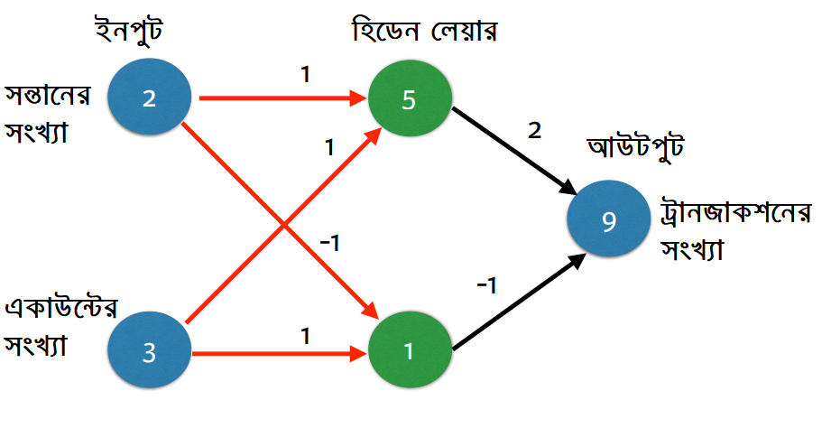
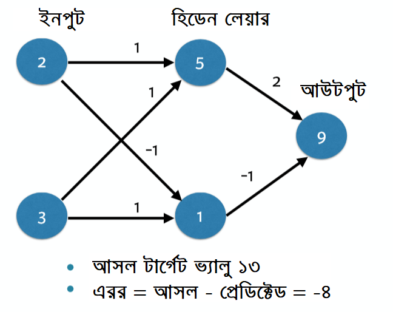
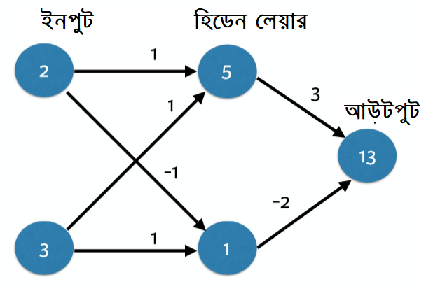
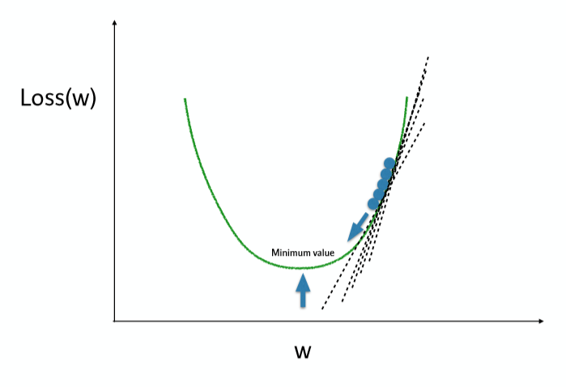
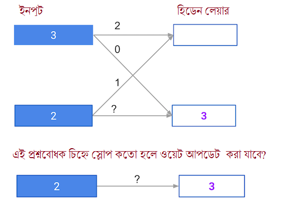
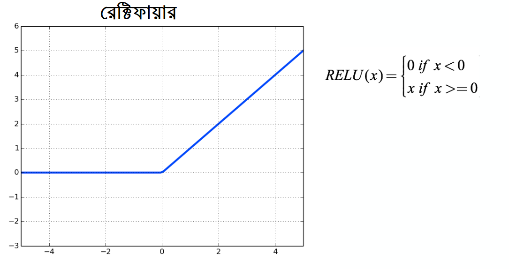

# ডিপ লার্নিং নেটওয়ার্ক: ফরওয়ার্ড এবং নেটওয়ার্ক অপটিমাইজেশনের জন্য ব্যাক প্রোপাগেশন


ড্যান বেকার আমার প্রিয় একজন মেন্টর। ক্যাগলের অনেক কিছুই শিখেছি তার কাছ থেকে। সেদিক থেকে ডাটাক্যাম্প আরেকটা প্রিয় লার্নিং প্ল্যাটফর্ম। ড্যান বেকারের চমত্কার একটা কোর্স থেকে নিচের উদাহরনটা নিচ্ছি এখানে। কোর্সের লিংক দেয়া আছে বইয়ের পেছনে। 


আমরা নিউরাল নেটওয়ার্কের প্রেডিকশন যখন করি, তখন আসলে ফরওয়ার্ড প্রপাগেশন অ্যালগরিদম ব্যবহার করি। সেটা হাতেকলমে দেখলে কেমন হয়? আমি উদাহরনটা হুবুহু রেখেছি যাতে ভবিষ্যতে উনার কোর্স ধরতে অসুবিধা না হয়।

আমাদের উদাহরণে একজন ব্যবহারকারী কতগুলো ট্রানজাকশন করতে পারেন সেটা নিয়ে আলাপ হবে। বোঝার সুবিধার্থে শুরুতেই আমরা সেই ব্যবহারকারীর সন্তানদের সংখ্যা এবং তার কতগুলো নিজস্ব একাউন্ট আছে সেটার ওপর নির্ভর করে প্রেডিকশন করব তার কতগুলো ব্যাংক ট্রানজেকশন হতে পারে। শুরুতে একটা ছবি দেখি যেখানে ইনপুট হিসেবে সন্তানদের সংখ্যা এবং অ্যাকাউন্ট সংখ্যা - আর আউটপুট হিসেবে আমরা ব্যাংকের ট্রানজেকশন দেখাচ্ছি। 

এখানে ইনপুট লেয়ার থেকে লাইন টেনে হিডেন লেয়ারে সংযোগ দিয়ে দেখাচ্ছি সবগুলোর মধ্যে যোগসূত্রের ব্যাপারটা। এখানে প্রতিটা লাইনের সাথে একটা করে ‘ওয়েট’ যোগ করা আছে যার মাধ্যমে বোঝা যাবে সেই ইনপুট তথ্যটা কতটুকু বাড়লো সেই লাইনের শেষে। আপনি যদি ভালোভাবে দেখেন হিডেন লেয়ারে যখন লাইনগুলো যাচ্ছে সেখানে উপর দিক থেকে একটা ‘ওয়েট’ এবং নিচ থেকে আরেকটা ‘ওয়েট’, অর্থাৎ সন্তান সংখ্যা থেকে একটা ‘ওয়েট’ আর অ্যাকাউন্টের সংখ্যা থেকে আরেকটা ‘ওয়েট’ এসে যুক্ত হচ্ছে সেখানে। 

এই ওয়েটগুলো আমাদের ট্রেনিং এর শুরুতে একরকম থাকলেও যখন নেটওয়ার্কে ট্রেনিং চালাবো তখন সেই ফিট মেথডে ‘ওয়েট’ পাল্টে যেতে পারে। আমাদের ডিপ লার্নিং এ এই শুরুর ‘ওয়েট’ এবং ট্রেনিং এর সময় ‘ওয়েট’ পাল্টে যাওয়ার ধারণাটা বুঝতে পারলেই ডিপ লার্নিং ব্যাপারটা অনেক সহজ হয়ে যাবে। 

ভালো করে লক্ষ্য করুন, আমরা যদি হিডেন লেয়ারের উপরের নোড থেকে যদি প্রেডিকশন করতে চাই তাহলে প্রতিটা ইনপুট নোডের ভ্যালু নিয়ে সেটাকে গুন করব তার ওয়েট দিয়ে, যেটা কানেক্ট করছে সেই হিডেন লেয়ারকে। এরপর সেই ভ্যালুগুলোকে যোগ করে দেব সেই উপরের হিডেন লেয়ারে। আপনারা দেখতে পাচ্ছেন উপরের হিডেন লেয়ারে ইনপুট নোড এর ভ্যালুর সাথে ওয়েট গুন করে এবং তার ফলাফল গুলোকে যোগ করে তার রেজাল্ট আউটপুট হিডেন লেয়ারে ৫ হিসেবে এসেছে। সেই একই সিস্টেমে নিচের হিডেন লেয়ারে ফলাফল এসেছে ১, কারণ এখানে ওয়েট হিসেবে একটা ঋণাত্মক সংখ্যা \(-১\) ছিল। 

এভাবে আগের মত একই প্রসেস ব্যবহার করব আউটপুট লেয়ারের জন্য। এখানে উপরের হিডেন লেয়ার থেকে আউটপুট লেয়ারের কানেক্টেড লিঙ্কের ওয়েট হচ্ছে ২ এবং নিচের হিডেন লেয়ার থেকে আউটপুট লেয়ারের ওয়েট হচ্ছে -১। এখানেও হিডেন লেয়ারের ৫ এবং ১কে ইনপুট ধরে তার সাথে ওয়েটগুলোকে গুন করে এবং তার ফলাফলকে যোগ করলে আসে সংখ্যা ৯। এর মানে হচ্ছে আমাদের ওই ব্যবহারকারীর জন্য প্রেডিকশন হচ্ছে ৯টা ট্রানজাকশন। এটাকে আমরা বলছি ফরওয়ার্ড প্রপাগেশন। 



মোদ্দা কথা হচ্ছে - আমরা ইনপুট লেয়ার থেকে এসেছি হিডেন লেয়ারে, এরপর সেই হিডেন লেয়ার থেকে এসেছি সর্বডানের আউটপুট লেয়ারে। আমরা এখানে শুরুতে গুন করেছি ভ্যালুগুলোকে, এরপরে সেগুলোকে যোগ করে দিয়েছি রেজাল্ট পাবার জন্য। আমরা যখন লিনিয়ার অ্যালজেব্রা বা ভেক্টর অ্যালজেব্রা নিয়ে কাজ করেছি - সেখানে এই ব্যাপারটাকে বলা হয় ডট প্রডাক্ট। এই ডট প্রডাক্ট না জানলেও হবে আমাদের। এখানে এতক্ষণ আমরা যা করলাম সেটা একটা অর্থাৎ একটা ডাটা পয়েন্ট থেকে ফরওয়ার্ড প্রপাগেশন ব্যবহার করলাম। এভাবে ডিপ লার্নিং মডেলে ওই একটা সময়ে একটা ডাটা পয়েন্ট থেকে ফরওয়ার্ড প্রপাগেশন করি আমরা।

এই পুরো ব্যাপারটাকে আমরা একটু কোড এ দেখি। শুরুতেই অংকের বিভিন্ন অপারেশনের জন্য নামপাইকে ইমপোর্ট করে নিয়ে আসি। ইনপুট ডাটা হিসেবে সন্তানের সংখ্যা এবং অ্যাকাউন্টের সংখ্যা দেওয়া হচ্ছে নামপাই অ্যারে হিসেবে। এরপরে আমরা ওয়েটগুলোকে ভাগ করে দিচ্ছি বিভিন্ন নোডে এবং আউটপুট লেয়ারে। আমাদের এই ভ্যালুগুলোকে একটা ডিকশনারি বানিয়ে সেখানে অ্যারে হিসেবে রাখছি। 

```text
import numpy as np

# আমাদের প্রেডিকশন করার জন্য ডেটা পয়েন্ট, ছবির সাথে মিলিয়ে দেখুন
input_data = np.array([2, 3])

# আমাদের ডিকশনারী
weights =   {'node_0': np.array([1, 1]),
             'node_1': np.array([-1, 1]),
             'output': np.array([2, -1])
            }
```

শুরু করছি আমাদের ফরওয়ার্ড প্রপাগেশন। শুরুতে আমাদের নোড ০। যেটা আসলে আমাদের উপরের হিডেন নোড, সেটাকে অংকের মাধ্যমে নিয়ে আসি এখানে। এখানে ফর্মুলা হিসেবে ইনপুট এবং ওয়েটকে গুণ করি সেই নোড এর জন্য। সে দুটোর রেজাল্টকে যোগ করে দেই শেষে। মনে আছে আমাদের নোড ০ এর জন্য দুটো ওয়েট ছিল? আমাদের দুটো ওয়েটকেই গুন করতে হবে সেই ইনপুট ডাটার সাথে। 

এই একই জিনিস এখন আমরা করব নিচের হিডেন লেয়ারের নোড এর জন্য। যেটাকে আমরা বলছি নোড ১। এখন আমাদের নোড ০ এবং নোড ১ এর জন্য দুটো সংখ্যা এসেছে। আমাদের সামনে মাল্টিপ্লিকেশন সহজ করার জন্য আমরা দুটোকে একটা অ্যারেতে রাখছি। আমাদের বোঝার সুবিধার জন্য সেই অবজেক্টকে প্রিন্ট করে দেখি সেটা ঠিক বলছে কিনা? ৫, ১। 

```text
# node 0 এর ভ্যালু ক্যালকুলেট করি: node_0_value
node_0_value = (input_data * weights['node_0']).sum()

# node ১ এর ভ্যালু ক্যালকুলেট করি: node_1_value
node_1_value = (input_data * weights['node_1']).sum()

# নোডগুলোর ভ্য়ালুগুলোকে অ্যারেতে রাখি: hidden_layer_outputs
hidden_layer_outputs = np.array([node_0_value, node_1_value])

# আউটপুট ক্যালকুলেট করি: output
output = (hidden_layer_outputs * weights['output']).sum()

# আউটপুট প্রিন্ট করে দেখি
print(hidden_layer_outputs)
print(output)
[5 1]
9
```

এখন আসি আমদের আউটপুট এর ব্যাপারে। হিডেন লেয়ারের ভ্যালুগুলোকে গুণ করতে হবে তার এসোসিয়েটেড ওয়েট দিয়ে। সেই গুণফলগুলোকে যোগ করলে তার উত্তর আসে ৯। ১০- ১= ৯। আর বাকি থাকে কি? ফরওয়ার্ড প্রপাগেশন বোঝা শেষ। আমাদের এই ছোট্ট এই নিউরাল নেটওয়ার্কের। 

#### গ্র্যাডিয়েন্ট ডিসেন্ট এবং লস ফাংশন 

তবে আমরা একটা জিনিস বুঝতে পারছি যে - নিউরাল নেটওয়ার্ক এর স্ট্রাকচার মানেই যে ভালো প্রেডিকশন দিতে পারবে সেটা ঠিক নয়। আমাদের মডেলের প্রেডিকশন ঠিক করতে গেলে তার ওয়েটের ইম্পর্টেন্স যে কত সেটা দেখব এখানে। আমাদের আগের মডেলের প্রেডিকশন ৯ হলেও এর আসল ভ্যালু হচ্ছে ১৩। এর আগের “শূন্য থেকে পাইথন মেশিন লার্নিং” বইয়ে ‘লস ফাংশন’ দিয়ে এরর কারেকশনের অনেকগুলো অংক দেখেছিলাম। সেই ধারণা থেকেই বলছি আমাদের আসল ভ্যালু ১৩ এর কাছাকাছি প্রেডিকশন হলে আমাদের কাজ হয়ে যাবে। আমরা আগে ‘ফরওয়ার্ড প্রপাগেশন’ ব্যবহার করেছিলাম যাতে হিডেন লেয়ারের ভ্যালুগুলো পাওয়া যায়। তখন আমরা দেখেছিলাম এটার ভ্যালু ৫ এবং ১ ছিল। এরপর সেটার ফরওয়ার্ড প্রপাগেশন এ সেটার আউটপুট পেয়েছিলাম ৯। যেহেতু আমাদের আসল ডাটা হচ্ছে ১৩ আর প্রেডিকশন ৯ তারমানে এখানে এরর এসে দাঁড়াচ্ছে ওই দুটোর বিয়োগফল অর্থাৎ - ৪। 



মজার কথা হচ্ছে আমাদের ওয়েট পাল্টে দিলেই কিন্তু আউটপুট প্রেডিকশন পাল্টে যাবে। ফলে আমাদের আসল আউটপুট যদি ১৩ হয় তাহলে ভেতরের ওয়েটগুলোকে পাল্টে দিলেই সেটাকে ১৩ করা যাবে। আমরা ভেতরের ওয়েটগুলো নিয়ে আলাপ না করে বাইরের হিডেন লেয়ার থেকে আউটপুট লেয়ারের দুটো ওয়েট পাল্টে দেই। এখানে উপরের ওয়েট হচ্ছে ৩ আর নিচের ওয়েট হচ্ছে -২। এখন ফরওয়ার্ড প্রপাগেশন চালালে আমরা প্রেডিকশন পাবো ১৩। এর অর্থ হচ্ছে আমাদের ওয়েট এর ভ্যালু পাল্টালে সেটার প্রেডিকশন আসল ভ্যালুর কাছাকাছি চলে যাবে।



এখানে একটা সমস্যা আছে। প্রতিটা ডাটা পয়েন্ট থেকে এই ধরনের ওয়েটগুলোর অনেকগুলো এরর আসবে যা হিসেব করা দুষ্কর। এজন্য আমরা সবগুলো এররকে একটা কমন জায়গায় নিয়ে আসব যাতে মডেলের প্রেডিকশন ভালো হয়। এটাকে আমরা বলছি ‘লস ফাংশন’। এই ব্যাপার নিয়ে আলাপ হয়েছে ‘শূন্য থেকে পাইথন মেশিন লার্নিং’ বই এ। সেখানে দেখেছি কম লস ফাংশন ভ্যালু মানে হচ্ছে ভালো মডেল। আমাদের কাজ - এমন ওয়েট ভ্যালু বের করব যা আসলে সবচেয়ে কম ভ্যালু দেখাবে লস ফাংশন এ। এটা করার জন্য যে অ্যালগরিদম ব্যবহার করা হয় সেটাকে আমরা বলি ‘গ্রেডিয়েন্ট ডিসেন্ট’। 

‘গ্রেডিয়েন্ট ডিসেন্ট’ এর একটা কমন গল্প আছে সব জায়গায়। ব্যাপারটা এরকম যে আপনি একটা ভ্যালি অথবা শুকনো পুকুরের নিচে নামছেন। এখানে জায়গাটা অন্ধকার বলে আপনি আস্তে আস্তে নিচে নামার চেষ্টা করছেন যাতে সেই ভ্যালি বা পুকুরের সবচেয়ে নিচের পয়েন্টে যেতে পারেন। আপনি ‘স্লোপ’ অথবা ঢাল ধরে ধরে নিচে নামার সময় শুরুর দিকে বড় বড় স্টেপ নেবেন। যত নিচে নামতে থাকবেন ততই আপনার স্টেপ ছোট হতে থাকবে কারণ আপনি সবচেয়ে নিচু পয়েন্টে পৌঁছে যাচ্ছেন। সবচেয়ে নিচে পৌঁছে গেলে একই প্রসেসে আপনি আবার উপরে ওঠার চেষ্টা করবেন। পুকুরের সবচেয়ে নিচু অংশে ‘লস ফাংশন’ সবচেয়ে কম, মানে মডেলের অ্যাকুরেসি সবচেয়ে বেশি এখানে। ওখানে পৌঁছাতে শুরুর দিকে বেশি ডিগ্রি ভেরিয়েশন থাকলেও শেষের দিকে সেই ভেরিয়েশনের ডিগ্রি কমে আসবে। ছবি দেখুন।



এই জিনিসটা আমাদের ওয়েটের জন্য প্রযোজ্য। এরর বেশি হলে বড় বড় স্টেপে এরর কমিয়ে শেষে সেটা আস্তে আস্তে অল্প অল্প করে ওয়েটের ভ্যালু পাল্টে টার্গেট ভ্যালুর কাছাকাছি পৌঁছানো যায়। এটাকে লার্নিং রেট বলা যায়। কিভাবে কম কম করে নিচে নাম যায়? স্লোপের ক্যালকুলেশন করে। এই জিনিস আমরা ক্যালকুলাস মানে চেইন রুল দিয়ে বের করতে পারি। তবে শুরুতে স্লোপ এর হিসেব বের করি। নতুন একটা উদাহরণ দিয়ে। 

```text
# নতুন ওয়েট এবং ইনপুট ডেটা 
weights = np.array([1, 2])
input_data = np.array([3, 4]) 

# প্রেডিকশন ক্যাল্কুলেট করি: preds
preds = (weights * input_data).sum()

# ধরি আমাদের টার্গেট ৬
target = 6

# এরর ক্যালকুলেট করি: error
error = preds - target

# স্লোপ ক্যালকুলেট করি: slope
slope = 2 * input_data * error

# স্লোপ প্রিন্ট করি 
print(slope)
[30 40]
```

#### মডেলের ওয়েট কিভাবে ভালো লেভেলে যাবে?

```text
# লার্নিং রেট ঠিক করি: learning_rate
learning_rate = 0.01

# স্লোপ/গ্রেডিয়েন্ট ক্যালকুলেট করি: gradient
gradient = 2 * input_data * error

# ওয়েট আপডেট করি: weights_updated
weights_updated = weights - learning_rate * gradient

# প্রেডিকশন আপডেট নেই : preds_updated
preds_updated = (weights_updated * input_data).sum()

# এররের আপডেট নেই: error_updated
error_updated = preds_updated - target

# শুরুর এরর প্রিন্ট করি 
print(error)

# নতুন এরর প্রিন্ট করি 
print(error_updated)
5
2.5
```

#### কিভাবে ওয়েট পাল্টালে অ্যাক্যুরেসি পাল্টায় 

শুরুর ওয়েট দিয়ে টার্গেট ভ্যালু না ধরতে পারলে সেটা পাল্টে নতুন ওয়েট দিয়ে দেখি এখানে। 

```text
import numpy as np

# আমাদের প্রেডিকশন করার জন্য ডেটা পয়েন্ট, ছবির সাথে মিলিয়ে দেখুন
input_data = np.array([0, 3])

# স্যাম্পল ওয়েট যা পাল্টে দিয়েছি আমরা  
weights_0 = {'node_0': [2, 1],
             'node_1': [1, 2],
             'output': [1, 1]
            }

# আসল টার্গেট ভ্যালু, এরর বের করার জন্য লাগবে 
target_actual = 3

# দুটো মেথড ডিফাইন করি 
def relu(input):
    output = max(0, input)
    return output

def predict_with_network(input_data_row, weights):
    node_0_input = (input_data_row * weights['node_0']).sum()
    # print(node_0_input)
    node_0_output = relu(node_0_input)
    # print(node_0_output)

    node_1_input = (input_data_row * weights['node_1']).sum()
    node_1_output = relu(node_1_input)
    
    hidden_layer_outputs = np.array([node_0_output, node_1_output])
    
    input_to_final_layer = (hidden_layer_outputs * weights['output']).sum()
    model_output = relu(input_to_final_layer)
    return model_output
       

# শুরুর ওয়েট দিয়ে প্রেডিকশন করি 
model_output_0 = predict_with_network(input_data, weights_0)

# এরর ক্যালকুলেট করি: error_0
error_0 = model_output_0 - target_actual

# নতুন ওয়েট দেই যাতে টার্গেট প্রেডিকশন (3) ধরতে পারে: weights_1
weights_1 = {'node_0': [2, 1],
             'node_1': [1, 2],
             'output': [1, 0]
            }

# নতুন ওয়েট দিয়ে প্রেডিকশন: model_output_1
model_output_1 = predict_with_network(input_data, weights_1)

# আবার এরর ক্যালকুলেট করি: error_1
error_1 = model_output_1 - target_actual

# সবকিছু প্রিন্ট করে দেখি 

print(model_output_0)
print(model_output_1)
print(error_0)
print(error_1)
9
3
6
0
```

#### ব্যাকওয়ার্ড প্রোপাগেশন 

আমরা এতক্ষন যে স্লোপ নিয়ে কথা বললাম, সেটাকে অপ্টিমাইজ করার জন্য আরেকটা টেকনিক ব্যবহার করবো যার নাম হচ্ছে ব্যাক প্রোপাগেশন। এর কাজ ফরওয়ার্ড প্রোপাগেশনের মতোই তবে সেটা হবে পেছন থেকে। আউটপুট লেয়ার থেকে এরর নিয়ে সেটাকে পেছন থেকে হিডেন লেয়ারের দিয়ে পাঠিয়ে একদম ইনপুট পর্যন্ত ওয়েটগুলোকে আপডেট করার এই প্রসেস আসলেই দেখার মতো। এখানে গ্রাডিয়েন্ট ডিসেন্ট নিউরাল নেটওয়ার্কের সব ওয়েটগুলোকে আপডেট করছে আউটপুটের প্রেডিকশন এরর থেকে, সেটা ছবিতে দেখুন। এখানে এই লস ফাংশনের স্লোপগুলো ওয়েটগুলোকে আপডেট করছে যতক্ষণ পর্যন্ত এরর কমে না আসছে। এটা  কাজ করে একেকটা লেয়ার ধরে পেছনে। এই ব্যাপারে একটা চমৎকার ভিডিও আছে "থ্রীব্লুওয়ানব্রাউন" থেকে। লিংক [https://youtu.be/Ilg3gGewQ5U](https://youtu.be/Ilg3gGewQ5U) .


একটা উদাহরণ দেখি। আমরা যেহেতু ফরওয়ার্ড প্রোপাগেশন করেছি, সেকারণে নোড ভ্যালুগুলোকে পেয়েছি নিচের ছবিতে সাদা বক্সে। এখানে ওয়েটগুলোকে দেখানো হয়েছে কালো অক্ষরে। প্রশ্নবোধক চিহ্নের পর ব্যাক প্রোপাগেশনের হিসেবে অনুযায়ী স্লোপ বের করা হয়েছে, ফরওয়ার্ড প্রোপাগেশন দিয়ে নয়। এখানে স্লোপ ভ্যালুগুলো \(৩\) একটু হালকা রংয়ে দেয়া আছে। 



এই নিউরাল নেটওয়ার্ক রেল্যু এক্টিভেশন ফাংশন \(নিচে দেখুন\)ব্যবহার করছে বলে এখানে এক্টিভেশন ফাংশনের স্লোপ ভ্যালু ১, যখন ওই নোড ইনপুট হিসেবে পজিটিভ ভ্যালু পাচ্ছে। আমরা ধরে নিচ্ছি, নেটওয়ার্ক থেকে পজিটিভ ভ্যালু আসছে তার কারণে এক্টিভেশন ফাংশনের স্লোপ এর মান ১।


আমাদের তিনটা জিনিস দরকার যেকোন ওয়েটের গুণিতক হিসেবে যা সেই ওয়েটের স্লোপ হিসেবে জানতে চাইবো। 

১. ওই নোডের ভ্যালু যখন সেই ওয়েটকে ফিড করছে সেখানে। 

২. যেই নোডে এক্টিভেশন ফাংশন ফিড হচ্ছে তার স্লোপ। 

৩. লস ফাংশনের স্লোপ যখন সেটা আউটপুট নোডে যাচ্ছে।


ঠিক ধরেছেন। এই ওয়েটকে আপডেট করতে যে স্লোপ প্রয়োজন সেটা ৬। 

#### এক্টিভেশন ফাংশন, লিনিয়ারিটি এবং নন-লিনিয়ারিটি 

এতক্ষণ আমরা যা করলাম সেটা হয়তোবা ডট প্রডাক্ট হিসেবে কাজ করবে - তবে এ ধরনের সিদ্ধান্ত নিতে গেলে ডিপ লার্নিং মডেলে নন-লিনিয়ারিটি সমস্যা সমাধান করতে হবে। আগেই বলেছি নিউরাল নেটওয়ার্কে তার আসল ক্ষমতা দেখাতে হলে এখানে একটা 'অ্যাক্টিভেশন ফাংশন' ব্যবহার করতে হবে। কেন ব্যবহার করতে হবে সেটা আপনারা দেখেছেন চাঁদ আকারের ডাটা সেটে। এই অ্যাক্টিভেশন ফাংশনই পারে ডাটাতে নন-লিনিয়ারিটি বুঝতে।
এই এক্টিভেশন ফাংশন ব্যবহার করবো প্রতিটা নোডে, যখন দরকার পড়বে। 


রেল্যু ফাংশন হচ্ছে ইনপুট হিসেবে যা দেবেন, সেটা যদি নেগেটিভ অর্থাৎ ঋনাত্বক সংখ্যা হয় তাহলে সে "০" রিটার্ন করবে। তবে ০ ছাড়া ইনপুট হিসেবে যদি পজিটিভ সংখ্যা থাকে তাহলে ওই সংখ্যাই রিটার্ন করবে। উদাহরণ, output = max\(0, input\) অর্থাৎ **relu\(3\) = 3** এবং **relu\(-3\) = 0**




নতুন একটা নেটওয়ার্ক দেখি। এখানে ইনপুট -১, ২ এবং ওয়েট হচ্ছে \(৩, ৩\), \(১, ৫\) এবং \(২, -১\) যা দেয়া হয়েছে ডিকশনারীতে। এরপর রেল্যু  ফাংশন।

```text
import numpy as np

# আমাদের প্রেডিকশন করার জন্য ডেটা পয়েন্ট, ছবির সাথে মিলিয়ে দেখুন
input_data = np.array([-1, 2])

# আমাদের ডিকশনারী
weights =   {'node_0': np.array([3, 3]),
             'node_1': np.array([1, 5]),
             'output': np.array([2, -1])
            }

def relu(input):
    '''রেল্যু ফাংশনকে ডিফাইন করে দিচ্ছি এখানে'''
    # ইনপুটে যা পাবো সেটাকে ম্যাক্সিমাম যা আসবে, অথবা ঋনাত্বক আসলে "০" : output
    output = max(0, input)
    
    # Return the value just calculated
    return(output)

# নোড ১ এর ভ্যালু ক্যালকুলেট করি: node_0_output
node_0_input = (input_data * weights['node_0']).sum()
node_0_output = relu(node_0_input)

# নোড ২ এর ভ্যালু ক্যালকুলেট করি: node_1_output
node_1_input = (input_data * weights['node_1']).sum()
node_1_output = relu(node_1_input)

# নতুন ভ্যালুগুলোকে অ্যারেতে বসাই: hidden_layer_outputs
hidden_layer_outputs = np.array([node_0_output, node_1_output])

# মডেলের আউটপুট ক্যালকুলেট করি (রেল্যুকে সরাসরি ব্যবহার না করে)
model_output = (hidden_layer_outputs * weights['output']).sum()

# Print model output
print(node_0_output)
print(node_1_output)
print(hidden_layer_outputs)
print(model_output)
3
9
[3 9]
-3
```

