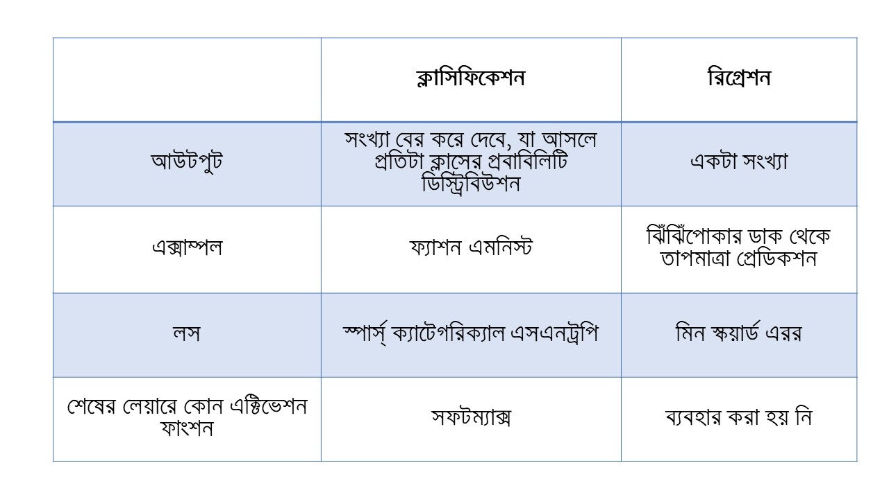

# রিগ্রেশন এবং ক্লাসিফিকেশন

আমরা দুটো জিনিস শিখলাম। দুটো নিউরাল নেটওয়ার্ক থেকে দুই ধরণের আউটপুট পেলাম। এর মানে হচ্ছে আমাদের নিউরাল নেটওয়ার্ক বিভিন্ন ধরণের সমস্যা সমাধান করতে পারে। প্রথমটা কি সমস্যা হতে পারে?  রিগ্রেশন। পরেরটা  ক্লাসিফিকেশন। 

১. প্রথম সমস্যায় নিউরাল নেটওয়ার্ক ঝিঁঝিঁপোকার ডাক থেকে তাপমাত্রা প্রেডিক্ট করছিল। এটা রিটার্ন করছে একটা সংখ্যা। যেটা আসলে বড় রেঞ্জের ফ্লোটিং পয়েন্ট নম্বর হতে পারে। মানে কন্টিনিউয়াস সংখ্যা। এভাবে বাসার রুমের সাথে তার ভাড়ার সম্পর্ক, মানে ২ রুমের যে ভাড়া সেভাবে ৭ রুমের একটা বাসার কি ভাড়া হতে পারে সেটা বের করতে পারবে এই ধরণের নিউরাল নেটওয়ার্ক। চাকরির বয়সের সাথে বেতনের সম্পর্ক সেভাবে বের করতে পারবে এই নেটওয়ার্ক। 

২. পরের সমস্যা ছবি দেখে সেটাকে বিভিন্নভাগে ঠিকমতো ক্লাসিফাই করতে পারে এধরণের একটা সমাধান করছে। অনেকগুলো লাইফস্টাইল প্রোডাক্ট, যেমন কাপড় চোপড়, জুতা, ব্যাগ ইত্যাদিকে ১০টা প্রোডাক্ট ক্যাটেগরিতে ভাগ করা। এই নিউরাল নেটওয়ার্কের কাজ হচ্ছে ইনপুট হিসেবে একটা ইমেজ যা ১০টার মধ্যে যেকোন একটা ক্লাসের মধ্যে পড়ে, সেটাকে ১০টা প্রোবাবিলিটি সংখ্যা বের করে দেয় যাতে এই প্রোবাবিলিটি বলতে পারে সেই নিউরাল নেটওয়ার্ক কতোটা কনফিডেন্ট তার আউটকামের ব্যাপারে। 

এভাবে এই ইমেজ থেকে বিভিন্ন প্রাণীকে তাদের ক্লাস অনুযায়ী ভাগ করতে পারলে সেটাকে অন্য সব জায়গায় কাজে লাগানো যাবে। সেলফ ড্রাইভিং কার  থেকে শুরু করে এই কম্পিউটার ভিশন যেটা অনেকটাই ইমেজ ক্লাসিফিকেশন কাজে লাগছে সামনে। 

নিচের একটা টেবিল দেখি।

ছবিতে ক্লাসিফিকেশনে দশটা  আইটেমের মধ্যে যেকোন একটা বের করার জন্য তাদের প্রোবাবিলিটি ডিস্ট্রিবিউশনের মধ্যে যেটা বেশি কনফিডেন্ট সেটাকে ধরেই এর কারুকাজ। এখানে প্রোবাবিলিটি ডিস্ট্রিবিউশনের সবগুলোর যোগফল সবসময় ১, অর্থাৎ ১০০ শতাংশ। 

সেদিক থেকে রিগ্রেশন সবসময় একটা সংখ্যা আউটপুট হিসেবে নিয়ে আসবে। কন্টিনিউয়াস সংখ্যা। 

পৃথিবীতে যতো মেশিন লার্নিং মডেল আছে সবই এই দুই ক্যাটেগরিতে পড়বে। হয় রিগ্রেশন অথবা ক্লাসিফিকেশন। আপনি সংখ্যা চাইবেন নাকি কয়েকটা ক্লাসের মধ্যে একটা জিনিসকে ক্লাসিফাই করবেন। সে হিসেবে আপনার পছন্দের নেটওয়ার্ক বেছে নেবেন। 

 

